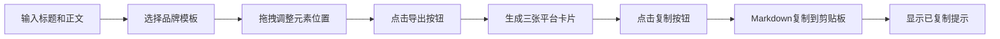

## 1. 产品概述

社交媒体卡片生成器是一款面向独立创作者和文案工作者的效率工具，帮助用户快速生成带有品牌化视觉风格的多平台社交媒体卡片，并一键复制为Markdown格式。解决了每次发博文前需要手动设计图片尺寸、排版不一致、且无法批量适配不同平台（Twitter、微信、小红书）的痛点。

### 核心价值
- 一键生成多平台尺寸卡片，提升内容创作效率
- 预设品牌模板，保证视觉风格一致性
- 拖拽式编辑，降低设计门槛
- Markdown格式导出，无缝接入博客发布流程

## 2. 核心功能

### 2.1 功能模块
1. **编辑面板**：标题输入、正文内容输入、模板选择器、网格切换
2. **预览画布**：实时卡片预览、拖拽元素定位、吸附网格
3. **导出模块**：多平台尺寸生成、Markdown复制、进度指示器
4. **模板系统**：4种预设品牌模板（极简白、科技蓝、暖橙手写、暗夜高端）

### 2.2 页面详情
| 页面名称 | 模块名称 | 功能描述 |
|-----------|-------------|---------------------|
| 主页面 | 顶部导航栏 | 品牌名称、模板下拉选择、导出按钮 |
| 主页面 | 左侧编辑面板 | 标题输入（80字限制）、正文输入（500字限制）、模板选择 |
| 主页面 | 右侧画布区域 | 卡片实时预览、元素拖拽、网格吸附、弹性回弹动画 |
| 主页面 | 导出弹窗 | 三平台卡片展示、进度指示器、一键复制Markdown |

## 3. 核心流程

### 用户操作流程
用户在左侧编辑面板输入标题和正文 → 选择品牌模板 → 在右侧画布上拖拽调整元素位置 → 点击导出按钮 → 系统生成三张不同平台尺寸的卡片 → 用户点击复制按钮 → Markdown内容复制到剪贴板 → 显示"已复制"提示

## 4. 用户界面设计

### 4.1 设计风格
- **整体风格**：专业简洁的编辑器风格，深色UI与浅色画布形成对比
- **主色调**：深色UI使用 #1e1e2e，画布背景使用 #f0f0f0，品牌色随模板动态变化
- **圆角规范**：输入框和按钮统一使用 8px 圆角
- **阴影规范**：元素拖拽时阴影为 0 4px 12px rgba(0,0,0,0.15)
- **毛玻璃效果**：编辑面板使用 backdrop-filter: blur(12px)

### 4.2 品牌模板
| 模板名称 | 主色 | 辅色 | 背景色 | 强调色 | 风格描述 |
|---------|------|------|--------|--------|----------|
| 极简白 | #333333 | #666666 | #ffffff | #000000 | 简约纯净，黑白灰为主 |
| 科技蓝 | #1976d2 | #42a5f5 | #e3f2fd | #0d47a1 | 专业科技感，蓝色调 |
| 暖橙手写 | #ff6b35 | #ffa726 | #fff8e1 | #bf360c | 温暖活泼，手写风格 |
| 暗夜高端 | #bb86fc | #03dac6 | #121212 | #cf6679 | 深色奢华，紫色调 |

### 4.3 页面设计概述
| 页面名称 | 模块名称 | UI元素 |
|-----------|-------------|----------|
| 主页面 | 顶部导航栏 | 高度56px，深灰背景，白色文字，左侧品牌名，中间模板选择，右侧导出按钮 |
| 主页面 | 左侧编辑面板 | 宽度360px，深灰背景#1e1e2e，毛玻璃效果，输入框圆角8px |
| 主页面 | 右侧画布 | 浅灰背景#f0f0f0，卡片居中带阴影，四周20px边距 |
| 主页面 | 可拖拽元素 | 标题、正文、Logo占位符、分隔线、图标标记 |

### 4.4 动画与交互
- **模板切换**：0.5s淡入缩放过渡
- **元素拖拽**：阴影跟随，16px网格吸附
- **释放元素**：约0.2s弹性回弹动画
- **导出进度**：圆形进度指示器，直径32px，青绿色#00bcd4，旋转周期1.5s
- **复制提示**：临时淡出文字，显示1.5s后消失

### 4.5 响应式设计
- **桌面端（≥800px）**：左右两栏布局，左侧编辑面板360px，右侧画布自适应
- **移动端（<800px）**：上下布局，编辑面板在上，画布在下，各占50%视口高度
- **触摸优化**：拖拽区域扩大，按钮最小触摸尺寸44px

### 4.6 性能要求
- 模板切换和拖拽元素动画帧率稳定在50fps以上
- 图片Base64压缩至不超过200KB
- 导出生成过程需有进度反馈
