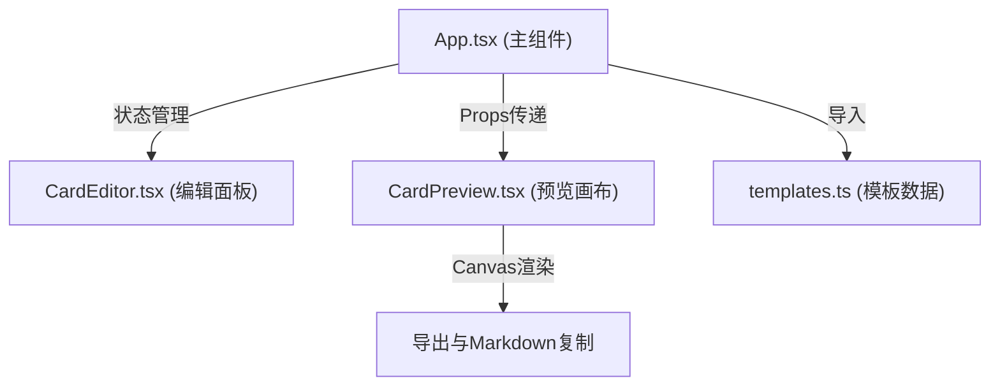

## 1. 架构设计



## 2. 技术描述

- **前端框架**：React 18 + TypeScript
- **构建工具**：Vite 5
- **样式方案**：原生CSS + CSS变量（主题切换）
- **状态管理**：React useState/useRef（轻量级，无额外状态库）
- **Canvas渲染**：HTML5 Canvas API（用于导出图片）
- **字体方案**：Google Fonts (Noto Sans SC, 特殊模板用手写字体)

## 3. 文件组织

| 文件路径 | 职责 |
|---------|------|
| `package.json` | 项目依赖与脚本配置 |
| `vite.config.js` | Vite构建配置，React插件 |
| `tsconfig.json` | TypeScript严格模式配置 |
| `index.html` | 入口HTML页面 |
| `src/App.tsx` | 主组件，管理布局与状态 |
| `src/CardEditor.tsx` | 左侧编辑面板，输入与模板选择 |
| `src/CardPreview.tsx` | 右侧画布，卡片渲染与导出 |
| `src/templates.ts` | 品牌模板与默认布局配置 |
| `src/index.css` | 全局样式与CSS变量 |
| `src/main.tsx` | React入口文件 |

## 4. 数据模型

### 4.1 模板类型定义
```typescript
interface TemplateColors {
  primary: string;
  secondary: string;
  background: string;
  accent: string;
}

interface LayoutConfig {
  title: { x: number; y: number; fontSize: number; fontWeight: number };
  body: { x: number; y: number; fontSize: number; lineHeight: number };
  logo: { x: number; y: number; size: number };
  divider: { x: number; y: number; width: number; height: number };
  icon: { x: number; y: number; size: number };
}

interface CardTemplate {
  id: string;
  name: string;
  colors: TemplateColors;
  defaultLayout: LayoutConfig;
  fontFamily: string;
}
```

### 4.2 平台尺寸定义
```typescript
interface PlatformSize {
  id: string;
  name: string;
  width: number;
  height: number;
}
// Twitter: 1200x675
// 微信公众号: 900x383
// 小红书: 1080x1440
```

### 4.3 卡片状态
```typescript
interface CardState {
  title: string;
  body: string;
  templateId: string;
  layout: LayoutConfig;
  showGrid: boolean;
}
```

## 5. 核心功能实现思路

### 5.1 拖拽系统
- 使用React的onMouseDown/onMouseMove/onMouseUp事件
- 拖拽时记录初始位置与偏移量
- 16px网格吸附：Math.round(position / 16) * 16
- 弹性回弹动画：CSS transition + cubic-bezier曲线

### 5.2 Canvas导出
- 使用Canvas API绘制卡片
- 根据不同平台尺寸等比缩放元素位置和字体大小
- 使用toDataURL('image/png')生成Base64
- 压缩：调整canvas尺寸或使用质量参数

### 5.3 Markdown复制
- 构造Markdown字符串：标题、正文、发布时间占位符、Slogan、图片
- 使用navigator.clipboard.writeText()复制到剪贴板
- 显示复制成功提示（1.5s后淡出）

### 5.4 主题切换动画
- 使用CSS opacity和transform实现淡入缩放
- transition: all 0.5s cubic-bezier(0.4, 0, 0.2, 1)

## 6. 性能优化

- 使用useMemo缓存计算结果
- 使用useCallback避免不必要的重渲染
- 拖拽时使用requestAnimationFrame保证流畅
- Canvas绘制时使用离屏Canvas优化性能
- 图片导出时使用渐进式压缩策略

## 7. 构建与运行

- 安装依赖：`npm install`
- 开发模式：`npm run dev`
- 生产构建：`npm run build`
