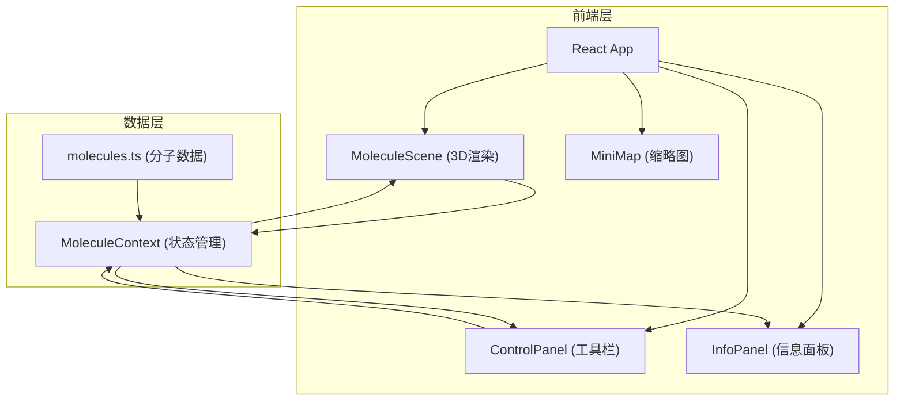

## 1. 架构设计



## 2. 技术说明

- 前端：React 18 + TypeScript + Vite
- 3D渲染：Three.js + @react-three/fiber + @react-three/drei
- 状态管理：React Context
- 初始化工具：vite-init (react-ts 模板)
- 后端：无
- 数据库：无，使用静态分子数据

## 3. 路由定义

| 路由 | 用途 |
|------|------|
| / | 主场景页面，包含3D分子模型和所有交互控件 |

## 4. 数据模型

### 4.1 核心类型定义

```typescript
interface Atom {
  id: string;
  element: string;
  position: [number, number, number];
  color: string;
  radius: number;
  mass: number;
}

interface Bond {
  id: string;
  atom1Id: string;
  atom2Id: string;
  order: number;
}

interface MoleculeData {
  id: string;
  name: string;
  formula: string;
  molecularWeight: number;
  geometry: string;
  bondAngles: string[];
  atoms: Atom[];
  bonds: Bond[];
}
```

### 4.2 文件结构

```
├── package.json
├── index.html
├── vite.config.js
├── tsconfig.json
├── src/
│   ├── main.tsx
│   ├── App.tsx
│   ├── components/
│   │   ├── MoleculeScene.tsx    # Three.js场景渲染
│   │   ├── ControlPanel.tsx     # 左侧工具栏
│   │   ├── InfoPanel.tsx        # 右侧信息面板
│   │   └── MiniMap.tsx          # Mini地图
│   ├── data/
│   │   └── molecules.ts         # 分子数据
│   └── utils/
│       └── context.ts           # React Context
```
