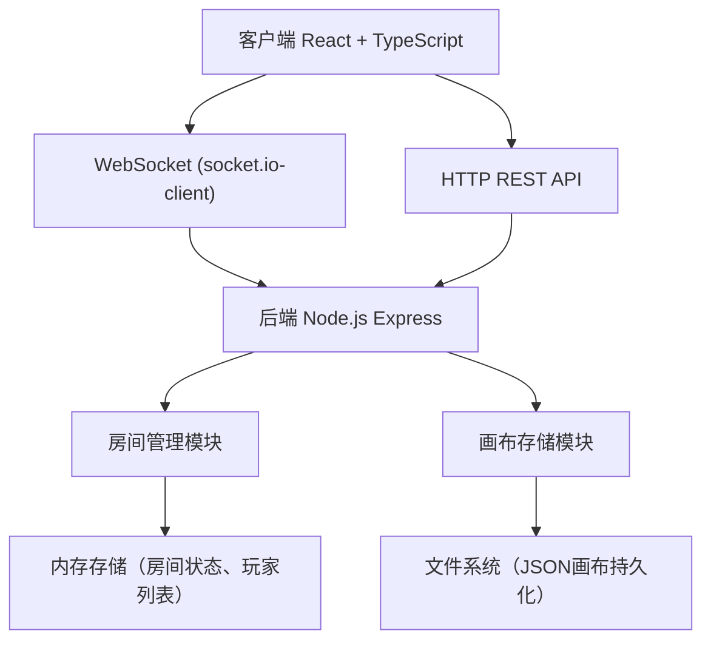
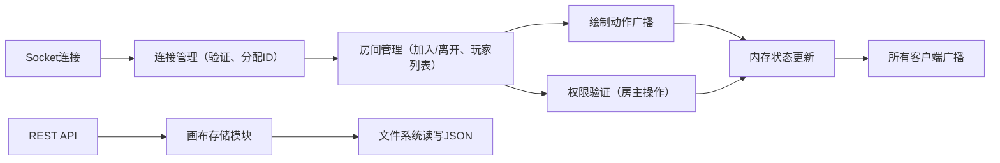
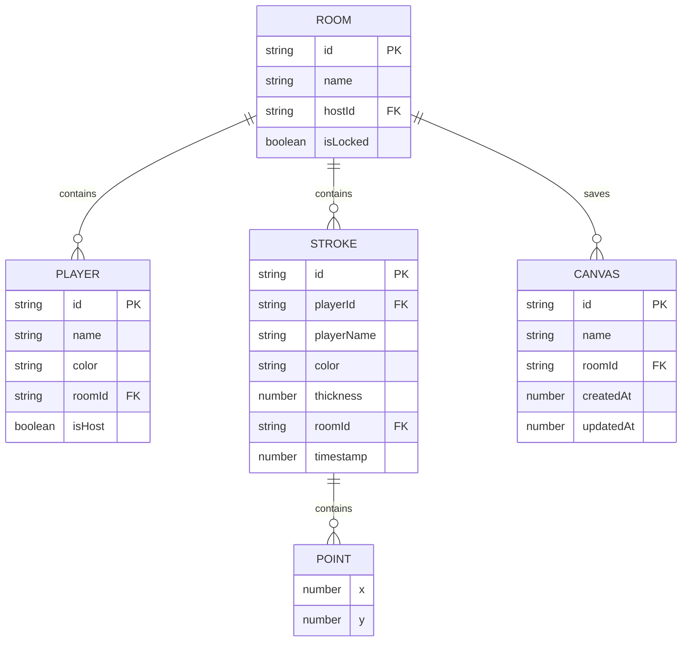

## 1. 架构设计



## 2. 技术描述

- 前端：React 18 + TypeScript + Vite + socket.io-client
- 后端：Express 4 + socket.io + TypeScript
- 构建工具：Vite（前端），ts-node（后端运行时）
- 数据存储：内存（临时房间状态）+ 文件系统（JSON画布持久化）
- 状态管理：React Context + useState/useRef（画布相关）

## 3. 项目文件结构

```
├── package.json              # 根依赖配置（前后端统一管理）
├── index.html                # 前端入口HTML
├── vite.config.js            # Vite构建配置，代理到后端3001端口
├── tsconfig.json             # TypeScript配置
├── server/
│   └── src/
│       ├── index.ts          # 后端入口，Express + socket.io服务
│       └── roomManager.ts    # 房间管理模块
└── client/
    └── src/
        ├── App.tsx           # 前端主组件，路由切换，Context管理
        └── components/
            ├── Canvas.tsx    # 画布组件，绘制逻辑，粒子效果
            └── Panel.tsx     # 画布管理面板
```

## 4. 路由定义

| 路由 | 用途 |
|------|------|
| / | 房间选择页面 |
| /room/:roomId | 绘画页面（房间内） |

## 5. API定义

### 5.1 RESTful API

```typescript
// 画布数据类型
interface Stroke {
  id: string;
  playerId: string;
  playerName: string;
  color: string;
  thickness: number;
  points: { x: number; y: number }[];
  timestamp: number;
}

interface CanvasData {
  id: string;
  name: string;
  roomId: string;
  strokes: Stroke[];
  createdAt: number;
  updatedAt: number;
  thumbnail?: string;
}

// 获取房间画布列表
GET /api/canvases?roomId=:roomId
Response: CanvasData[]

// 保存画布
POST /api/canvases
Body: { roomId: string; name: string; strokes: Stroke[] }
Response: CanvasData

// 加载画布
GET /api/canvases/:canvasId
Response: CanvasData
```

### 5.2 Socket.io事件

```typescript
// 客户端 -> 服务器
'join-room': { roomId: string; playerName: string }
'draw-start': { roomId: string; strokeId: string; color: string; thickness: number; x: number; y: number }
'draw-move': { roomId: string; strokeId: string; x: number; y: number }
'draw-end': { roomId: string; strokeId: string }
'lock-canvas': { roomId: string; locked: boolean }
'clear-recent': { roomId: string }
'save-canvas-notification': { roomId: string }
'player-cursor': { roomId: string; x: number; y: number }

// 服务器 -> 客户端
'player-joined': { playerId: string; playerName: string; color: string }
'player-left': { playerId: string }
'room-state': { players: Player[]; strokes: Stroke[]; isLocked: boolean; hostId: string }
'draw-start': Stroke
'draw-move': { strokeId: string; x: number; y: number }
'draw-end': { strokeId: string }
'canvas-locked': { locked: boolean; byPlayerName: string }
'recent-cleared': { byPlayerName: string }
'canvas-saved': { byPlayerName: string }
'player-cursor': { playerId: string; x: number; y: number; playerName: string; color: string }
'notification': { message: string; type: 'info' | 'success' | 'warning' }
```

## 6. 服务器架构



## 7. 数据模型

### 7.1 数据模型定义



### 7.2 TypeScript类型定义

```typescript
interface Player {
  id: string;
  name: string;
  color: string;
  isHost: boolean;
  socketId: string;
}

interface Point {
  x: number;
  y: number;
}

interface Stroke {
  id: string;
  playerId: string;
  playerName: string;
  color: string;
  thickness: number;
  points: Point[];
  timestamp: number;
}

interface RoomState {
  id: string;
  name: string;
  hostId: string;
  players: Player[];
  strokes: Stroke[];
  isLocked: boolean;
}

interface CanvasSave {
  id: string;
  name: string;
  roomId: string;
  strokes: Stroke[];
  createdAt: number;
  updatedAt: number;
}
```
