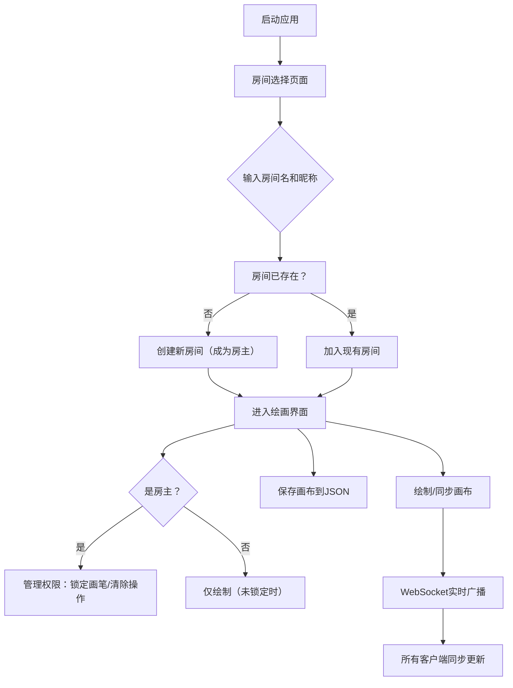

## 1. 产品概述

多人在线实时协作的魔法阵绘制沙盒应用，解决传统绘画工具无法让多名玩家同步在同一画布上绘制复杂符文图案的问题。

- 目标用户：需要协作创作魔法/符文图案的玩家和创作者
- 核心价值：实时同步的多人画布协作体验，支持魔法主题的视觉效果

## 2. 核心功能

### 2.1 用户角色

| 角色 | 注册方式 | 核心权限 |
|------|----------|----------|
| 房主（第一个创建房间的玩家） | 输入房间名和昵称创建房间 | 锁定/解锁画笔、清除最近50笔操作、绘制、保存画布 |
| 普通玩家 | 输入房间名和昵称加入房间 | 绘制、保存画布（当画笔未锁定时） |

### 2.2 功能模块

1. **房间选择页面**：房间卡片展示、创建/加入房间、在线玩家列表
2. **绘画画布**：Canvas绘制、画笔工具、颜色选择器、粗细调节、粒子拖尾效果
3. **实时同步**：WebSocket广播绘制动作、玩家光标/标签显示、权限变更通知
4. **画布管理**：保存画布为JSON、画布列表展示（缩略图+名称+日期）、加载画布
5. **权限管理**：房主锁定画笔、清除最近操作、确认弹窗、通知提示

### 2.3 页面详情

| 页面名称 | 模块名称 | 功能描述 |
|----------|----------|----------|
| 房间选择页 | 房间卡片 | 显示房间信息，悬停上移效果，点击查看详情 |
| 房间选择页 | 加入/创建表单 | 输入房间名（20字符）和昵称（12字符）自动分配颜色 |
| 房间选择页 | 玩家列表 | 圆形首字母头像，随机背景色，显示在线状态 |
| 绘画页 | 主画布 | 800x600px Canvas，背景#1E293B，40px网格线 |
| 绘画页 | 工具栏 | 左侧60px宽固定工具栏，画笔工具按钮48x48px |
| 绘画页 | 颜色选择器 | 左下角浮动面板，12种魔法色，32x32px色块，圆角8px |
| 绘画页 | 粗细调节 | 滑块2-20px，实时预览笔画宽度 |
| 绘画页 | 画布管理面板 | 已保存画布列表，缩略图120x90px，悬停缩放110% |
| 绘画页 | 权限控制 | 房主可锁定画笔、清除操作，带确认弹窗和通知 |
| 绘画页 | 在线玩家 | 右上角显示在线人数，画布上显示玩家名称标签 |

## 3. 核心流程

用户启动应用后进入房间选择页面，输入房间名和昵称创建或加入房间。进入房间后，玩家可以在画布上使用画笔绘制（支持颜色和粗细调节、粒子效果），绘制动作通过WebSocket实时同步给其他玩家。房主可以管理权限（锁定画笔、清除操作）。玩家可以保存当前画布为JSON，并从列表中加载历史画布。

## 4. 用户界面设计

### 4.1 设计风格

- 主色调：深色主题，主背景#0F172A，卡片背景#1E293B
- 强调色：#6366F1（魔法紫），文字#E2E8F0
- 按钮样式：圆角12px，悬停背景过渡0.2s，选中时边框高亮
- 字体：现代无衬线字体，清晰易读
- 布局：卡片式布局，画布居中，工具栏固定左侧，控制面板浮动
- 视觉效果：毛玻璃效果（backdrop-filter: blur(8px)）、发光边框、粒子拖尾

### 4.2 页面设计概述

| 页面名称 | 模块名称 | UI元素 |
|----------|----------|--------|
| 房间选择页 | 房间卡片 | 宽320px，圆角12px，背景#1E293B，内边距16px，悬停上移4px+阴影过渡0.3s |
| 房间选择页 | 玩家头像 | 36x36px圆形，随机背景色，首字母白色 |
| 绘画页 | 画布 | 800x600px，背景#1E293B，网格线40px间距#334155 |
| 绘画页 | 工具栏 | 左侧固定60px宽，内边距8px，工具按钮48x48px圆角12px背景#334155，悬停#475569，选中边框#6366F1 |
| 绘画页 | 颜色选择器 | 左下角浮动，背景#1E293B+毛玻璃，圆角12px，色块32x32px圆角8px，选中发光+过渡0.2s |
| 绘画页 | 粗细滑块 | 浮动面板内，2-20px范围，实时预览 |
| 绘画页 | 画布列表 | 缩略图120x90px圆角8px，悬停缩放110%过渡0.2s |
| 绘画页 | 确认弹窗 | 背景rgba(15,23,42,0.8)，圆角16px，过渡0.3s |
| 绘画页 | 通知提示 | 淡入淡出，2s自动消失 |
| 绘画页 | 玩家标签 | 白色文字，背景#1E293B，圆角4px，跟随鼠标 |
| 绘画页 | 在线人数 | 右上角，白色文字，背景rgba(99,102,241,0.8)，圆角50%，24px |

### 4.3 响应式

- 桌面优先设计，最小宽度1024px
- 画布尺寸自适应缩放
- 工具栏和浮动面板保持固定位置

### 4.4 视觉与动效

- 粒子拖尾效果：绘制时产生5-10个粒子，生命周期0.5s，颜色随画笔颜色渐变消失
- 玩家绘制的最新10笔以不同颜色半透明描边显示（不透明度0.3）
- 所有过渡动画使用0.2-0.3s缓动
