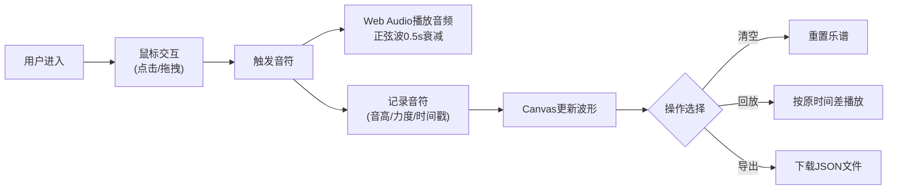

## 1. 产品概述

手势乐谱是一款基于Web的音乐创作应用，用户通过鼠标手势在虚拟钢琴键盘上演奏音乐，实时可视化旋律波形并记录音符。

- 主要目的：让用户无需实体乐器即可体验音乐创作，通过直观的手势交互演奏和记录音乐
- 目标用户：音乐爱好者、初学者、创意工作者
- 产品价值：降低音乐创作门槛，提供即时的视觉和听觉反馈，支持乐谱记录与分享

## 2. 核心功能

### 2.1 功能模块

1. **手势控制区**：虚拟钢琴键盘（12个半音，C4-B4），支持点击和拖拽演奏
2. **乐谱显示区**：Canvas波形可视化，实时显示演奏的音符和旋律曲线
3. **控制栏**：清空乐谱、回放录制、导出JSON三大核心操作
4. **音频引擎**：Web Audio API生成正弦波音频，支持自然衰减效果

### 2.2 页面详情

| 页面名称 | 模块名称 | 功能描述 |
|-----------|-------------|---------------------|
| 主页面 | 手势控制区 | 12键虚拟钢琴，支持点击/拖拽连续演奏，按键下压动画 |
| 主页面 | 乐谱显示区 | Canvas波形图，横轴时间/纵轴频率，自动滚动，音符标记 |
| 主页面 | 底部控制栏 | 清空乐谱、按原时间差回放、导出JSON文件 |

## 3. 核心流程

用户进入应用 → 鼠标点击或拖拽钢琴键演奏 → 实时播放音频并记录音符 → Canvas显示波形和音符标记 → 可选择清空/回放/导出乐谱

## 4. 用户界面设计

### 4.1 设计风格

- **颜色主题**：深蓝灰 + 绿色强调
  - 主背景：#0F172A
  - 卡片背景：#1E293B
  - 强调色：#10B981
  - 钢琴键渐变：#3B82F6 至 #1D4ED8
  - 文字：#E2E8F0
  - 控件背景：#334155，悬停#475569

- **按钮样式**：圆角8px，悬停0.2s过渡，点击缩放0.95倍
- **钢琴键样式**：圆角4px，宽高比1:4，激活时缩放至0.9、阴影加深
- **布局风格**：垂直分栏，上60vh手势区/下40vh乐谱区，1px #334155分隔线

### 4.2 页面设计概述

| 页面名称 | 模块名称 | UI元素 |
|-----------|-------------|-------------|
| 主页面 | 手势控制区 | 12个渐变钢琴键，左右对称布局，背景#1E293B，圆角12px，内边距16px，按键下压动画0.15s cubic-bezier |
| 主页面 | 乐谱显示区 | Canvas波形图，背景#0F172A，圆角12px，波形#10B981，频率线间距12px，自动向左滚动 |
| 主页面 | 底部控制栏 | 三个80x40px按钮：清空乐谱、回放、导出JSON，背景#1E293B，圆角8px |

### 4.3 响应式

- **桌面端**：上60vh手势区，下40vh乐谱区
- **移动端**（<768px）：上下各50vh等分，钢琴键最小宽度40px自适应缩小
- 所有交互带0.2s ease-out平滑过渡

### 4.4 动画与交互

- 按键下压：缩放至0.9，阴影加深至4px
- 松键回弹：0.15s cubic-bezier动画
- 音符卡片：从下方淡入乐谱区
- 按钮悬停：背景#475569，0.2s过渡
- 按钮点击：缩放0.95倍并恢复

## 5. 性能要求

- 手势触发到音频播放延迟 < 50ms
- Canvas波形更新保持 60fps
- 回放时音符间隔误差 ≤ 5ms
