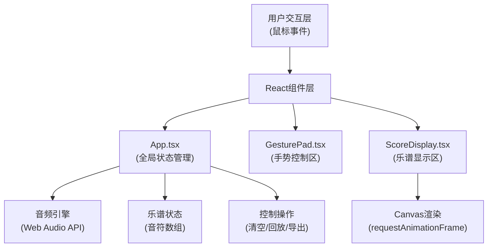

## 1. 架构设计



## 2. 技术描述

- **前端框架**：React 18 + TypeScript 5 + Vite 5
- **构建工具**：Vite 5 + @vitejs/plugin-react 4
- **音频处理**：Web Audio API（原生）
- **可视化**：HTML5 Canvas 2D
- **状态管理**：React useState/useRef（轻量级，无需额外状态库）
- **样式**：CSS Modules + 内联样式（遵循设计规范）

## 3. 项目结构

```
auto215/
├── package.json
├── index.html
├── vite.config.js
├── tsconfig.json
└── src/
    ├── main.tsx          # React入口
    ├── App.tsx           # 主布局组件，全局状态
    ├── GesturePad.tsx    # 手势控制区组件
    ├── ScoreDisplay.tsx  # 乐谱显示区组件
    └── types.ts          # 类型定义（新增）
```

## 4. 核心类型定义

```typescript
interface Note {
  id: string;
  pitch: number;      // 0-11 对应 C4-B4
  frequency: number;  // 计算出的频率
  velocity: number;   // 0-1 力度
  timestamp: number;  // 触发时间戳
  duration: number;   // 持续时间(ms)
}

type PlayNoteCallback = (pitch: number, velocity: number) => void;
```

## 5. 音频频率计算

十二平均律频率计算：
- A4 = 440Hz 为基准
- 半音间隔 = 2^(1/12)
- C4 = A4 * 2^(-9/12) = 440 * 2^(-0.75) ≈ 261.63Hz
- 频率公式：`frequency = 440 * Math.pow(2, (pitch - 9) / 12)`
  其中 pitch 0-11 对应 C4-B4

## 6. 核心模块说明

### 6.1 音频引擎（App.tsx内实现）
- 使用 `AudioContext` 创建振荡器
- 正弦波类型 `OscillatorNode`
- GainNode 控制音量包络（0.5秒自然衰减）
- 延迟优化：AudioContext 预初始化，避免首次点击延迟

### 6.2 手势控制区（GesturePad.tsx）
- 12个钢琴键，左右对称布局
- 鼠标事件：`onMouseDown` / `onMouseEnter`（拖拽时）
- 防重复触发：`lastTriggeredKey` ref 记录
- 按键动画：CSS transform + transition
- 宽高比1:4，使用padding-bottom技巧实现

### 6.3 乐谱显示区（ScoreDisplay.tsx）
- Canvas 2D 绘图
- `requestAnimationFrame` 60fps 循环
- 波形绘制：连接相邻音符频率点
- 频率线：12条水平参考线，间距12px
- 自动滚动：超出画布宽度时向左偏移
- 音符标记：垂直短线 + 音高标签

### 6.4 控制功能
- **清空乐谱**：重置音符数组，清空Canvas
- **回放**：使用 `setTimeout` 按原时间差调度，误差控制在5ms内
- **导出JSON**：`JSON.stringify` + Blob + `<a download>`

## 7. 性能优化策略

1. **音频延迟优化**：
   - 页面加载时即初始化 AudioContext
   - 复用 AudioContext 实例，不重复创建
   - 预计算所有12个音高的频率值

2. **Canvas性能优化**：
   - 使用 `requestAnimationFrame` 而非 `setInterval`
   - 离屏Canvas缓存静态元素（频率线）
   - 仅重绘变化区域（脏矩形优化）

3. **拖拽性能优化**：
   - 使用 `mousemove` 事件节流或 `pointermove`
   - 事件处理器保持轻量，避免重渲染

4. **回放精度优化**：
   - 使用 `performance.now()` 高精度时间戳
   - 计算累积延迟，动态调整下一个音符的播放时间

## 8. 响应式断点

| 断点 | 手势区高度 | 乐谱区高度 | 钢琴键最小宽度 |
|------|-----------|-----------|---------------|
| ≥768px | 60vh | 40vh | 60px |
| <768px | 50vh | 50vh | 40px |

## 9. 浏览器兼容性

- Web Audio API：Chrome 35+, Firefox 25+, Safari 14.1+
- Canvas 2D：所有现代浏览器
- 无需Polyfill，目标现代浏览器
