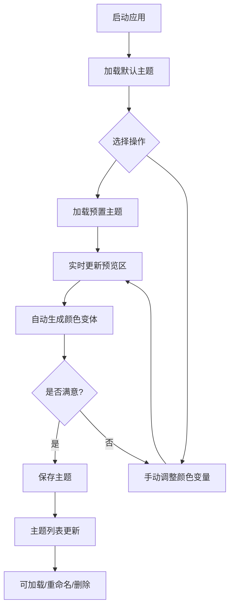

## 1. 产品概述

CSS颜色主题系统编辑器是一款面向UI/UX设计师的高效配色工具，帮助设计师在项目初期快速创建、预览和对比多种CSS颜色主题方案，解决手动调整配色时效率低、效果难以直观对比的问题。

- 目标用户：UI/UX设计师、前端开发者
- 核心价值：提升配色方案创建效率，提供实时预览和主题管理功能

## 2. 核心功能

### 2.1 用户角色

| 角色 | 注册方式 | 核心权限 |
|------|---------|---------|
| 普通用户 | 无需注册，本地使用 | 编辑颜色主题、预览效果、保存/加载主题 |

### 2.2 功能模块

1. **主题编辑面板**：颜色变量调整、预置色板选择、自动颜色变体生成
2. **实时预览区**：模拟UI界面展示、响应式颜色变化
3. **主题管理**：主题保存、加载、重命名、删除
4. **预置主题库**：5个内置主题方案

### 2.3 页面详情

| 页面名称 | 模块名称 | 功能描述 |
|---------|---------|---------|
| 主页面 | 主题编辑面板 | 5个核心颜色变量编辑、12色预设色板、颜色变体自动生成 |
| 主页面 | 实时预览区 | 卡片、按钮、输入框、导航栏的模拟UI展示 |
| 主页面 | 主题管理 | 保存主题为JSON、主题列表展示、加载/重命名/删除 |
| 主页面 | 分隔条 | 可拖拽调整左右面板宽度 |

## 3. 核心流程

用户打开应用 → 选择预置主题或手动调整颜色 → 实时查看预览效果 → 系统自动生成颜色变体 → 保存满意的主题方案 → 后续可加载已保存的主题继续编辑

## 4. 用户界面设计

### 4.1 设计风格

- **整体色调**：深色主题，背景#0F172A，文字主色#E2E8F0，辅助文字#94A3B8
- **按钮风格**：圆角8px，悬停时背景加深10%并上移1px，0.2s过渡动画
- **色块风格**：圆形/圆角方形，选中外圈发光，悬停放大效果
- **卡片风格**：圆角12-16px，柔和阴影，背景随主题变化
- **动画规范**：所有交互过渡时间0.2s-0.3s，动画曲线ease-out

### 4.2 页面设计概览

| 页面名称 | 模块名称 | UI元素 |
|---------|---------|-------|
| 主页面 | 左侧编辑面板(320px) | 颜色拾取器、12色色板、颜色变体网格、已保存主题列表 |
| 主页面 | 中间分隔条(3px) | 可拖拽，悬停变宽变紫 |
| 主页面 | 右侧预览区(自适应) | 导航栏(64px)、卡片(360px)、按钮、输入框 |

### 4.3 响应式设计

- 桌面优先设计，目标屏幕768px以上
- 左侧面板固定宽度320px，右侧预览区自适应
- 分隔条可拖拽调整比例

### 4.4 性能要求

- 颜色变量更新后预览区50ms内完成重新渲染
- 避免不必要的重渲染，优化组件更新
