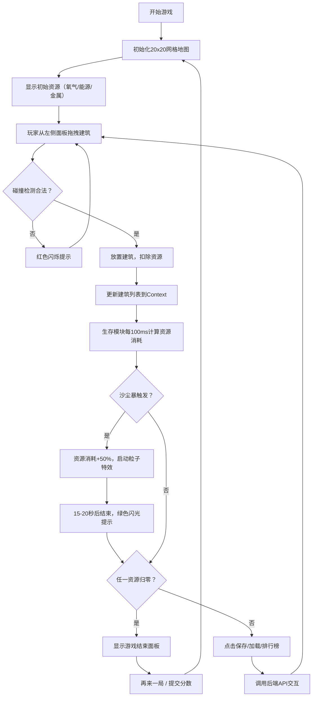

## 1. 产品概述

星尘拓荒是一款深度定制的太空殖民地模拟Web游戏，玩家通过在2.5D等距视角的面包板上拖拽放置功能建筑，精心管理氧气、能源和金属三项关键资源，在周期性沙尘暴事件中保障殖民地生存。

- 面向模拟经营游戏爱好者，填补"深度干预建造过程+直观视觉反馈"的市场空白
- 提供建造规划与生存模拟的双重玩法，兼顾策略性与紧张感

## 2. 核心特性

### 2.1 功能模块清单

1. **建造规划模块**：20x20网格地图渲染、建筑拖拽放置、碰撞检测、资源消耗预算预览
2. **生存模拟模块**：资源实时消耗计算、沙尘暴事件触发与警报提示、游戏结束判定
3. **殖民地存档系统**：保存/加载/删除殖民地状态
4. **全球排行榜系统**：按生存天数排名的前20名记录提交与查询

### 2.2 页面详情

| 页面名称 | 模块名称 | 功能描述 |
|-----------|-------------|---------------------|
| 主游戏界面 | 等距视角画布 | 2.5D面包板渲染，20x20半透明网格线（#334155，1px，间距40px） |
| 主游戏界面 | 资源状态条 | 氧气/能源/金属三种资源实时显示，带渐变填充条与数字跳动动画 |
| 主游戏界面 | 左侧建筑面板 | 宽度240px，滑入动画，展示可拖拽建筑（氧气塔、燃料精炼厂、居住舱等） |
| 主游戏界面 | 底部操作栏 | 保存/加载/排行榜按钮，高度64px，圆角12px |
| 主游戏界面 | 沙尘暴特效 | 半透明红色遮罩+30个粒子流向中心效果，结束时绿色闪光提示 |
| 加载模态框 | 存档列表 | 最近10个存档（存档时间+生存天数），点击载入恢复状态 |
| 排行榜模态框 | 排名列表 | 前20名玩家（排名、名称、生存天数），可通过遮罩或X按钮关闭 |
| 游戏结束面板 | 结果展示 | 毛玻璃效果，最终生存天数数字跳动动画，再来一局/提交分数按钮 |

## 3. 核心流程

## 4. 用户界面设计

### 4.1 设计风格

- **主色调**：深空暗色主题，背景色#0F172A，面板#1E293B
- **点缀色**：氧气#3B82F6（水滴蓝）、能源#F59E0B（闪电橙）、金属#10B981（六边形绿）、警报#EF4444（沙尘暴红）
- **按钮样式**：圆角8px，背景#334155，文字#E2E8F0，悬停变#475569，0.2s过渡
- **字体**：采用现代科幻风格无衬线字体，资源数字加粗强调
- **布局风格**：中心化画布布局，左侧建筑面板（滑入），顶部资源条，底部操作栏
- **动画**：统一0.3s cubic-bezier(0.4,0,0.2,1)缓动，放置时邻近建筑微动推开效果

### 4.2 页面设计概要

| 页面名称 | 模块名称 | UI元素 |
|-----------|-------------|-------------|
| 主游戏界面 | 等距画布 | 2.5D等距投影，半透明网格线，建筑阴影层次 |
| 主游戏界面 | 资源状态条 | 三色图标+渐变进度条+跳动数字（字号14px，间距16px） |
| 主游戏界面 | 左侧建筑面板 | 宽240px，背景#1E293B，圆角12px，内边距16px，0.3s ease-out滑入 |
| 主游戏界面 | 建筑卡片 | 48x48px图标，圆角8px，悬停放大1.1倍，0.2s过渡 |
| 主游戏界面 | 底部操作栏 | 高64px，背景#1E293B，圆角12px，按钮间距16px |
| 模态框 | 容器 | 背景#0F172A opacity 0.8，圆角16px，遮罩点击关闭 |
| 游戏结束 | 面板 | rgba(0,0,0,0.6)毛玻璃，backdrop-filter blur 8px，生存天数48px bold #F59E0B |
| 拖拽预览 | 指示框 | #3B82F6 opacity 0.5，2px虚线边框 |
| Toast | 提示 | 圆角8px，背景#065F46，绿色成功提示持续2s |

### 4.3 响应式设计

- 桌面端优先设计，最小支持宽度1280px
- 游戏画布区域自适应居中，保持等距比例
- 建筑面板与操作栏固定定位，不随画布滚动

### 4.4 特效设计

- **沙尘暴**：#EF4444 opacity 0.15全屏遮罩 + 30个#94A3B8粒子从边缘流向中心（速度0.5-2px/帧）
- **结束闪光**：沙尘暴结束时#10B981绿色闪光持续1s
- **资源跳动**：数值变化时0.3s内缩放1.15倍后恢复
- **建筑放置**：邻近建筑0.3s微动推开效果
- **非法位置**：红色闪烁提示
