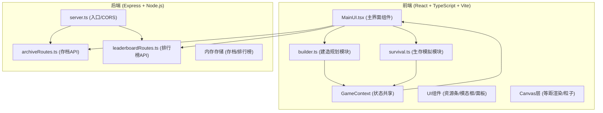

## 1. 架构设计



## 2. 技术栈说明

- **前端框架**：React@18 + TypeScript (严格模式)
- **构建工具**：Vite (端口3000，代理/api到后端5000)
- **网络请求**：Axios
- **状态管理**：React Context (共享建筑布局与资源状态)
- **渲染引擎**：HTML5 Canvas (2.5D等距视角、网格线、建筑、粒子系统)
- **样式方案**：内联样式 + CSS动画（深太空主题色）
- **后端框架**：Express@4
- **跨域配置**：CORS中间件
- **数据存储**：服务端内存存储（无需数据库，重启清空）

## 3. 文件结构与职责

```
project-root/
├── package.json                 # 前后端依赖+启动脚本
├── vite.config.js               # Vite构建配置(端口3000, 代理/api→5000)
├── tsconfig.json                # TypeScript严格模式配置
├── index.html                   # 入口页面(全屏暗色背景)
├── server.ts                    # Express入口, 监听5000, 注册路由, CORS
├── src/
│   ├── game/
│   │   ├── builder.ts           # 建造规划模块: 20x20网格, 拖拽, 碰撞检测, 资源预算
│   │   └── survival.ts          # 生存模拟模块: 100ms资源计算, 沙尘暴事件, 游戏结束判定
│   ├── ui/
│   │   └── MainUI.tsx           # 主界面: Canvas画布, 资源条, 操作栏, 模态框
│   ├── api/
│   │   ├── archiveRoutes.ts     # 存档路由: POST /save, GET /load/:id, DELETE /delete/:id
│   │   └── leaderboardRoutes.ts # 排行榜路由: GET /leaderboard, POST /leaderboard
│   ├── context/
│   │   └── GameContext.tsx      # Context定义: 建筑列表, 资源状态, 共享方法
│   ├── types/
│   │   └── index.ts             # TypeScript类型定义: Building, Resource, SaveData等
│   └── utils/
│       └── constants.ts         # 常量定义: 建筑配置, 资源初始值, 时间间隔
```

### 文件调用关系与数据流

1. **入口链**：`index.html` → `src/main.tsx` → `MainUI.tsx`
2. **建造数据流**：`MainUI.tsx`(接收拖拽) → `builder.ts`(处理/碰撞检测) → `GameContext`(更新建筑列表) → `survival.ts`(读取建筑计算消耗)
3. **生存数据流**：`survival.ts`(每100ms循环) → `GameContext`(更新资源值) → `MainUI.tsx`(渲染资源条)
4. **后端数据流**：`MainUI.tsx`(axios调用) → Vite代理 → `server.ts` → `archiveRoutes.ts`/`leaderboardRoutes.ts` → 内存存储

## 4. API接口定义

### 4.1 存档接口 (archiveRoutes.ts)

```typescript
// 保存殖民地
POST /api/save
Request Body: {
  buildings: Building[];
  resources: { oxygen: number; energy: number; metal: number };
  survivalDays: number;
  timestamp: number;
}
Response: { id: string; message: string }

// 加载存档
GET /api/load/:id
Response: {
  id: string;
  buildings: Building[];
  resources: { oxygen: number; energy: number; metal: number };
  survivalDays: number;
  timestamp: number;
}

// 删除存档
DELETE /api/delete/:id
Response: { success: boolean; message: string }

// 列出存档（最近10个）
GET /api/saves
Response: Array<{
  id: string;
  timestamp: number;
  survivalDays: number;
}>
```

### 4.2 排行榜接口 (leaderboardRoutes.ts)

```typescript
// 获取排行榜（前20名，按生存天数降序）
GET /api/leaderboard
Response: Array<{
  rank: number;
  playerName: string;
  survivalDays: number;
  submittedAt: number;
}>

// 提交分数
POST /api/leaderboard
Request Body: { playerName: string; survivalDays: number }
Response: { success: boolean; rank: number; message: string }
```

## 5. 核心数据模型

```typescript
// 建筑类型
interface Building {
  id: string;
  type: 'oxygen_tower' | 'fuel_refinery' | 'habitat' | 'solar_panel' | 'mining_drill';
  gridX: number;        // 网格左上角X (0-19)
  gridY: number;        // 网格左上角Y (0-19)
  size: 2 | 3;          // 占用2x2或3x3
  production: {
    oxygen: number;     // 每秒产量(+/-)
    energy: number;
    metal: number;
  };
  cost: {
    oxygen: number;     // 建造成本
    energy: number;
    metal: number;
  };
}

// 资源状态
interface Resources {
  oxygen: number;       // 当前值
  energy: number;
  metal: number;
  oxygenMax: number;    // 容量上限
  energyMax: number;
  metalMax: number;
}

// 沙尘暴状态
interface SandstormState {
  active: boolean;
  startTime: number;
  duration: number;     // 毫秒
  multiplier: number;   // 消耗倍率 (1.5)
}

// 存档数据
interface SaveData {
  id: string;
  buildings: Building[];
  resources: Resources;
  survivalDays: number;
  timestamp: number;
}

// 排行榜条目
interface LeaderboardEntry {
  playerName: string;
  survivalDays: number;
  submittedAt: number;
}
```

## 6. 性能与动画实现要点

### 6.1 游戏循环 (30FPS+ 目标)

- **资源计算**：`survival.ts` 使用 `setInterval` 每100ms执行一次，每帧执行时间 < 5ms
- **Canvas渲染**：`requestAnimationFrame` 驱动，每帧只重绘变化区域
- **粒子系统**：沙尘暴30个粒子，位置更新采用增量计算，避免对象创建
- **碰撞检测**：网格占位数组 `gridOccupied[20][20]`，O(1)查询

### 6.2 动画策略

- **UI过渡**：CSS transition (0.2-0.3s) 处理按钮悬停、面板滑入、模态框
- **Canvas动画**：`requestAnimationFrame` 线性插值，建筑放置推开效果用位移缓动
- **数字跳动**：CSS transform scale + transition，0.3s内 scale(1.15) → scale(1)
- **粒子效果**：每个粒子独立状态，随机速度0.5-2px/帧，从屏幕四边流向中心

### 6.3 2.5D等距投影公式

```typescript
// 网格坐标 (gx, gy) → 屏幕坐标 (sx, sy)
const TILE_W = 40;
const TILE_H = 20; // 等距投影的1/2高度比例
function gridToScreen(gx: number, gy: number) {
  const sx = (gx - gy) * TILE_W / 2 + CANVAS_OFFSET_X;
  const sy = (gx + gy) * TILE_H / 2 + CANVAS_OFFSET_Y;
  return { x: sx, y: sy };
}
```
