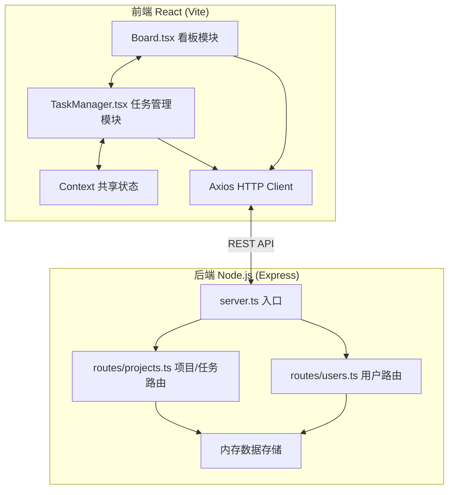
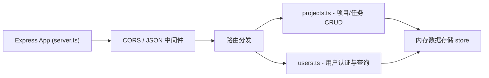
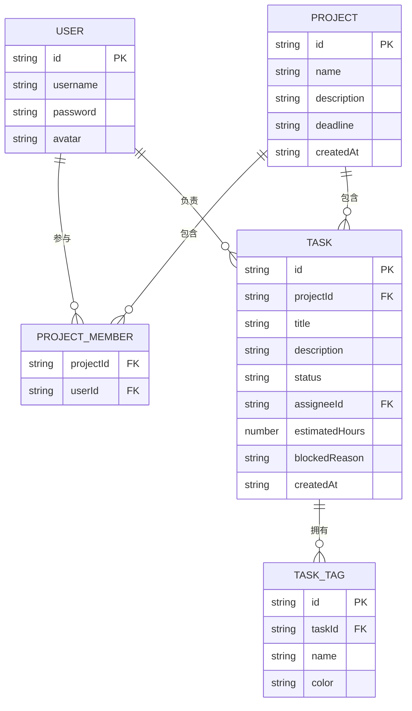

## 1. 架构设计



## 2. 技术说明
- 前端：React 18 + TypeScript + Vite
- 后端：Node.js + Express + TypeScript
- HTTP客户端：Axios
- 状态管理：React Context（共享项目和用户信息）
- 数据存储：内存存储（无持久化数据库，便于演示）
- 样式：原生 CSS + CSS Variables

## 3. 路由定义

| 路由 | 用途 |
|------|------|
| / | 看板主页 |
| /project/:id | 项目详情页 |
| /login | 登录页 |
| /register | 注册页 |

## 4. API 定义

```typescript
// 数据类型
interface User {
  id: string;
  username: string;
  password: string;
  avatar?: string;
}

interface Project {
  id: string;
  name: string;
  description: string;
  deadline: string;
  memberIds: string[];
  createdAt: string;
}

type TaskStatus = 'todo' | 'in-progress' | 'done';
type TagColor = 'red' | 'blue' | 'green' | 'orange' | 'purple';

interface TaskTag {
  id: string;
  name: string;
  color: TagColor;
}

interface Task {
  id: string;
  projectId: string;
  title: string;
  description?: string;
  status: TaskStatus;
  tags: TaskTag[];
  assigneeId?: string;
  estimatedHours: number;
  blockedReason?: string;
  createdAt: string;
}

// 用户 API
POST   /api/users/register      { username, password }       → User
POST   /api/users/login         { username, password }       → User
GET    /api/users                                          → User[]

// 项目 API
GET    /api/projects                                       → Project[]
POST   /api/projects        { name, description, deadline } → Project
PUT    /api/projects/:id    { name, description, deadline } → Project
DELETE /api/projects/:id                                            

// 任务 API
GET    /api/projects/:id/tasks                             → Task[]
POST   /api/projects/:id/tasks   { title, status, ... }    → Task
PUT    /api/tasks/:id        { status, tags, ... }         → Task
DELETE /api/tasks/:id
```

## 5. 服务端架构图



## 6. 数据模型

### 6.1 数据模型定义



### 6.2 初始化数据

启动时预置：
- 3个示例用户（Alice、Bob、Charlie）
- 1个示例项目
- 多个示例任务分布在三个状态列中
- 5种预设标签颜色映射
