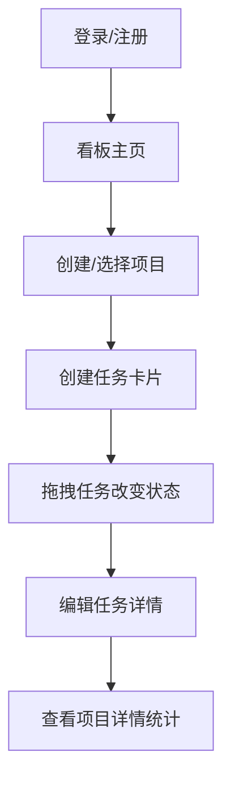

## 1. 产品概述
本产品是一个面向个人和小团队的简易项目管理与进度看板应用，解决通用表格或白板工具在任务流转、依赖关系和进度追踪方面的痛点。通过直观的看板视图、拖拽交互和结构化的任务管理，帮助团队高效协作。

- 目标用户：个人开发者、小团队（3-10人）
- 核心价值：直观的任务流转可视化、清晰的进度追踪、简洁高效的交互体验

## 2. 核心功能

### 2.1 用户角色

| 角色 | 注册方式 | 核心权限 |
|------|----------|----------|
| 普通用户 | 用户名+密码注册 | 创建/编辑项目、管理任务、查看看板 |

### 2.2 功能模块

1. **看板模块**：三列状态面板（待办、进行中、已完成），任务卡片拖拽，项目增删改查
2. **任务管理模块**：标签、负责人、工时、阻塞原因管理
3. **项目详情页**：成员列表、标签统计（SVG 圆环图）、任务列表
4. **用户系统**：注册、登录、用户列表

### 2.3 页面详情

| 页面名称 | 模块名称 | 功能描述 |
|----------|----------|----------|
| 登录/注册页 | 用户认证 | 用户名密码登录与注册 |
| 看板主页 | 看板模块 | 三列状态面板展示任务卡片，支持拖拽移动，项目管理 |
| 项目详情页 | 详情模块 | 左侧成员和统计图面板，右侧任务列表 |
| 任务编辑弹框 | 任务管理 | 编辑标签、负责人、工时、阻塞信息 |

## 3. 核心流程

用户注册/登录 → 进入看板主页 → 创建或选择项目 → 在看板中创建任务卡片 → 拖拽任务改变状态 → 点击任务编辑标签、负责人、工时、阻塞信息 → 查看项目详情页了解统计和成员信息

## 4. 用户界面设计

### 4.1 设计风格
- 主色调：深蓝灰（#0F172A、#1E293B、#334155）+ 白色（#F8FAFC、#E2E8F0）
- 强调色：#6366F1（靛蓝色）
- 标签色：红#EF4444、蓝#3B82F6、绿#10B981、橙#F59E0B、紫#8B5CF6
- 按钮：圆角8px、文字#E2E8F0、背景#334155、悬停#475569（0.2s过渡）、点击缩放0.95
- 卡片：280px宽、圆角12px、内边距16px、悬停上移3px（0.3s阴影过渡）
- 布局：顶部导航+主内容区，桌面端三列横向、移动端纵向堆叠

### 4.2 页面设计概览

| 页面名称 | 模块名称 | UI 元素 |
|----------|----------|---------|
| 看板主页 | 状态列面板 | 三列卡片布局、拖拽区域、卡片悬停动效、从右滑入动画 |
| 看板主页 | 任务卡片 | 标签、负责人头像、阻塞指示条、工时信息 |
| 项目详情 | 左侧面板 | 260px宽、#1E293B背景、成员头像列表、SVG圆环统计图 |
| 任务编辑 | 表单 | 标签选择、负责人下拉、工时数字输入、阻塞原因文本框 |

### 4.3 响应式
桌面优先设计，宽度<768px时三列状态面板改为纵向堆叠排列。

### 4.4 性能要求
- 看板页面2秒内可交互
- 拖拽帧率≥30FPS
- 卡片拖动时半透明跟随鼠标，释放弹性动画落位
