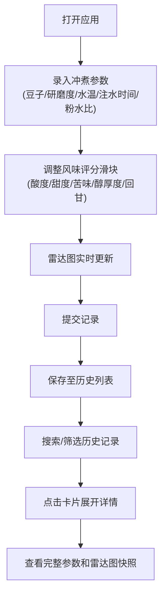

## 1. 产品概述

咖啡冲煮日志是一款为咖啡爱好者打造的个性化冲煮记录与分析工具，帮助用户系统地记录手冲咖啡参数并通过可视化风味雷达图对比不同冲煮方案的风味表现，从而找到最适配个人口味的冲煮配方。

- 核心目标：让咖啡爱好者能够精准记录每次冲煮的参数与风味评价，通过数据可视化找到最佳冲煮方案
- 目标用户：手冲咖啡爱好者、精品咖啡玩家
- 产品价值：通过结构化记录和可视化分析，提升冲煮技术，复刻满意的咖啡风味

## 2. 核心功能

### 2.1 用户角色
| 角色 | 注册方式 | 核心权限 |
|------|----------|----------|
| 普通用户 | 无需注册，本地使用 | 记录冲煮参数、查看历史记录、搜索筛选、风味对比分析 |

### 2.2 功能模块
1. **主界面**：参数录入表单、实时风味雷达图、搜索筛选栏、历史记录列表
2. **参数录入**：豆子品种、研磨度、水温、注水时间、粉水比输入
3. **风味评价**：酸度、甜度、苦味、醇厚度、回甘五个维度的滑块评分
4. **雷达图可视化**：Canvas绘制五边形雷达图，实时响应评分变化，支持动画过渡
5. **历史记录**：卡片式展示冲煮记录，支持展开查看完整参数和历史雷达图快照
6. **搜索筛选**：按豆子名称、日期范围精确查找历史记录

### 2.3 页面详情
| 页面名称 | 模块名称 | 功能描述 |
|----------|----------|----------|
| 主页面 | 参数录入表单 | 录入豆子名称、研磨度、水温、注水时间、粉水比，调整五维风味评分 |
| 主页面 | 风味雷达图 | 实时显示当前评分的五边形雷达图，评分变化时平滑动画过渡 |
| 主页面 | 搜索筛选栏 | 支持按豆子名称搜索、日期范围筛选历史记录 |
| 主页面 | 历史记录列表 | 卡片式展示记录，点击展开完整参数和雷达图快照，分页加载 |

## 3. 核心流程

用户打开应用后，在左侧表单录入本次冲煮的参数信息，通过滑块调整五个风味维度的评分，右侧雷达图实时更新展示风味分布。提交后，记录保存到历史列表中。用户可以通过搜索和筛选功能查找特定记录，点击卡片可展开查看完整参数和当时的风味雷达图快照。

## 4. 用户界面设计

### 4.1 设计风格
- **主色调**：蓝灰色 #1E293B，搭配琥珀色 #F59E0B 作为强调色
- **整体主题**：深色主题，背景色 #0F172A
- **按钮/输入框/滑块**：圆角 8px，悬停时背景变为 #374151，0.2s 颜色过渡
- **交互动画**：点击按钮有 0.1s 缩放动画（缩放至 0.95 倍再弹回）
- **卡片样式**：背景 #1F2937，圆角 12px，悬停上浮 2px 并增加阴影

### 4.2 页面设计概览
| 页面名称 | 模块名称 | UI元素 |
|----------|----------|--------|
| 主页面 | 布局容器 | 左右分栏布局（桌面端），单列布局（移动端） |
| 主页面 | 参数表单 | 背景 #1E293B，圆角 12px，内边距 20px |
| 主页面 | 雷达图 | Canvas 320x320px，背景 #0F172A，圆角 16px，网格线 #334155，连线渐变 #FCD34D→#F59E0B |
| 主页面 | 记录卡片 | 宽度 280px，最小高度 160px，背景 #1F2937，圆角 12px |
| 主页面 | 搜索栏 | 输入框+日期选择器，圆角 8px |
| 主页面 | 无结果提示 | 颜色 #64748B，字号 14px |

### 4.3 响应式设计
- **桌面端**（≥768px）：左右两栏布局，左侧表单，右侧雷达图，下方卡片网格
- **移动端**（<768px）：单列布局，表单在上，雷达图在中，卡片列表在下，卡片宽度自适应至 90%
- **触控优化**：滑块和按钮尺寸适配触控操作，最小点击区域 44x44px

### 4.4 性能要求
- 雷达图渲染帧率不低于 50fps
- 历史记录分页加载，每页 12 条
- 评分滑块拖拽时连线颜色渐变过渡 0.15s
- 卡片悬停过渡 0.2s ease-out
