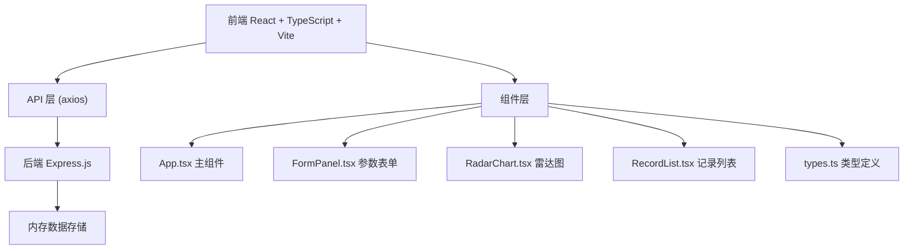
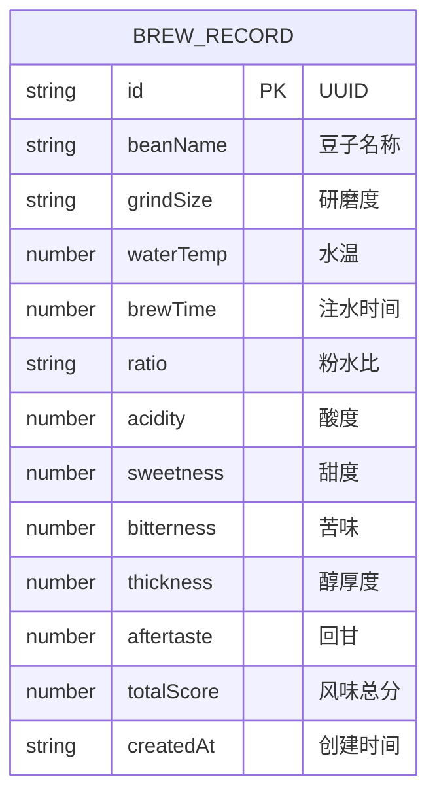

## 1. 架构设计



## 2. 技术描述

- **前端**：React 18 + TypeScript + Vite
- **初始化工具**：Vite
- **后端**：Express.js 4.x
- **数据存储**：内存数组（开发环境）
- **HTTP 客户端**：axios
- **样式方案**：原生 CSS + CSS 变量

## 3. 路由定义

| 路由 | 用途 |
|------|------|
| / | 主页面，包含参数表单、雷达图、搜索栏、记录列表 |

## 4. API 定义

### 4.1 类型定义

```typescript
// 风味评分
interface FlavorRatings {
  acidity: number;      // 酸度 0-10
  sweetness: number;    // 甜度 0-10
  bitterness: number;   // 苦味 0-10
  thickness: number;    // 醇厚度 0-10
  aftertaste: number;   // 回甘 0-10
}

// 冲煮参数
interface BrewParams {
  beanName: string;     // 豆子名称
  grindSize: string;    // 研磨度
  waterTemp: number;    // 水温 (°C)
  brewTime: number;     // 注水时间 (秒)
  ratio: string;        // 粉水比
}

// 冲煮记录
interface BrewRecord extends BrewParams {
  id: string;
  createdAt: string;
  ratings: FlavorRatings;
  totalScore: number;
}

// 筛选条件
interface FilterParams {
  keyword?: string;
  startDate?: string;
  endDate?: string;
  page?: number;
  pageSize?: number;
}
```

### 4.2 API 接口

| 方法 | 路径 | 描述 | 请求参数 | 返回数据 |
|------|------|------|----------|----------|
| GET | /api/records | 获取记录列表 | page, pageSize | { data: BrewRecord[], total: number } |
| POST | /api/records | 提交新记录 | BrewParams + ratings | { success: boolean, data: BrewRecord } |
| GET | /api/records/search | 搜索记录 | keyword, startDate, endDate, page, pageSize | { data: BrewRecord[], total: number } |

## 5. 服务器架构图


## 6. 数据模型

### 6.1 数据模型定义



### 6.2 项目文件结构

```
auto224/
├── package.json
├── index.html
├── vite.config.js
├── tsconfig.json
├── src/
│   ├── App.tsx          # 主组件
│   ├── FormPanel.tsx    # 参数录入表单
│   ├── RadarChart.tsx   # 风味雷达图
│   ├── RecordList.tsx   # 历史记录列表
│   ├── types.ts         # 类型定义
│   └── api.ts           # API 封装
└── server/
    ├── package.json
    ├── index.js         # Express 入口
    └── routes/
        └── records.js   # REST API 路由
```
