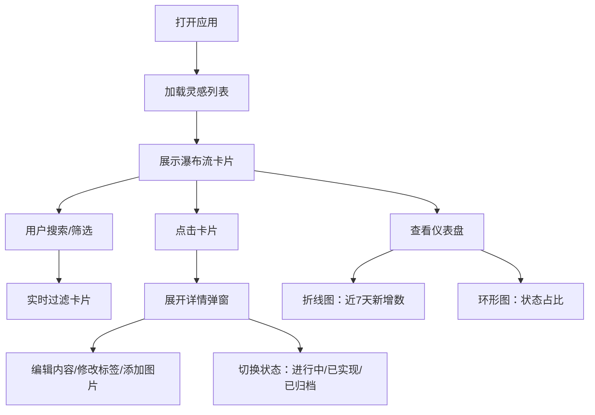

## 1. 产品概述

灵感收集器是一款面向小型团队和个人的创意灵感管理应用，解决创意想法分散在便签、聊天记录和白板上，缺乏统一管理、分类和回顾机制的问题。

- 核心目的：帮助用户快速捕捉、组织和回顾创意灵感，避免好点子被遗忘
- 目标用户：创意工作者、产品经理、设计师、开发者及任何需要管理创意的个人或小团队
- 产品价值：提供统一的灵感管理平台，支持分类、搜索、状态追踪和数据可视化分析

## 2. 核心功能

### 2.1 用户角色

| 角色 | 注册方式 | 核心权限 |
|------|---------|---------|
| 普通用户 | 无需注册（本地存储） | 创建、编辑、删除、搜索灵感，查看统计数据 |

### 2.2 功能模块

1. **灵感面板模块**：瀑布流卡片展示所有灵感，支持详情查看和编辑
2. **灵感管理模块**：分类标签筛选、全文搜索、状态标记（进行中/已实现/已归档）
3. **仪表盘模块**：折线图展示近7天新增灵感数，环形图展示各状态灵感占比

### 2.3 页面详情

| 页面名称 | 模块名称 | 功能描述 |
|---------|---------|---------|
| 主页面 | 顶部导航栏 | 应用名称、灵感数量统计、移动端汉堡菜单 |
| 主页面 | 搜索筛选区 | 全文搜索框（400px宽）、预设标签筛选（设计/技术/商业/个人） |
| 主页面 | 灵感瀑布流 | 卡片瀑布流展示（280px宽，自适应高度），悬停动画效果 |
| 主页面 | 详情弹窗 | 点击卡片展开详情，可编辑内容、添加图片、修改标签 |
| 主页面 | 仪表盘 | 折线图（400x250px）展示每日新增，环形图（200x200px）展示状态占比 |

## 3. 核心流程

用户打开应用 → 浏览瀑布流中的灵感卡片 → 通过搜索框或标签筛选定位目标灵感 → 点击卡片查看详情/编辑 → 切换灵感状态 → 在仪表盘查看统计趋势

## 4. 用户界面设计

### 4.1 设计风格

- **主题**：暗色主题，专业深邃的视觉感受
- **主背景**：#0F172A（深蓝黑），辅助背景：#1E293B（深灰蓝）
- **主要文字**：#E2E8F0（浅灰白），次要文字：#94A3B8（灰蓝）
- **强调色**：#6366F1（靛蓝）、#8B5CF6（紫色）、#10B981（绿色-进行中）、#3B82F6（蓝色-已实现）、#6B7280（灰色-已归档）
- **按钮样式**：圆角8px，背景#334155，悬停#475569，点击缩放0.95倍，0.2s过渡
- **字体**：现代无衬线字体，清晰易读
- **布局**：顶部固定导航栏 + 主内容区瀑布流布局
- **图标风格**：简约线性图标

### 4.2 页面设计概览

| 页面名称 | 模块名称 | UI 元素 |
|---------|---------|---------|
| 主页面 | 导航栏 | 高度64px，毛玻璃效果（backdrop-filter blur 8px），底部1px边框#334155，透明度0.5 |
| 主页面 | 灵感卡片 | 280px宽，最小160px高，背景#1E293B，圆角12px，内边距16px，悬停阴影加深+上浮3px（0.3s cubic-bezier过渡） |
| 主页面 | 标签筛选 | 32x32px圆形色块，选中时外圈发光#6366F1，0.2s背景色过渡 |
| 主页面 | 搜索框 | 400px宽，背景#0F172A，圆角8px，内边距12px，0.15s结果更新延迟 |
| 主页面 | 状态条 | 卡片左侧5px宽彩色条：进行中#10B981、已实现#3B82F6、已归档#6B7280 |
| 主页面 | 详情弹窗 | 背景#334155，圆角16px，内边距24px，0.2s缩放动画 |
| 主页面 | 折线图 | Canvas绘制，400x250px，背景#0F172A，圆角12px，线条#8B5CF6，数据点#A78BFA |
| 主页面 | 环形图 | Canvas绘制，200x200px，背景#0F172A，圆形，渐变色系切片 |
| 主页面 | Tooltip | 背景#1E293B，圆角6px，内边距8px，文字#E2E8F0，字体12px |

### 4.3 响应式设计

- **桌面端**：瀑布流3列布局
- **平板/移动端**（768px断点）：瀑布流2列布局
- **移动端导航**：折叠为汉堡菜单
- **触控优化**：按钮和可点击区域最小44x44px

### 4.4 性能要求

- 灵感面板渲染50张以内卡片时间 ≤ 200ms
- 折线图重绘帧率 ≥ 30fps
- 图表每整点自动刷新
