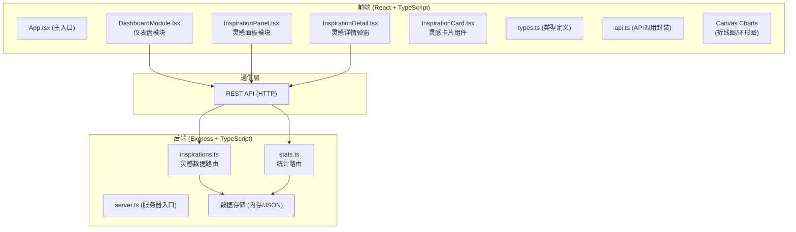
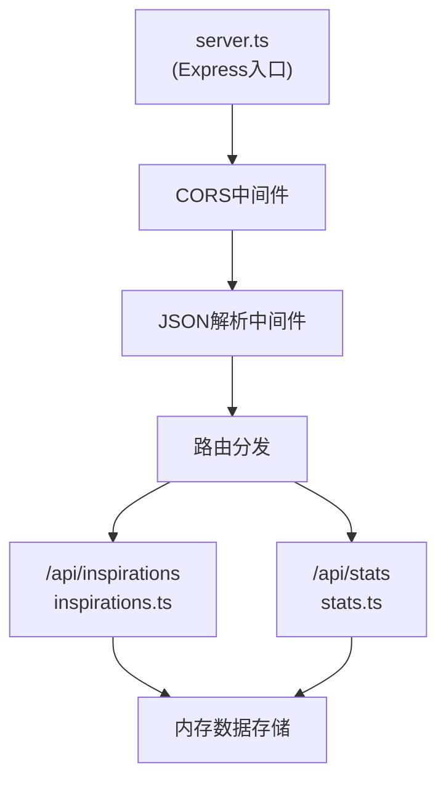
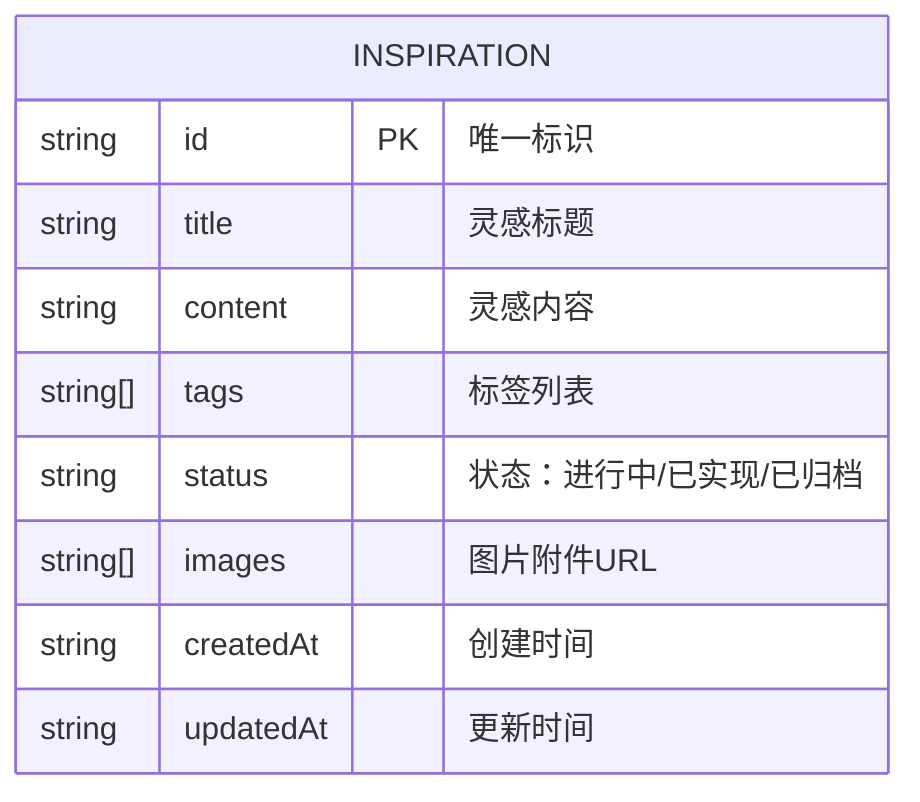

## 1. 架构设计



## 2. 技术描述

- **前端**：React 18 + TypeScript + Vite
- **图表库**：recharts（作为备选，主要使用Canvas原生绘制）
- **HTTP客户端**：axios
- **构建工具**：Vite
- **后端**：Express 4 + TypeScript
- **后端中间件**：cors
- **ID生成**：uuid（前端）、unique-slug（后端）
- **样式方案**：原生CSS（CSS Modules或全局CSS）
- **状态管理**：React Hooks（useState、useEffect），组件间通过props传递

## 3. 路由定义

| 路由 | 用途 |
|------|------|
| / | 主页面，包含所有功能模块 |

## 4. API 定义

### 4.1 灵感相关接口

#### GET /api/inspirations
获取灵感列表，支持筛选
- Query参数：
  - `tag` (可选)：按标签筛选，如 "设计"、"技术"、"商业"、"个人"
  - `status` (可选)：按状态筛选，如 "进行中"、"已实现"、"已归档"
  - `search` (可选)：全文搜索关键词
- 响应：
```typescript
interface Inspiration {
  id: string;
  title: string;
  content: string;
  tags: string[];
  status: '进行中' | '已实现' | '已归档';
  images: string[];
  createdAt: string;
  updatedAt: string;
}

type Response = Inspiration[];
```

#### POST /api/inspirations
创建新灵感
- 请求体：
```typescript
interface CreateInspirationRequest {
  title: string;
  content: string;
  tags: string[];
  status?: '进行中' | '已实现' | '已归档';
  images?: string[];
}
```
- 响应：`Inspiration`

#### PUT /api/inspirations/:id
更新灵感
- 请求体：
```typescript
interface UpdateInspirationRequest {
  title?: string;
  content?: string;
  tags?: string[];
  status?: '进行中' | '已实现' | '已归档';
  images?: string[];
}
```
- 响应：`Inspiration`

#### DELETE /api/inspirations/:id
删除灵感
- 响应：`{ success: boolean }`

### 4.2 统计相关接口

#### GET /api/stats/daily
获取近N天每日新增灵感数
- Query参数：
  - `days` (可选，默认7)：统计天数
- 响应：
```typescript
interface DailyStats {
  date: string;  // YYYY-MM-DD
  count: number;
}

type Response = DailyStats[];
```

#### GET /api/stats/status
获取各状态灵感数量
- 响应：
```typescript
interface StatusStats {
  '进行中': number;
  '已实现': number;
  '已归档': number;
}

type Response = StatusStats;
```

## 5. 服务器架构图



## 6. 数据模型

### 6.1 数据模型定义



### 6.2 初始数据

后端启动时内置若干示例灵感数据，方便前端联调测试：
- 包含不同标签（设计、技术、商业、个人）
- 包含不同状态（进行中、已实现、已归档）
- 覆盖近7天的创建日期

## 7. 项目文件结构

```
auto226/
├── package.json
├── index.html
├── vite.config.js
├── tsconfig.json
├── client/
│   ├── src/
│   │   ├── App.tsx
│   │   ├── main.tsx
│   │   ├── types.ts
│   │   ├── api.ts
│   │   ├── index.css
│   │   └── components/
│   │       ├── InspirationPanel.tsx
│   │       ├── InspirationCard.tsx
│   │       ├── InspirationDetail.tsx
│   │       ├── DashboardModule.tsx
│   │       ├── LineChart.tsx
│   │       ├── DonutChart.tsx
│   │       └── Navbar.tsx
└── server/
    ├── server.ts
    ├── data.ts
    └── routes/
        ├── inspirations.ts
        └── stats.ts
```

## 8. 启动脚本

```bash
npm install    # 安装所有依赖
npm run dev    # 同时启动前端Vite开发服务器和后端Express服务器
```

## 9. 性能优化策略

1. **灵感卡片列表**：使用React.memo优化卡片组件渲染，避免不必要的重渲染
2. **搜索防抖**：搜索输入框使用debounce（0.15s延迟），减少API调用频率
3. **Canvas图表**：使用原生Canvas绘制，保证30fps以上帧率
4. **图表刷新**：整点刷新时使用requestAnimationFrame保证流畅性
5. **瀑布流布局**：使用CSS Grid或CSS Columns实现高性能瀑布流
