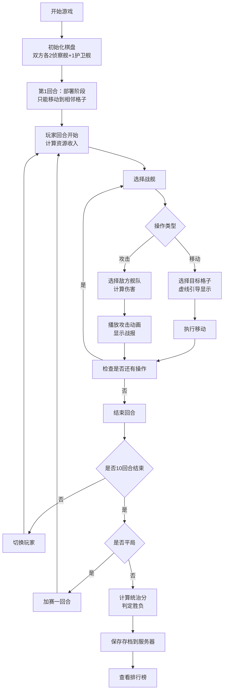

## 1. 产品概述

银河帝国策略棋盘游戏是一款在浏览器中运行的双人回合制策略游戏，玩家在4x4虚拟星图上部署舰队、进行星际战争并争夺资源。通过战术决策和资源管理，玩家需要在10回合内获得更高统治分以获胜。

- 主要目的：提供沉浸式星际策略对战体验，考验玩家的战术规划和资源管理能力
- 目标用户：策略游戏爱好者、桌面游戏玩家、休闲竞技玩家
- 产品价值：结合经典战棋玩法与科幻主题，提供便捷的浏览器端双人对战体验

## 2. 核心特性

### 2.1 用户角色

| 角色 | 注册方式 | 核心权限 |
|------|----------|----------|
| 玩家1 | 本地游戏 | 控制左上基地，部署蓝色舰队 |
| 玩家2 | 本地游戏 | 控制右下基地，部署红色舰队 |

### 2.2 功能模块

1. **主菜单模块**：游戏开始、排行榜查看、操作说明
2. **游戏棋盘模块**：4x4星图渲染、行星显示、舰队驻扎展示
3. **战斗系统模块**：战舰移动、攻击计算、战报展示
4. **资源管理模块**：资源收入计算、战舰建造、舰队升级
5. **回合管理模块**：回合切换、部署阶段控制、胜负判定
6. **排行榜模块**：游戏记录存储、排名展示、自动刷新
7. **游戏存档模块**：存档保存、游戏加载

### 2.3 页面详情

| 页面名称 | 模块名称 | 功能描述 |
|----------|----------|----------|
| 主菜单页 | 主菜单模块 | 开始新游戏、查看排行榜、游戏规则说明 |
| 游戏主页面 | 游戏棋盘模块 | 渲染4x4星图、显示行星类型和驻留舰队、响应点击选中 |
| 游戏主页面 | 战斗系统模块 | 处理战舰移动、攻击逻辑、战报动画播放 |
| 游戏主页面 | 资源管理模块 | 显示资源数、建造战舰、资源收入计算 |
| 游戏主页面 | 回合管理模块 | 显示回合数、结束回合、胜负判定 |
| 游戏结束弹窗 | 回合管理模块 | 显示最终得分、获胜方、保存存档 |
| 排行榜页 | 排行榜模块 | 展示历史游戏记录、按统治分排序、5秒自动刷新 |

## 3. 核心流程

## 4. 用户界面设计

### 4.1 设计风格

- **设计主题**：深空科幻风格，营造宇宙战场氛围
- **主色调**：深空蓝黑渐变 `#0B0C10` → `#1F2833` 径向渐变背景
- **强调色**：青色 `#66FCF1`（选中高亮、移动路径）、蓝绿色 `#45A29E`（边框）
- **文字色**：浅灰 `#C5C6C7`（正文）、纯白 `#FFFFFF`（战报）
- **行星区分**：中立🪐灰色、友方🌏蓝色、敌方🔥红色
- **按钮风格**：圆角8px，悬停背景变亮20%，点击缩放0.95，过渡0.2s

### 4.2 字体与排版

- **标题字体**：Orbitron 或类似科幻字体，24px粗体
- **正文字体**：Rajdhani 或现代无衬线字体，16px
- **资源显示**：16px粗体，`#C5C6C7`
- **战报文字**：18px，白色居中，淡入淡出动画

### 4.3 页面设计概述

| 页面名称 | 模块名称 | UI元素 |
|----------|----------|--------|
| 游戏主页面 | 顶部资源栏 | 资源图标、资源数值、回合数、当前玩家指示 |
| 游戏主页面 | 战报区域 | 战报文字、淡入淡出动画、2秒后自动消失 |
| 游戏主页面 | 4x4棋盘区域 | 60x60px格子、圆角8px、`#45A29E`边框、行星emoji、舰队图标 |
| 游戏主页面 | 选中状态 | 格子外围`#66FCF1`发光效果 |
| 游戏主页面 | 战舰选中 | 格子底部亮绿色光圈旋转动画（45度，1s无限循环） |
| 游戏主页面 | 移动路径 | `#66FCF1`虚线，透明度0.6 |
| 游戏主页面 | 攻击动画 | 红色闪烁2次，每次0.3秒 |
| 游戏主页面 | 底部操作栏 | 建造按钮、结束回合按钮、资源消耗提示 |
| 游戏结束弹窗 | 得分面板 | 双方统治分详情、获胜方标识、保存存档按钮 |
| 排行榜页 | 排行榜表格 | 玩家名、回合数、获胜方、游戏时长、统治分 |

### 4.4 动画效果

- **页面加载**：棋盘格子逐个淡入，staggered动画
- **战舰移动**：平滑过渡，使用requestAnimationFrame
- **攻击效果**：红色闪烁 + 数值跳动
- **战报显示**：fadeIn 0.3s → 停留1.4s → fadeOut 0.3s
- **按钮交互**：hover变亮，click缩放0.95，过渡0.2s
- **选中光圈**：旋转45度，1s infinite

### 4.5 响应式设计

- 桌面端优先，棋盘固定尺寸
- 移动端适配：棋盘缩放、触控优化
- 最小支持宽度：320px
