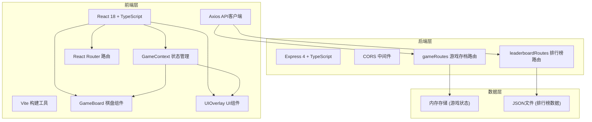
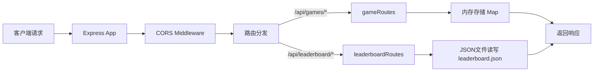
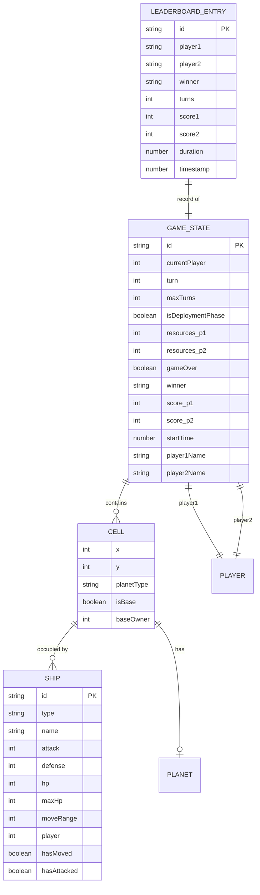

## 1. 架构设计



## 2. 技术描述

- **前端框架**：React 18 + TypeScript 5 + Vite 5
- **状态管理**：React Context API (GameContext)
- **路由**：React Router DOM 6
- **HTTP客户端**：Axios 1.6
- **后端框架**：Express 4 + TypeScript
- **中间件**：CORS 2.8
- **唯一ID**：UUID 9.0
- **数据存储**：内存存储(游戏状态) + JSON文件(排行榜)
- **开发工具**：@vitejs/plugin-react 4

## 3. 项目结构

```
auto228/
├── package.json          # 根目录依赖配置
├── index.html            # 入口HTML，深色星空背景
├── vite.config.js        # Vite配置，代理/api到3001端口
├── tsconfig.json         # TypeScript严格模式配置
├── src/
│   ├── main.tsx          # React入口文件
│   ├── App.tsx           # 根组件，路由配置
│   ├── types/            # TypeScript类型定义
│   │   └── game.ts       # 游戏相关类型
│   ├── context/
│   │   └── GameContext.tsx    # 游戏全局状态共享
│   ├── components/
│   │   ├── GameBoard.tsx     # 4x4棋盘渲染组件
│   │   ├── UIOverlay.tsx     # UI覆盖层组件
│   │   ├── MainMenu.tsx      # 主菜单组件
│   │   └── Leaderboard.tsx   # 排行榜组件
│   ├── utils/
│   │   ├── gameLogic.ts      # 游戏核心逻辑
│   │   └── animation.ts      # 动画工具函数
│   └── api/
│       └── client.ts         # Axios API客户端
└── server/
    ├── server.ts             # Express应用入口
    ├── routes/
    │   ├── gameRoutes.ts      # 游戏存档路由
    │   └── leaderboardRoutes.ts  # 排行榜路由
    ├── data/
    │   └── leaderboard.json   # 排行榜数据文件
    └── types/
        └── index.ts           # 后端类型定义
```

## 4. 路由定义

### 前端路由

| 路由 | 组件 | 用途 |
|------|------|------|
| `/` | MainMenu | 主菜单页面 |
| `/game` | GameBoard + UIOverlay | 游戏主页面 |
| `/leaderboard` | Leaderboard | 排行榜页面 |

### 后端API路由

| 路由 | 方法 | 用途 |
|------|------|------|
| `/api/games` | POST | 创建新游戏存档 |
| `/api/games/:id` | GET | 加载指定游戏存档 |
| `/api/games/:id` | PUT | 更新游戏存档 |
| `/api/leaderboard` | GET | 获取排行榜列表 |
| `/api/leaderboard` | POST | 新增排行榜记录 |
| `/api/leaderboard/:id` | DELETE | 删除指定排行榜记录 |

## 5. API定义

### 5.1 类型定义

```typescript
// 战舰类型
type ShipType = 'scout' | 'frigate' | 'capital';

// 战舰属性
interface Ship {
  id: string;
  type: ShipType;
  name: string;
  attack: number;
  defense: number;
  hp: number;
  maxHp: number;
  moveRange: number;
  player: 1 | 2;
  hasMoved: boolean;
  hasAttacked: boolean;
}

// 行星类型
type PlanetType = 'neutral' | 'friendly1' | 'friendly2' | 'enemy1' | 'enemy2';

// 棋盘格子
interface Cell {
  x: number;
  y: number;
  planet: PlanetType | null;
  ships: Ship[];
  isBase: boolean;
  baseOwner?: 1 | 2;
}

// 游戏状态
interface GameState {
  id: string;
  board: Cell[][];
  currentPlayer: 1 | 2;
  turn: number;
  maxTurns: number;
  isDeploymentPhase: boolean;
  resources: { player1: number; player2: number };
  selectedCell: { x: number; y: number } | null;
  selectedShip: Ship | null;
  battleReport: string | null;
  gameOver: boolean;
  winner: 1 | 2 | 'draw' | null;
  scores: { player1: number; player2: number };
  startTime: number;
  playerNames: { player1: string; player2: string };
}

// 排行榜记录
interface LeaderboardEntry {
  id: string;
  player1: string;
  player2: string;
  winner: string;
  turns: number;
  score1: number;
  score2: number;
  duration: number;
  timestamp: number;
}

// 战舰配置
const SHIP_CONFIGS: Record<ShipType, Omit<Ship, 'id' | 'player' | 'hasMoved' | 'hasAttacked'>> = {
  scout: { type: 'scout', name: '侦察舰', attack: 2, defense: 1, hp: 5, maxHp: 5, moveRange: 3 },
  frigate: { type: 'frigate', name: '护卫舰', attack: 4, defense: 3, hp: 10, maxHp: 10, moveRange: 2 },
  capital: { type: 'capital', name: '主力舰', attack: 8, defense: 5, hp: 20, maxHp: 20, moveRange: 1 },
};

// 建造成本
const SHIP_COSTS: Record<ShipType, number> = {
  scout: 3,
  frigate: 6,
  capital: 10,
};

// 舰队价值（用于计算统治分）
const SHIP_VALUES: Record<ShipType, number> = {
  scout: 1,
  frigate: 3,
  capital: 6,
};
```

### 5.2 请求/响应格式

**创建游戏存档**
- `POST /api/games`
- 请求体：`GameState`
- 响应：`{ success: boolean; gameId: string }`

**加载游戏存档**
- `GET /api/games/:id`
- 响应：`{ success: boolean; game: GameState }`

**更新游戏存档**
- `PUT /api/games/:id`
- 请求体：`Partial<GameState>`
- 响应：`{ success: boolean; game: GameState }`

**获取排行榜**
- `GET /api/leaderboard`
- 响应：`{ success: boolean; entries: LeaderboardEntry[] }`

**新增排行榜记录**
- `POST /api/leaderboard`
- 请求体：`LeaderboardEntry`
- 响应：`{ success: boolean; entry: LeaderboardEntry }`

**删除排行榜记录**
- `DELETE /api/leaderboard/:id`
- 响应：`{ success: boolean }`

## 6. 服务器架构



## 7. 数据模型

### 7.1 实体关系图



### 7.2 核心数据结构说明

**GameState（游戏状态）**
- 完整的游戏快照，可序列化用于存档
- 包含棋盘、回合、资源、玩家信息
- 前端Context以此为核心状态

**Cell（棋盘格子）**
- 4x4网格的基本单元
- 包含行星信息、驻扎舰队、基地标记

**Ship（战舰）**
- 三种类型：侦察舰、护卫舰、主力舰
- 每种有独特的攻击、防御、移动属性
- 标记每回合是否已移动/攻击

**LeaderboardEntry（排行榜记录）**
- 游戏结束后持久化存储
- 包含玩家名、回合数、得分、游戏时长
- 按统治分降序排列

## 8. 性能优化策略

### 8.1 前端优化
- `React.memo` 包装 `GameBoard` 和 `Cell` 组件，避免不必要重渲染
- 战舰移动和攻击动画使用 `requestAnimationFrame` 驱动
- Context状态精细化，使用 `useMemo` 和 `useCallback` 优化
- 组件拆分，大型列表使用虚拟化（如排行榜）

### 8.2 后端优化
- 游戏状态使用内存Map存储，读写O(1)
- 排行榜JSON文件缓存，避免频繁磁盘IO
- API响应时间控制在300ms以内
- CORS预检请求缓存

## 9. 启动方式

```bash
# 根目录安装依赖
npm install

# 前端安装依赖
cd client && npm install

# 后端安装依赖
cd server && npm install

# 启动开发环境（根目录）
npm run dev

# 或分别启动
# 前端：client目录下 npm run dev (http://localhost:5173)
# 后端：server目录下 node server.js (http://localhost:3001)
```
