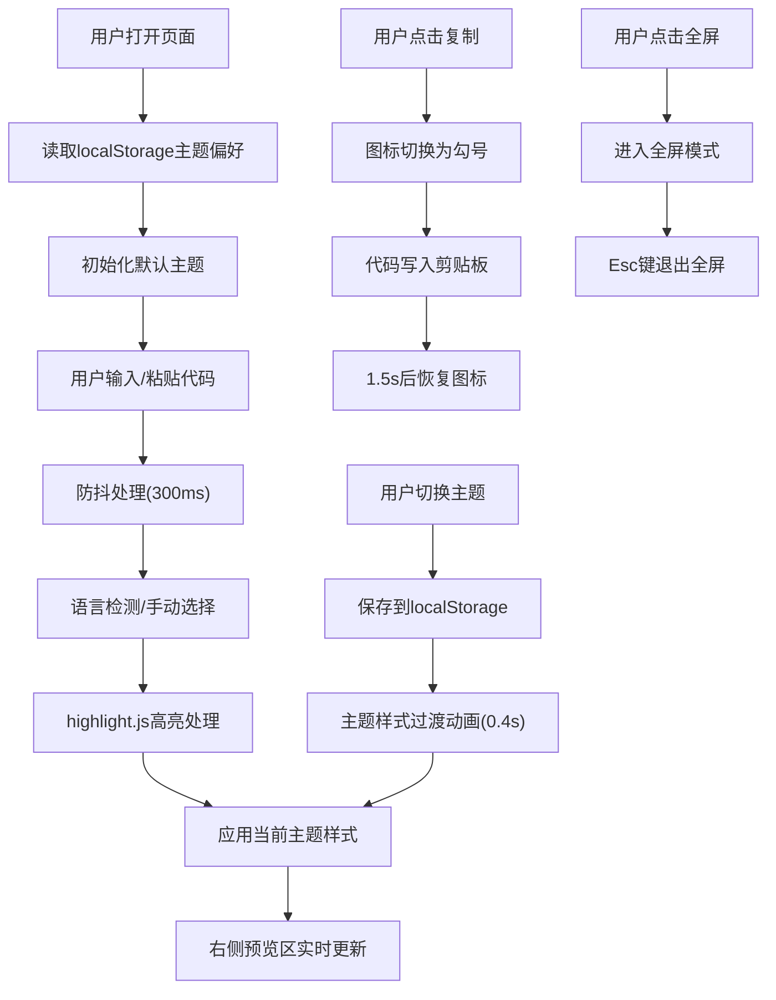

## 1. 产品概述
代码片段语法高亮与主题风格快速切换预览应用，为开发者提供代码高亮实时预览和主题快速切换功能。
- 支持HTML、CSS、JavaScript、Python四种语言的代码输入与高亮显示
- 提供6种以上预设主题（Monokai、Solarized Light、Dracula、Nord、One Dark、GitHub Light）
- 面向开发者、技术写作者和需要展示代码的用户

## 2. 核心功能

### 2.1 功能模块
1. **代码编辑区**：左侧40%宽度，支持代码输入、粘贴、Tab缩进、撤销/重做
2. **高亮预览区**：右侧60%宽度，实时显示带行号的高亮代码
3. **主题切换工具栏**：顶部工具栏，支持主题快速切换、一键复制、全屏模式
4. **语言选择器**：下拉选择语言类型，支持自动检测
5. **可拖拽分隔线**：支持左右/上下区域宽度/高度调整
6. **本地存储**：保存用户主题偏好到localStorage

### 2.2 页面详情
| 页面名称 | 模块名称 | 功能描述 |
|-----------|-------------|---------------------|
| 主页面 | 代码编辑区 | textarea输入，支持Tab缩进、undo/redo，浅灰背景#f5f5f5 |
| 主页面 | 高亮预览区 | 根据语言和主题渲染代码，带行号，主题背景色动态适配 |
| 主页面 | 主题切换下拉 | 每个选项带主色/背景色小色块，切换带0.4s过渡动画 |
| 主页面 | 复制按钮 | 点击复制代码，图标从拷贝变为勾号，1.5s后恢复 |
| 主页面 | 全屏按钮 | 合并为全屏预览，Esc键退出 |
| 主页面 | 可拖拽分隔线 | 4px宽度，悬停变色，支持水平/垂直拖拽 |
| 主页面 | 语言选择器 | 下拉选择HTML/CSS/JS/Python，未选则自动检测 |

## 3. 核心流程

## 4. 用户界面设计

### 4.1 设计风格
- **主色调**：随主题动态变化（每个主题有独立配色）
- **按钮样式**：无边框扁平风格，圆角6px，悬停透明度0.85
- **字体**：代码区使用等宽字体（Fira Code、JetBrains Mono等）
- **布局**：弹性布局flex，左右两栏（桌面）/ 上下堆叠（移动端<768px）
- **图标风格**：使用lucide-react线性图标

### 4.2 页面设计概述
| 页面名称 | 模块名称 | UI元素 |
|-----------|-------------|-------------|
| 主页面 | 顶部工具栏 | 主题下拉（带色块）、语言下拉、复制按钮、全屏按钮 |
|主页面 | 左侧编辑区 | textarea、浅灰边框、聚焦时边框变主题主色、圆角6px |
| 主页面 | 右侧预览区 | 带行号代码块、12px内边距、圆角8px、行号透明度60% |
| 主页面 | 分隔线 | 4px宽度、#cccccc、悬停#888888、col-resize光标 |

### 4.3 响应式
- **桌面端(>768px)**：左右弹性布局，编辑区40%，预览区60%，垂直分隔线可拖拽
- **移动端(<768px)**：上下堆叠，编辑区40%高度，预览区60%高度，水平分隔线可拖拽
- **最小宽度/高度**：各区域最小30%，防止过度压缩

### 4.4 动画效果
- 主题切换：0.4s ease-out过渡，背景色、文字色、高亮色彩同时渐变
- 按钮/下拉悬停：0.2s透明度或颜色过渡
- 分隔线悬停：0.2s颜色变化
- 复制成功图标切换：1.5s后恢复
