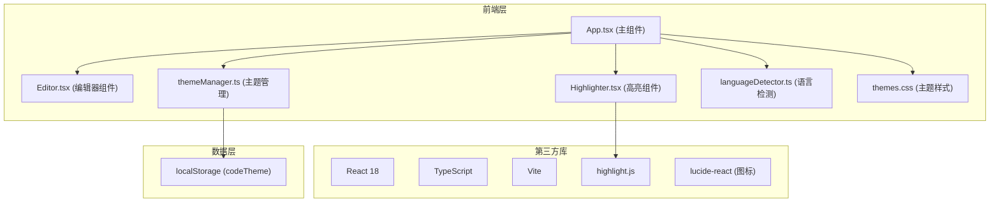

## 1. 架构设计



## 2. 技术描述
- **前端框架**：React 18 + TypeScript
- **构建工具**：Vite
- **代码高亮**：highlight.js
- **图标库**：lucide-react
- **样式方案**：CSS变量 + 原生CSS（主题切换）
- **状态管理**：React useState/useEffect（轻量级状态）
- **语言检测**：自定义languageDetector工具函数

## 3. 项目结构

```
d:\Pro\tasks\auto23\
├── package.json
├── vite.config.js
├── tsconfig.json
├── index.html
├── src\
│   ├── App.tsx          # 主组件，状态管理
│   ├── Editor.tsx       # 代码编辑器组件
│   ├── Highlighter.tsx  # 高亮渲染组件
│   ├── main.tsx         # 入口文件
│   ├── themeManager.ts  # 主题管理模块
│   ├── utils\
│   │   └── languageDetector.ts  # 语言检测工具
│   └── styles\
│       └── themes.css   # 主题CSS变量定义
```

## 4. 文件功能说明

| 文件 | 功能说明 |
|------|----------|
| `package.json` | 依赖管理：react, react-dom, typescript, vite, @vitejs/plugin-react, @types/react, @types/react-dom, highlight.js, lucide-react |
| `vite.config.js` | Vite构建配置，React插件 |
| `tsconfig.json` | TypeScript严格模式配置 |
| `index.html` | 入口页面，挂载root div |
| `src/App.tsx` | 主组件，管理代码输入、主题切换、语言选择、全屏模式、拖拽分隔线状态 |
| `src/Editor.tsx` | textarea编辑器，支持Tab缩进、undo/redo，onChange回调 |
| `src/Highlighter.tsx` | 使用highlight.js生成高亮HTML，应用主题样式，显示行号 |
| `src/themeManager.ts` | 定义6+主题对象（名称、配色、背景、字体），提供切换/获取方法 |
| `src/utils/languageDetector.ts` | 根据代码关键字自动检测语言类型 |
| `src/styles/themes.css` | 所有主题的CSS变量定义和样式类 |
| `src/main.tsx` | React入口，渲染App组件 |

## 5. 核心数据模型

### 5.1 主题对象结构
```typescript
interface Theme {
  name: string;
  displayName: string;
  colors: {
    background: string;
    foreground: string;
    primary: string;
    comment: string;
    keyword: string;
    string: string;
    number: string;
    function: string;
    variable: string;
    operator: string;
    punctuation: string;
  };
  fontFamily: string;
  previewColors: {
    primary: string;
    background: string;
  };
}
```

### 5.2 应用状态
```typescript
interface AppState {
  code: string;
  language: 'html' | 'css' | 'javascript' | 'python' | 'auto';
  currentTheme: string;
  isFullscreen: boolean;
  leftWidth: number; // 0-100百分比
  copied: boolean;
}
```

## 6. 性能优化策略
1. **防抖处理**：代码输入时300ms防抖，避免频繁高亮计算
2. **CSS变量主题切换**：使用CSS自定义属性，切换主题只需改变CSS类，避免重渲染
3. **useMemo缓存**：高亮结果使用useMemo缓存，依赖code和language变化
4. **requestAnimationFrame**：拖拽分隔线时使用RAF优化性能，确保60FPS
5. **transition GPU加速**：主题切换动画使用transform和opacity，启用GPU加速
