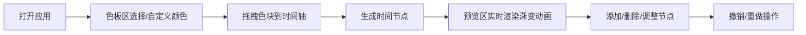

## 1. 产品概述

色彩排挡是一款交互式渐变色动画编排工具，用户通过拖拽彩色方块在时间轴上编排动态渐变色动画，并实时预览效果。主要面向设计师、前端开发者和创意工作者，帮助他们快速创建和调试CSS渐变动画效果。

## 2. 核心功能

### 2.1 用户角色
| 角色 | 注册方式 | 核心权限 |
|------|----------|----------|
| 普通用户 | 无需注册 | 使用全部功能，本地操作 |

### 2.2 功能模块
1. **色板区**：16种预设色块 + 最多6个自定义色块，支持颜色拾取器
2. **时间轴面板**：最多8个时间节点，支持添加/删除/拖拽排序
3. **渐变预览区**：实时渲染CSS渐变背景动画
4. **撤销/重做**：最多10步历史记录

### 2.3 页面详情
| 页面名称 | 模块名称 | 功能描述 |
|----------|----------|----------|
| 主页面 | 色板区 | 16种预设色块(40x40px)，横向滚动，支持颜色拾取器自定义新颜色，最多保存6个自定义色块 |
| 主页面 | 时间轴面板 | 高度160px，节点间距60px，支持色块拖拽添加，节点删除，进度条连接，时间百分比显示 |
| 主页面 | 渐变预览区 | 600x200px，从左到右线性渐变，1s ease-in-out动画循环，时间轴变化时重新触发 |
| 主页面 | 撤销/重做按钮 | 右上角，36x36px，箭头图标，最多10步历史 |

## 3. 核心流程

用户打开应用 → 从色板区拖拽色块到时间轴 → 时间轴自动生成渐变节点 → 预览区实时显示渐变动画 → 可继续添加/删除/调整节点 → 支持撤销/重做操作 → 可自定义颜色加入色板

## 4. 用户界面设计

### 4.1 设计风格
- **主背景**：#0F172A（深海军蓝）
- **面板背景**：#1E293B（石板蓝灰）
- **文字颜色**：#E2E8F0（浅灰白）
- **高亮色**：#3B82F6（蓝色）
- **删除按钮**：红色圆形16x16px，悬停20px带0.2s过渡
- **整体风格**：深色主题，精致细腻，专业工具感

### 4.2 页面设计概述
| 页面名称 | 模块名称 | UI元素 |
|----------|----------|--------|
| 主页面 | 色板区 | 16个预设色块网格排列，下方自定义色块区，颜色拾取器，色块40x40px圆角8px，背景#334155，内边距12px |
| 主页面 | 时间轴面板 | 横向排列节点，节点间距60px，进度条高度4px背景#475569，时间百分比文字，删除按钮，背景#1E293B圆角12px内边距16px |
| 主页面 | 渐变预览区 | 600x200px圆角16px，线性渐变背景，动画效果 |
| 主页面 | 撤销/重做 | 右上角两个按钮，36x36px背景#334155圆角8px，悬停#475569 |

### 4.3 响应式
- **桌面端**：色板区横向滚动，预览区600x200px居中
- **移动端**（<768px）：预览区宽度100%，色板区改为纵向滚动
- **所有设备**：拖拽保持60FPS，预览更新延迟<100ms

### 4.4 交互动效
- 拖拽色块：跟随鼠标半透明，0.3s cubic-bezier(0.4, 0, 0.2, 1)过渡
- 有效区域高亮：#3B82F6
- 删除节点：scale 1→0缩小动画
- 新增节点：scale 0→1放大动画
- 删除按钮悬停：16px→20px扩大，0.2s过渡
- 渐变动画：1s ease-in-out循环切换
