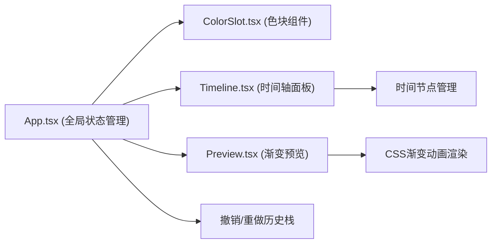

## 1. 架构设计



## 2. 技术描述

- **前端框架**：React@18 + TypeScript
- **构建工具**：Vite
- **状态管理**：React useState + useReducer（本地状态，无需额外状态库）
- **样式方案**：原生CSS + CSS Modules（或内联样式，保持简单）
- **拖拽实现**：HTML5 Drag and Drop API + 鼠标事件（保证60FPS）
- **动画实现**：CSS transitions + CSS keyframes animations

## 3. 文件结构

```
├── package.json
├── index.html
├── vite.config.js
├── tsconfig.json
└── src/
    ├── App.tsx          # 主应用组件，全局状态，撤销/重做
    ├── ColorSlot.tsx    # 单个色块组件，拖拽与颜色选择
    ├── Timeline.tsx     # 时间轴面板，色块序列与时间节点
    └── Preview.tsx      # 渐变预览组件，实时渲染CSS渐变
```

## 4. 数据模型

### 4.1 颜色节点
```typescript
interface ColorNode {
  id: string;
  color: string;
  position: number; // 0-100 百分比
}
```

### 4.2 时间轴状态
```typescript
interface TimelineState {
  nodes: ColorNode[];
  maxNodes: number; // 8
}
```

### 4.3 色板状态
```typescript
interface PaletteState {
  presetColors: string[]; // 16种预设
  customColors: string[]; // 最多6个自定义
}
```

### 4.4 历史记录
```typescript
interface HistoryState {
  past: ColorNode[][];
  present: ColorNode[];
  future: ColorNode[][];
  maxHistory: number; // 10
}
```

## 5. 核心功能实现要点

### 5.1 拖拽系统
- 使用 `onDragStart`, `onDragOver`, `onDrop` 事件
- 拖拽时创建半透明幽灵元素跟随鼠标
- 计算鼠标位置与目标节点的对应关系
- 使用 `requestAnimationFrame` 保证60FPS

### 5.2 渐变预览
- 根据时间节点生成 `linear-gradient` CSS字符串
- 使用CSS `animation` 实现循环切换效果
- 时间轴变化时通过key变化重新触发动画

### 5.3 撤销/重做
- 使用 `useReducer` 管理历史状态
- 每次时间轴变化时推入历史栈
- 限制最大10步历史记录

### 5.4 性能优化
- 使用 `React.memo` 避免不必要的重渲染
- 拖拽操作使用 `transform` 而非 `top/left` 保证GPU加速
- 预览更新使用 `requestAnimationFrame` 批量处理
