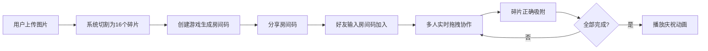

## 1. 产品概述

协作拼图工坊是一款在线多人实时协作拼图应用，解决传统线上拼图工具缺少协作功能、图片尺寸限制等痛点，让朋友间可以一起在线完成一幅拼图，享受共同创作的乐趣。

- 核心价值：提供流畅的多人实时协作拼图体验，支持任意图片上传切割
- 目标用户：拼图爱好者、朋友间休闲娱乐、团队建设活动

## 2. 核心功能

### 2.1 用户角色

| 角色 | 注册方式 | 核心权限 |
|------|----------|----------|
| 普通用户 | 无需注册，临时会话 | 创建游戏、加入游戏、上传图片、协作拼图 |

### 2.2 功能模块

1. **首页**：创建游戏表单、加入游戏表单、图片上传组件
2. **游戏页**：拼图区域、控制面板、碎片拖拽交互、实时同步

### 2.3 页面详情

| 页面名称 | 模块名称 | 功能描述 |
|----------|----------|----------|
| 首页 | 创建游戏 | 输入游戏名称，上传图片（JPG/PNG，最大10MB），点击创建生成6位房间码 |
| 首页 | 加入游戏 | 输入6位房间码，点击加入进入游戏 |
| 游戏页 | 拼图区域 | 4x4网格，渲染16个可拖拽碎片，支持鼠标和触摸操作 |
| 游戏页 | 控制面板 | 显示房间码、计时器、步数统计、碎片进度、撤销按钮、参与人数 |
| 游戏页 | 完成动画 | 所有碎片拼合后播放彩色纸屑庆祝动画，显示完成时间和参与人数 |

## 3. 核心流程

用户上传图片 → 系统切割为4x4共16个碎片 → 创建游戏生成6位房间码 → 分享房间码给好友 → 好友输入房间码加入 → 多人实时拖拽碎片协作 → 碎片正确吸附 → 全部完成播放庆祝动画

## 4. 用户界面设计

### 4.1 设计风格

- 主色调：蓝灰色 #3B82F6
- 辅助色：完成状态绿色 #10B981，警告色黄色 #F59E0B
- 按钮样式：圆角8px，白色文字，蓝色背景，悬停时背景变暗，0.2s过渡
- 字体：主字体使用系统无衬线字体，房间码使用等宽字体（monospace）
- 布局：游戏页采用两栏布局，左侧拼图区占75%，右侧控制面板固定280px
- 交互：碎片拖拽有弹性动画吸附效果，悬停时有上浮效果，拖拽时有放大阴影

### 4.2 页面设计概述

| 页面名称 | 模块名称 | UI元素 |
|----------|----------|--------|
| 首页 | 主容器 | 居中卡片布局，蓝灰主题，大标题"协作拼图工坊" |
| 首页 | 创建游戏区 | 表单卡片，图片上传拖拽区，创建按钮 |
| 首页 | 加入游戏区 | 分隔线，6位房间码输入框，加入按钮 |
| 游戏页 | 拼图区域 | 75%宽度，背景#F8FAFC，圆角16px，内边距8px，最小高度600px |
| 游戏页 | 控制面板 | 固定280px宽度，深灰背景#1E293B，圆角12px，内边距16px |
| 游戏页 | 碎片组件 | 浅灰背景#E2E8F0，1px虚线边框#94A3B8，拖拽时放大1.1倍带阴影 |

### 4.3 响应性

- 桌面优先设计，拼图区域支持响应式缩小至400px
- 移动端触控事件支持，确保移动设备可操作
- 控制面板在小屏幕可折叠或改为底部布局

### 4.4 动效设计

- 碎片正确吸附：0.3s弹性动画 cubic-bezier(0.34, 1.56, 0.64, 1)
- 碎片悬停：上浮3px，0.2s阴影过渡
- 完成庆祝：彩色纸屑从顶部飘落3秒
- 按钮状态：0.2s背景色过渡
