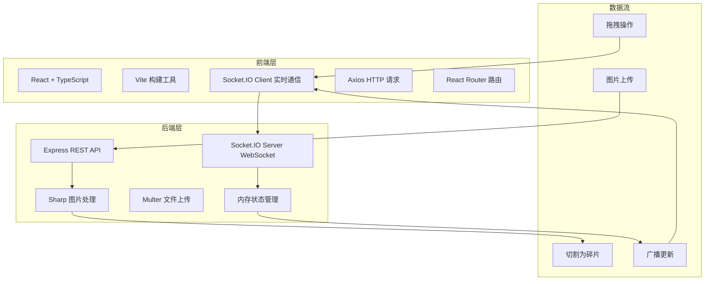
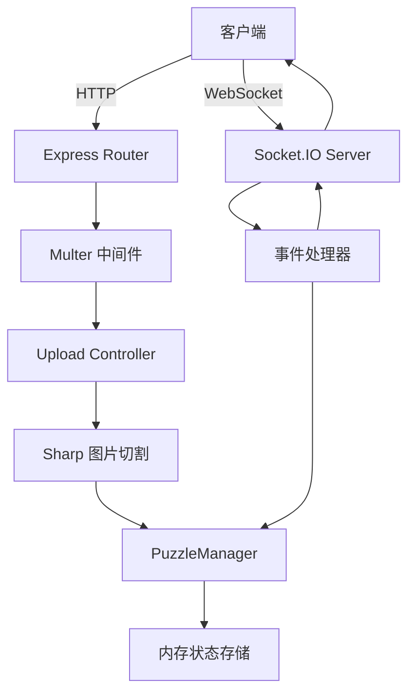
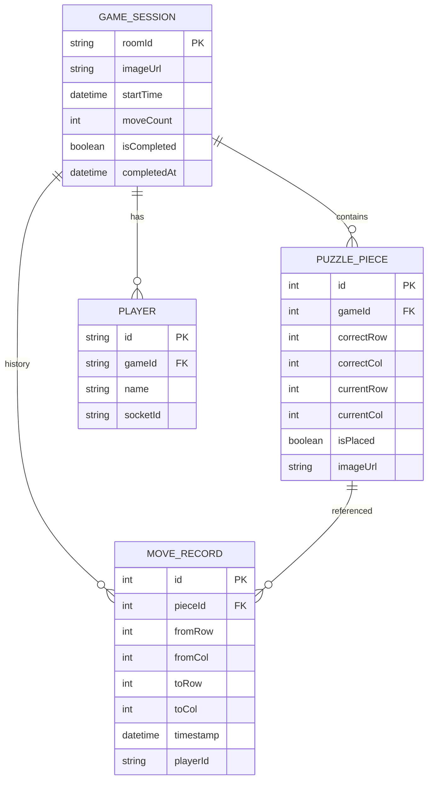

## 1. 架构设计



## 2. 技术描述

- 前端：React@18 + TypeScript + Vite
- 后端：Node.js + Express@4 + Socket.IO
- 图片处理：Sharp
- 文件上传：Multer
- HTTP客户端：Axios
- 实时通信：Socket.IO
- 路由：React Router DOM
- 状态管理：React useState/useReducer 本地状态，服务端内存存储会话

## 3. 路由定义

| 路由 | 用途 |
|------|------|
| / | 首页，创建/加入游戏 |
| /game/:roomId | 游戏页，拼图协作主界面 |

## 4. API 定义

### 4.1 TypeScript 类型定义

```typescript
interface PuzzlePiece {
  id: number;
  correctRow: number;
  correctCol: number;
  currentRow: number;
  currentCol: number;
  isPlaced: boolean;
  imageUrl: string;
}

interface GameSession {
  roomId: string;
  imageUrl: string;
  pieces: PuzzlePiece[];
  players: Player[];
  startTime: number;
  moveCount: number;
  history: MoveRecord[];
  isCompleted: boolean;
  completedAt?: number;
}

interface Player {
  id: string;
  name: string;
  socketId: string;
}

interface MoveRecord {
  pieceId: number;
  fromRow: number;
  fromCol: number;
  toRow: number;
  toCol: number;
  timestamp: number;
  playerId: string;
}
```

### 4.2 REST API

| 方法 | 路径 | 描述 | 请求 | 响应 |
|------|------|------|------|------|
| POST | /api/upload | 上传图片并创建游戏 | multipart/form-data: image, gameName | { roomId, imageUrl, pieces } |
| GET | /api/game/:roomId | 获取游戏状态 | - | { game: GameSession } |
| POST | /api/join/:roomId | 加入游戏 | { playerName } | { game: GameSession, playerId } |

### 4.3 WebSocket 事件

| 事件 | 方向 | 描述 | 数据 |
|------|------|------|------|
| piece_moved | 客户端→服务端 | 碎片移动 | { pieceId, toRow, toCol, playerId } |
| piece_moved | 服务端→客户端 | 广播碎片移动 | { pieceId, toRow, toCol, playerId, isCorrect } |
| move_conflict | 服务端→客户端 | 移动冲突需回滚 | { pieceId, originalRow, originalCol } |
| undo_move | 客户端→服务端 | 撤销操作 | { playerId } |
| move_undone | 服务端→客户端 | 广播撤销 | { pieceId, toRow, toCol } |
| game_completed | 服务端→客户端 | 游戏完成 | { completedAt, duration, playerCount } |
| player_joined | 服务端→客户端 | 玩家加入 | { player: Player } |
| player_left | 服务端→客户端 | 玩家离开 | { playerId } |

## 5. 服务器架构图



## 6. 数据模型

### 6.1 数据模型定义



### 6.2 内存存储结构

服务端使用 Map 存储游戏会话，键为 roomId：

```javascript
const games = new Map<string, GameSession>();
```

每个会话包含完整的拼图状态、玩家列表和操作历史。
