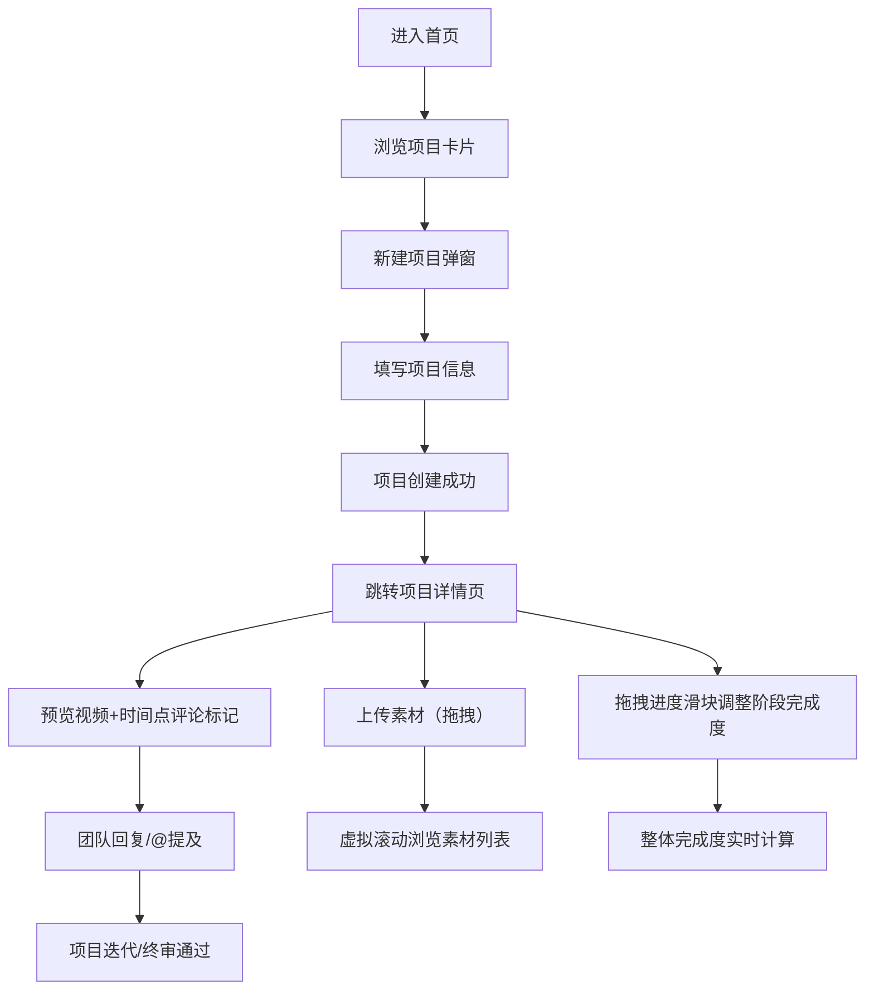

## 1. 产品概述
视频创作者项目管理平台，解决项目文件散落、剪辑进度难追踪、团队意见反馈分散的痛点。
- 面向个人视频创作者和小型制作团队，统一管理从项目创建到终审交付的全流程
- 通过可视化进度追踪和实时协作评论，提升团队协作效率30%以上

## 2. 核心功能

### 2.1 用户角色
| 角色 | 注册方式 | 核心权限 |
|------|----------|----------|
| 创作者/团队成员 | 默认全部使用 | 创建项目、上传素材、调整进度、发表评论 |

### 2.2 功能模块
1. **项目列表页**: 项目卡片网格、新建项目弹窗、骨架屏加载
2. **项目详情页**: 左侧导航栏、素材网格模块、剪辑进度时间轴、协作评论区

### 2.3 页面详情
| 页面名称 | 模块名称 | 功能描述 |
|----------|----------|----------|
| 项目列表页 | 项目卡片网格 | 卡片宽320px高200px，背景#1E293B圆角16px，底部影片类型彩色指示条，悬停上移4px阴影过渡0.3s |
| 项目列表页 | 新建项目弹窗 | 输入项目名称、一句话简介、选择影片类型（微电影/Vlog/宣传片）、设定目标时长 |
| 项目列表页 | 骨架屏加载 | API请求期间展示卡片骨架屏动画 |
| 项目详情页 | 素材管理模块 | 拖拽上传区（#0F172A背景2px虚线#475569边框），拖入时变#3B82F6实线+#1E3A5F背景，进度条6px#10B981，4列网格16:9缩略图，点击全屏预览 |
| 项目详情页 | 进度时间轴 | 6个剪辑阶段（素材整理/粗剪/精剪/音效/调色/终审），横轴日期，可拖拽滑块（直径20px），未填充#334155已填充#8B5CF6，渐变#3B82F6→#8B5CF6 |
| 项目详情页 | 协作评论区 | 时间点标记（红色），评论卡片#1E293B背景圆角12px左侧3px#10B981边框，支持回复@提及，0.3s fadeIn动画 |
| 项目详情页 | 左侧导航栏 | 固定320px宽#0F172A背景，含项目列表和时间线概览 |

## 3. 核心流程
用户进入首页浏览项目卡片，点击新建按钮创建项目后自动跳转至项目详情页。在详情页依次进行：上传视频/音频/图片素材→拖动进度滑块更新各剪辑阶段完成度→播放预览并在特定时间点添加评论标记→团队成员回复评论和@提及→持续迭代直到终审完成。

## 4. 用户界面设计

### 4.1 设计风格
- **主色**: 深色海军蓝 #0F172A（导航/上传区背景）、#1E293B（卡片/主内容区）、#334155（输入框/进度未填充）
- **强调色**: 紫色 #8B5CF6（进度填充/滑块）、青色 #06B6D4（辅助强调）、蓝色 #3B82F6（边框聚焦/渐变起始）、绿色 #10B981（进度条/评论边框）
- **文字色**: 主文字 #E2E8F0，次要文字 #94A3B8
- **按钮/交互元素**: 统一圆角8px，边框色 #475569，聚焦时边框 #3B82F6
- **动画**: 所有状态变化0.2-0.3s ease-out过渡
- **布局**: 左右分栏（左320px固定导航+右侧主内容区），768px以下左栏收缩为底部tab栏

### 4.2 页面设计概述
| 页面名称 | 模块名称 | UI元素 |
|----------|----------|--------|
| 项目列表页 | 项目卡片网格 | 320×200px卡片#1E293B背景圆角16px内边距20px，底部彩色类型指示条，悬停translateY(-4px)阴影从0 4px 12px→0 8px 24px rgba(0,0,0,0.4)过渡0.3s |
| 项目详情页 | 素材上传区 | #0F172A背景2px虚线#475569边框圆角12px，拖入时#3B82F6实线边框+#1E3A5F背景，进度条6px高#10B981平滑动画 |
| 项目详情页 | 素材网格 | 每行4列，16:9缩略图圆角8px，全屏预览#000000透明度0.85背景点击外部关闭 |
| 项目详情页 | 进度时间轴 | 6个剪辑阶段列表+日期横轴，滑块圆形直径20px，进度渐变#3B82F6→#8B5CF6，悬停阴影扩大0.2s过渡 |
| 项目详情页 | 评论区 | 评论卡片#1E293B圆角12px内边距12px左侧3px#10B981实线边框，圆形头像40px，0.3s fadeIn动画 |

### 4.3 响应式
- **桌面优先**设计（≥1024px）：左右分栏，左侧固定320px导航
- **平板**（768px-1023px）：左右分栏保留，右侧内容自适应
- **移动端**（<768px）：左侧导航收缩为底部tab栏，主内容全宽显示
- **触控优化**：所有可点击元素≥44px，滑块加大触控区域

### 4.4 性能要求
- 素材列表超过100个时使用**虚拟滚动**，保持60fps滚动刷新率
- 首屏加载时间≤1.5s（骨架屏+懒加载优化）
- 动画全部使用CSS transform/opacity，避免布局抖动
