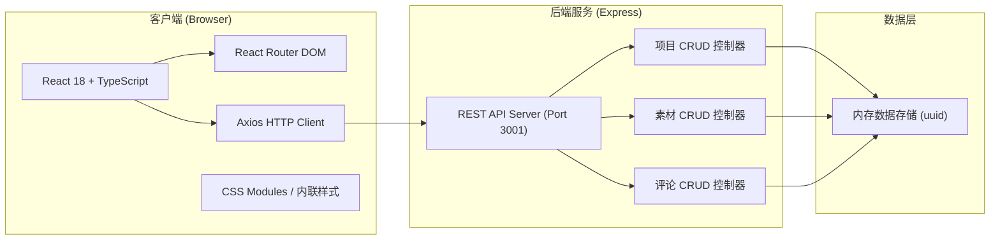
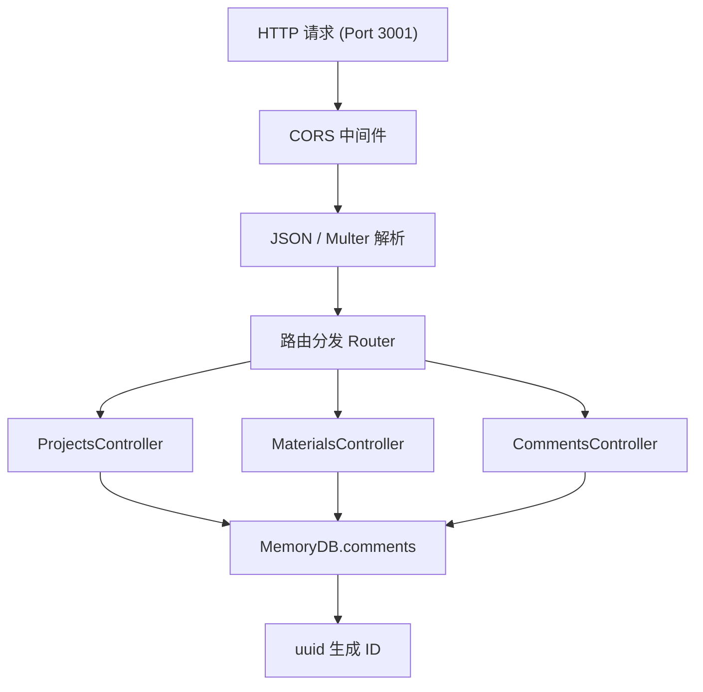
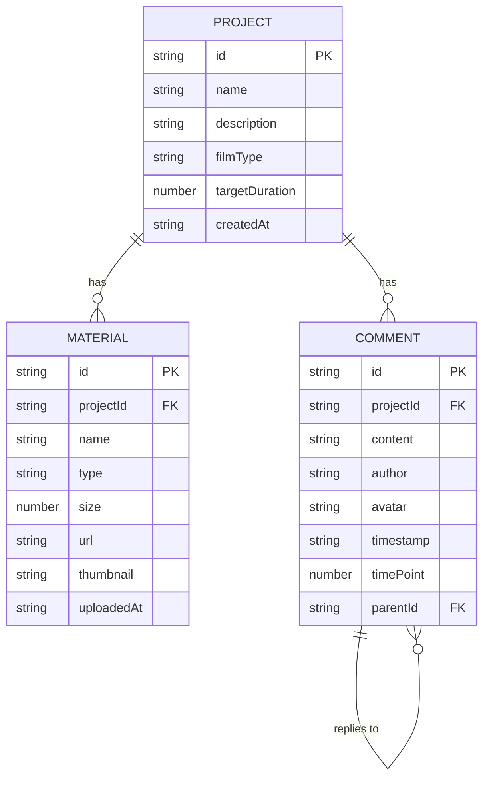

## 1. 架构设计



## 2. 技术栈描述
- **前端框架**: React@18 + TypeScript@5 严格模式，ESNext 模块
- **构建工具**: Vite@5 + @vitejs/plugin-react
- **路由**: react-router-dom@6
- **HTTP客户端**: axios@1
- **后端服务**: Express@4 + cors@2 + uuid@9（Port 3001）
- **数据存储**: 内存存储（无需数据库，后端启动时加载mock数据）
- **开发模式**: 前后端分离，`npm run dev` 同时启动 Vite(5173) 和 Express(3001)

## 3. 路由定义
| 路由路径 | 页面组件 | 功能说明 |
|----------|----------|----------|
| `/` | ProjectList.tsx | 首页项目列表，渲染卡片网格+新建项目入口 |
| `/project/:id` | ProjectDetail.tsx | 项目详情页，包含素材网格、进度时间轴、评论区 |

## 4. API 定义

### 4.1 类型定义
```typescript
type FilmType = '微电影' | 'Vlog' | '宣传片';

interface Project {
  id: string;
  name: string;
  description: string;
  filmType: FilmType;
  targetDuration: number; // 分钟
  createdAt: string;
  stages: StageProgress[];
}

interface StageProgress {
  name: '素材整理' | '粗剪' | '精剪' | '音效' | '调色' | '终审';
  percent: number; // 0-100
}

type MaterialType = 'video' | 'audio' | 'image';

interface Material {
  id: string;
  projectId: string;
  name: string;
  type: MaterialType;
  size: number;
  url: string;
  thumbnail: string;
  uploadedAt: string;
}

interface Comment {
  id: string;
  projectId: string;
  content: string;
  author: string;
  avatar: string;
  timestamp: string; // ISO
  timePoint?: number; // 预览时间点秒数
  parentId?: string; // 回复父评论ID
  mentions?: string[]; // @提及用户列表
}
```

### 4.2 REST 接口
| 方法 | 路径 | 请求体/参数 | 响应 | 功能 |
|------|------|------------|------|------|
| GET | `/api/projects` | - | Project[] | 获取所有项目列表 |
| POST | `/api/projects` | {name, description, filmType, targetDuration} | Project | 创建新项目 |
| GET | `/api/projects/:id` | - | Project | 获取单个项目详情 |
| PUT | `/api/projects/:id/stages` | {stages: StageProgress[]} | Project | 更新项目阶段进度 |
| GET | `/api/projects/:id/materials` | - | Material[] | 获取项目素材列表 |
| POST | `/api/projects/:id/materials` | FormData (file字段) | Material | 上传素材 |
| DELETE | `/api/materials/:id` | - | {success:true} | 删除素材 |
| GET | `/api/projects/:id/comments` | - | Comment[] | 获取项目评论列表 |
| POST | `/api/projects/:id/comments` | {content, author, avatar, timePoint?, parentId?, mentions?} | Comment | 添加评论/回复 |
| DELETE | `/api/comments/:id` | - | {success:true} | 删除评论 |

## 5. 后端服务架构



## 6. 数据模型

### 6.1 实体关系



### 6.2 数据初始化（Mock数据）
- 后端启动时，生成3个示例项目（微电影/Vlog/宣传片各1）
- 每个项目预置6个剪辑阶段，进度值0-80随机
- 每个项目预置8-12个素材（视频/音频/图片混合）
- 每个项目预置3-5条评论，含时间点标记和回复
- 所有ID使用uuid v4生成

## 7. 目录结构

```
auto234/
├── package.json
├── index.html
├── vite.config.js
├── tsconfig.json
├── server/
│   └── index.js                 # Express REST API
└── src/
    ├── App.tsx                  # 主应用+路由+全局状态
    ├── pages/
    │   ├── ProjectList.tsx      # 项目列表页
    │   └── ProjectDetail.tsx    # 项目详情页
    └── components/
        ├── MaterialGrid.tsx     # 素材网格+上传+虚拟滚动
        ├── TimelineProgress.tsx # 进度时间轴+可拖拽滑块
        └── CommentSection.tsx   # 评论区+时间点标记+回复
```
