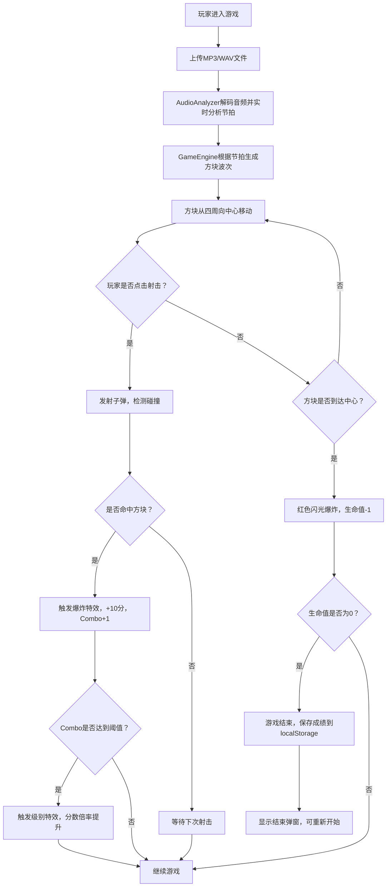

## 1. 产品概述

节拍粉碎机是一款在浏览器中运行的节奏射击游戏，玩家跟随音乐节拍瞄准并击碎从屏幕四周向中心推进的彩色方块。通过将音乐节拍检测与射击反馈深度结合，创造沉浸式的节奏游戏体验。

- 核心玩法：上传本地音乐 → 跟随节拍射击方块 → 积累连击获得高分
- 目标用户：喜欢音乐游戏和射击游戏的休闲玩家

## 2. 核心功能

### 2.1 功能模块

1. **音乐上传与分析**：支持MP3/WAV格式上传，实时解析BPM和节拍相位
2. **方块生成系统**：每4拍为一波，从屏幕四周径向生成4-8个彩色方块
3. **射击与碰撞检测**：鼠标控制准星，点击射击，命中触发爆炸特效
4. **连击系统**：记录连续命中次数，达到阈值触发特效和分数倍率
5. **生命值系统**：方块到达中心未击碎扣减生命，生命耗尽游戏结束
6. **历史记录**：localStorage保存最近10条成绩记录

### 2.2 页面详情

| 页面名称 | 模块名称 | 功能描述 |
|---------|---------|----------|
| 游戏主页面 | 音乐上传区 | 文件上传按钮，支持拖拽上传MP3/WAV |
| 游戏主页面 | Canvas游戏区 | 80%屏幕区域，渲染准星、方块、爆炸特效 |
| 游戏主页面 | 顶部HUD条 | 得分、Combo数、生命值、歌曲进度条 |
| 游戏主页面 | 侧边历史面板 | 展示最近10条历史成绩 |
| 游戏主页面 | 游戏结束弹窗 | 显示总得分、最高连击、歌曲名 |

## 3. 核心流程

## 4. 用户界面设计

### 4.1 设计风格

- **主色调**：深空渐变背景 #0A0A1A → #1A1A2E
- **节拍颜色**：
  - 第1拍：红色 #FF3366
  - 第2拍：蓝色 #3366FF
  - 第3拍：绿色 #33FF66
  - 第4拍：紫色 #9933FF
- **强调色**：金色 #FFD700（Combo特效）
- **字体**：使用独特的显示字体配合精致的正文字体，营造未来感游戏氛围
- **布局风格**：桌面端横向布局（左侧面板 + 中央游戏区），移动端纵向布局
- **动效风格**：快节奏、有冲击力的粒子爆炸和屏幕震动效果

### 4.2 页面设计概述

| 页面名称 | 模块名称 | UI元素 |
|---------|---------|--------|
| 游戏主页面 | Canvas游戏区 | 动态十字准星、圆角彩色方块（带纹理图案）、爆炸粒子、飘字得分 |
| 游戏主页面 | 顶部HUD条（60px高） | 半透明背景#0A0A1ACC，居中显示得分、Combo数字（弹性缩放动效）、心形生命值图标、歌曲名+渐变进度条（300px宽，#FF3366→#9933FF） |
| 游戏主页面 | 左侧侧边面板（220px宽） | 背景#1E1E2E，圆角8px，边距16px，历史成绩列表 |
| 游戏主页面 | 音乐上传按钮 | 中央大号按钮，霓虹边框动效，支持拖拽上传区域 |
| 游戏主页面 | 游戏结束弹窗 | 毛玻璃背景，大号得分显示，重新开始按钮 |

### 4.3 响应式设计

- 桌面端（≥768px）：横向布局，左侧历史面板 + 中央游戏区 + 顶部HUD
- 移动端（<768px）：纵向布局，HUD分上下两行，侧边面板折叠为可滑出的底部抽屉，优化触摸操作

### 4.4 特效等级

| Combo等级 | 特效描述 |
|----------|---------|
| 5连击 | 准星发光 #FFD700 |
| 10连击 | 背景色短暂闪烁 |
| 20连击 | 慢动作效果 0.3秒 |
| 50连击 | 全屏粒子爆发 |

## 5. 性能约束

- 游戏主循环使用 requestAnimationFrame 以60FPS运行
- Canvas渲染层采用离屏Canvas预渲染方块纹理
- 每帧绘制调用不超过100次
- 音频节拍分析在Web Worker中执行，避免阻塞主线程
