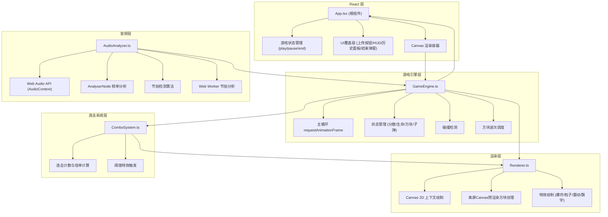
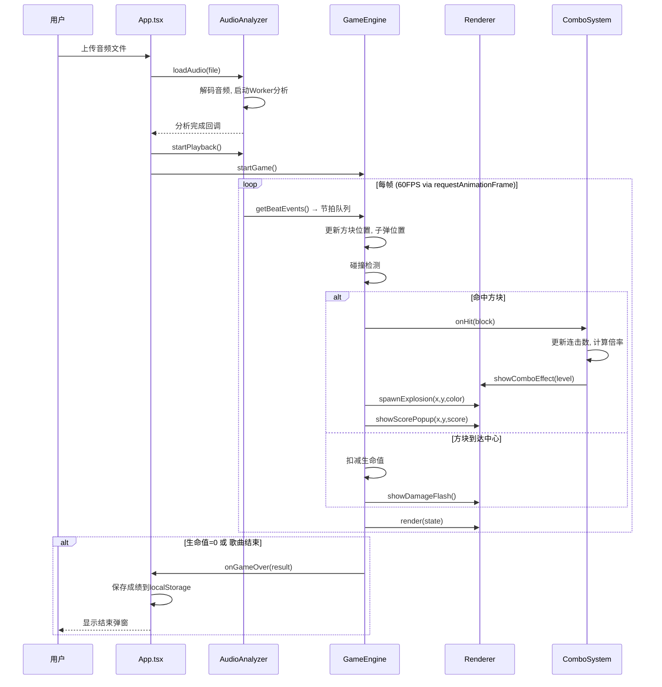

## 1. 架构设计



**数据流向：**
1. AudioAnalyzer 解析音频 → 生成节拍事件队列 → 传递给 GameEngine
2. GameEngine 根据节拍事件 → 生成方块波次 → 传递给 Renderer 绘制
3. GameEngine 碰撞检测 → 命中事件 → 传递给 ComboSystem
4. ComboSystem 更新连击数 → 通知 Renderer 显示连击特效
5. GameEngine 更新游戏状态 → 通知 App.tsx 更新 UI 覆盖层

## 2. 技术描述

- **前端框架**：React 18 + TypeScript 5
- **构建工具**：Vite 5 + @vitejs/plugin-react
- **游戏渲染**：HTML5 Canvas 2D API + 离屏Canvas预渲染
- **音频处理**：Web Audio API (AudioContext, AnalyserNode, AudioBufferSourceNode)
- **状态管理**：React useState/useRef（组件级）+ GameEngine内部状态（游戏循环级）
- **持久化**：localStorage 保存历史成绩
- **并发优化**：Web Worker 执行音频节拍分析

## 3. 目录结构

```
auto236/
├── package.json
├── index.html
├── vite.config.js
├── tsconfig.json
└── src/
    ├── App.tsx                    # React根组件
    ├── GameEngine.ts              # 游戏主循环与状态管理
    ├── Renderer.ts                # Canvas渲染逻辑
    ├── AudioAnalyzer.ts           # 音频上传、播放与节拍分析
    ├── ComboSystem.ts             # 连击计算与UI反馈
    ├── types.ts                   # 类型定义（可选）
    └── workers/
        └── beatAnalyzer.worker.ts # Web Worker 节拍分析
```

## 4. 核心模块与调用关系

### 4.1 文件间调用关系

| 模块 | 被谁调用 | 调用谁 | 数据输入 | 数据输出 |
|-----|---------|--------|---------|---------|
| App.tsx | React渲染 | GameEngine, Renderer | 用户交互事件 | 游戏状态(playing/paused/ended) |
| GameEngine.ts | App.tsx | Renderer, ComboSystem, AudioAnalyzer | 节拍事件, 鼠标输入 | 游戏状态, 渲染指令, 命中事件 |
| Renderer.ts | GameEngine, ComboSystem | Canvas 2D API | 渲染状态(方块/子弹/特效/HUD) | 画面绘制 |
| AudioAnalyzer.ts | App.tsx, GameEngine | Web Audio API, Web Worker | 音频文件 | 节拍事件队列, 播放进度, BPM |
| ComboSystem.ts | GameEngine | Renderer, GameEngine | 命中事件 | 连击数, 分数倍率, 特效级别 |

### 4.2 调用流向图



## 5. 核心数据模型

### 5.1 游戏状态 (GameState)

```typescript
interface GameState {
  status: 'idle' | 'playing' | 'paused' | 'ended';
  score: number;
  lives: number;
  combo: number;
  maxCombo: number;
  scoreMultiplier: number;
  blocks: Block[];
  bullets: Bullet[];
  particles: Particle[];
  scorePopups: ScorePopup[];
  songName: string;
  songProgress: number; // 0-1
  bpm: number;
}
```

### 5.2 方块 (Block)

```typescript
interface Block {
  id: number;
  x: number;           // 当前位置x
  y: number;           // 当前位置y
  startX: number;      // 起点位置x
  startY: number;      // 起点位置y
  angle: number;       // 移动角度(弧度)
  speed: number;       // 移动速度(像素/帧)
  size: number;        // 边长 50-70px
  beatPhase: 0 | 1 | 2 | 3;  // 节拍相位 0-3
  color: string;       // 根据节拍相位派生的颜色
  opacity: number;     // 透明度 0.3-0.9
  distanceFromCenter: number;
  spawnTime: number;
}
```

### 5.3 子弹 (Bullet)

```typescript
interface Bullet {
  id: number;
  x: number;
  y: number;
  vx: number;
  vy: number;
  speed: number;
}
```

### 5.4 粒子 (Particle)

```typescript
interface Particle {
  x: number;
  y: number;
  vx: number;
  vy: number;
  color: string;
  size: number;
  life: number;        // 剩余生命值(0-1)
  decay: number;       // 每帧衰减量
}
```

### 5.5 历史成绩 (ScoreRecord)

```typescript
interface ScoreRecord {
  songName: string;
  score: number;
  maxCombo: number;
  timestamp: number;
}
```

## 6. 性能优化策略

1. **离屏Canvas预渲染**：每种节拍颜色的方块纹理预渲染到离屏Canvas，避免每帧重复绘制图案
2. **Web Worker音频分析**：节拍检测算法在Worker线程运行，不阻塞主线程渲染
3. **对象池模式**：粒子、子弹等频繁创建销毁的对象使用对象池复用
4. **绘制调用限制**：每帧控制绘制调用在100次以内，合并同类型绘制
5. **requestAnimationFrame调度**：严格使用rAF驱动游戏循环，确保60FPS流畅度
