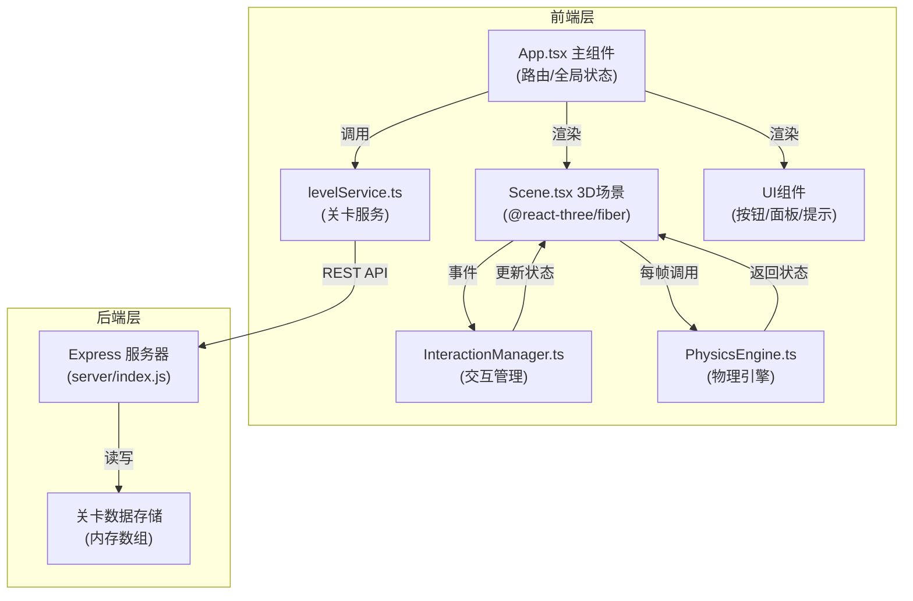
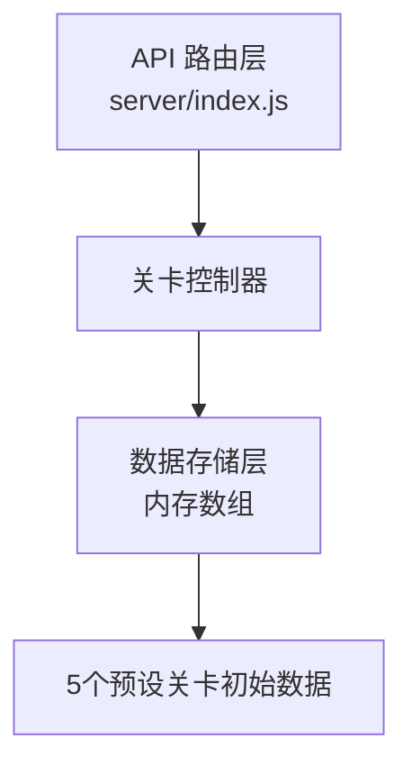
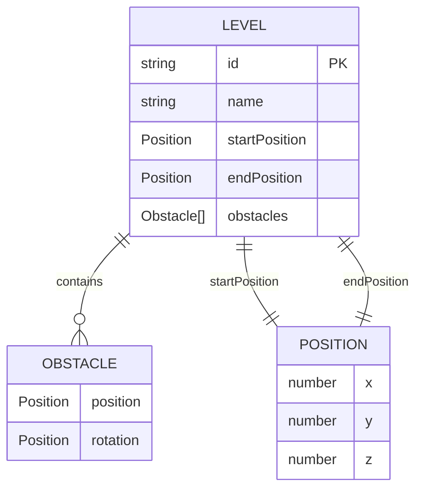

## 1. 架构设计



## 2. 技术说明

- **前端框架**：React 18 + TypeScript + Vite
- **3D渲染**：Three.js + @react-three/fiber + @react-three/drei
- **状态管理**：React useState/useRef（组件级状态），无全局状态管理库需求
- **后端服务**：Express 4 + CORS + UUID
- **数据存储**：后端内存数组（开发/演示用途）
- **构建工具**：Vite，配置代理将 `/api` 转发至后端 3001 端口

## 3. 路由定义

| 路由 | 用途 |
|-------|---------|
| `/` | 游戏主界面，包含3D场景和所有UI控制 |

本游戏为单页应用，通过内部状态切换关卡和编辑模式，无需多路由。

## 4. API 定义

### 4.1 类型定义

```typescript
interface Position {
  x: number;
  y: number;
  z: number;
}

interface Obstacle {
  position: Position;
  rotation?: Position;
}

interface PortalConfig {
  position: Position | null;
}

interface Level {
  id: string;
  name: string;
  startPosition: Position;
  endPosition: Position;
  obstacles: Obstacle[];
  initialPortals?: {
    blue: PortalConfig;
    orange: PortalConfig;
  };
}
```

### 4.2 接口定义

#### GET /api/levels
返回所有关卡列表

**响应：**
```json
{
  "success": true,
  "data": [
    {
      "id": "uuid-1",
      "name": "第一关 - 初见",
      "startPosition": { "x": -3, "y": 0.5, "z": -3 },
      "endPosition": { "x": 3, "y": 0, "z": 3 },
      "obstacles": []
    }
  ]
}
```

#### GET /api/levels/:id
返回指定关卡详细配置

**响应：**
```json
{
  "success": true,
  "data": {
    "id": "uuid-1",
    "name": "第一关 - 初见",
    "startPosition": { "x": -3, "y": 0.5, "z": -3 },
    "endPosition": { "x": 3, "y": 0, "z": 3 },
    "obstacles": [],
    "initialPortals": {
      "blue": { "position": null },
      "orange": { "position": null }
    }
  }
}
```

#### POST /api/levels
保存新关卡，使用 uuid 生成 ID

**请求体：**
```json
{
  "name": "自定义关卡",
  "startPosition": { "x": 0, "y": 0.5, "z": -4 },
  "endPosition": { "x": 0, "y": 0, "z": 4 },
  "obstacles": [
    { "position": { "x": 0, "y": 0.5, "z": 0 } }
  ]
}
```

**响应：**
```json
{
  "success": true,
  "data": {
    "id": "new-uuid",
    "name": "自定义关卡",
    ...
  }
}
```

## 5. 服务端架构



## 6. 数据模型

### 6.1 实体关系



### 6.2 预设关卡数据

后端启动时初始化5个难度递增的预设关卡，存储于全局 `levels` 数组中。
