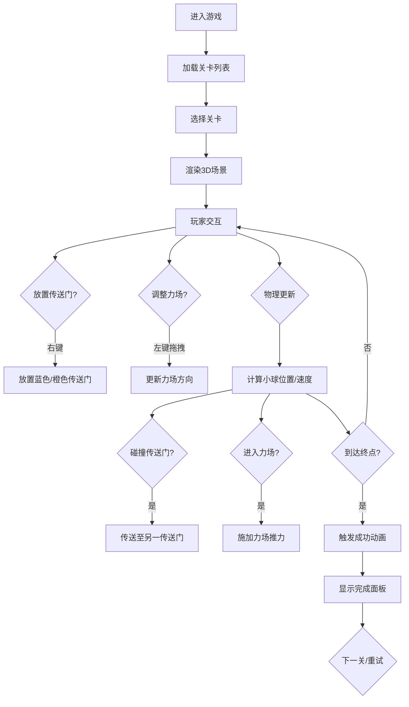

## 1. 产品概述

传送门力场谜题是一款结合空间推理和物理模拟的3D益智游戏，玩家通过放置传送门和调整力场方向，引导金色小球从起点滚落到终点区域。相比传统推箱子游戏，本作通过3D视觉效果、传送门穿梭机制和力场物理模拟带来更强的策略趣味性和视觉冲击力。

- **目标用户**：益智游戏爱好者、物理模拟游戏玩家
- **核心价值**：通过物理机制和空间推理结合，提供具有挑战性和视觉美感的解谜体验

## 2. 核心功能

### 2.1 功能模块

1. **3D游戏场景**：半透明网格地面、发光墙壁、起点/终点平台、小球、传送门、力场、障碍物的渲染与动画
2. **物理模拟系统**：重力、摩擦力、碰撞检测、力场推力、传送门穿越等物理计算
3. **交互控制系统**：右键放置传送门、左键拖拽调整力场方向、滚轮缩放视角
4. **关卡管理系统**：5个预设难度递增关卡、自定义关卡编辑与保存、关卡进度显示
5. **成功判定与反馈**：终点检测、完成动画、用时统计、步数统计、下一关/重试

### 2.2 页面详情

| 页面名称 | 模块名称 | 功能描述 |
|-----------|-------------|---------------------|
| 游戏主界面 | 3D场景渲染 | 渲染地面、墙壁、起点、终点、小球、传送门、力场、障碍物 |
| 游戏主界面 | 物理模拟 | 每帧更新小球位置、速度、碰撞检测、力场作用 |
| 游戏主界面 | 交互系统 | 鼠标右键放传送门、左键拖拽力场、滚轮缩放 |
| 游戏主界面 | UI控制层 | 游戏名称、关卡进度、操作提示、重置/保存/返回按钮 |
| 游戏主界面 | 成功面板 | 完成关卡动画、用时/步数统计、下一关/重试按钮 |
| 关卡编辑模式 | 编辑器 | 放置障碍物、移动起点/终点、保存自定义关卡 |

## 3. 核心流程

玩家进入游戏 → 选择关卡 → 查看场景布局 → 右键放置蓝色传送门 → 右键放置橙色传送门 → 左键拖拽调整力场方向 → 观察小球滚动 → 小球进入终点 → 显示成功面板 → 选择下一关或重试

## 4. 用户界面设计

### 4.1 设计风格

- **主色调**：科幻深色主题，背景 `#1a1a2e`，地面 `#2a2a3a`，墙壁发光 `#4488ff`
- **强调色**：蓝色传送门 `#4488ff`，橙色传送门 `#ff8844`，绿色力场 `#00ff88`，金色小球/终点 `#ffd700`，标题青色 `#00e5ff`
- **字体**：标题使用 `Orbitron` 科幻字体，正文使用现代无衬线字体
- **按钮风格**：圆角按钮，背景 `#2a2a4e`，悬停渐变 `#3a3a6e`，过渡 0.2s ease
- **动效**：呼吸发光、脉动、旋转波纹、粒子拖尾、传送淡入、成功爆发

### 4.2 页面设计概览

| 页面名称 | 模块名称 | UI元素 |
|-----------|-------------|-------------|
| 游戏主界面 | 标题区域 | 左上角"传送门力场谜题"，Orbitron粗体24px，#00e5ff，呼吸发光动画 |
| 游戏主界面 | 进度区域 | 右上角关卡名称与进度"3/5"，白色文字 |
| 游戏主界面 | 操作提示 | 左下角提示条，14px #a0a0b0 |
| 游戏主界面 | 底部按钮 | 重置/保存关卡/返回列表，圆角按钮 #2a2a4e |
| 游戏主界面 | 成功面板 | 毛玻璃效果 #00000066，圆角12px，完成关卡/用时/步数，按钮悬停#ffffff33 |
| 3D场景 | 地面 | 10x10半透明网格，#2a2a3a底色，#555577网格线，透明度0.6 |
| 3D场景 | 墙壁 | 四周半透明蓝色墙壁，高度2单位，边框#4488ff发光 |
| 3D场景 | 起点 | 红色平台直径0.8，1s周期脉动动画 |
| 3D场景 | 终点 | 金色区域直径2，持续旋转波纹环 |
| 3D场景 | 传送门 | 2单位高椭圆光圈，边缘流动光效，0.5圈/秒 |
| 3D场景 | 力场 | 半透明锥体半径1.5高3，#00ff8844，流动粒子指示方向 |
| 3D场景 | 小球 | 金色球体半径0.3，随机旋转亮斑纹理，高速时金色拖尾粒子 |

### 4.3 响应式设计

- **桌面端**：完整UI布局，所有元素正常显示
- **移动端**（<768px）：UI元素缩小，操作提示和按钮变为可折叠面板，保证3D场景可视区域最大化

### 4.4 3D场景指引

- **环境**：深色科幻空间，无需HDRI，纯色背景即可
- **光照**：环境光 + 方向光，突出传送门和力场的自发光效果
- **相机**：透视相机，可通过滚轮缩放，默认俯视45°角
- **交互**：鼠标事件与Three.js Raycaster实现3D空间拾取
- **后处理**：传送门光效、粒子系统、发光效果
- **性能**：物理步长≤16ms，粒子数≤500，帧率≥30fps
