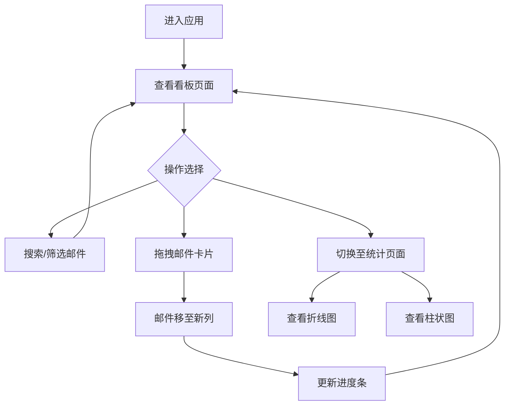

## 1. 产品概述

收件箱减压器是一款游戏化邮件清理Web应用，帮助用户通过看板拖拽的方式将杂乱邮件分类归档、标记状态，并实时统计清理进度与效率。
- 目标用户：日常邮件量大、需要高效管理收件箱的办公人群
- 核心价值：将枯燥的邮件清理转化为可视化的游戏化体验，降低心理负担，提升处理效率

## 2. 核心功能

### 2.1 用户角色

| 角色 | 注册方式 | 核心权限 |
|------|----------|----------|
| 普通用户 | 无需注册 | 浏览看板、拖拽邮件、查看统计 |

### 2.2 功能模块

1. **看板页面**：三列看板（待处理/处理中/已完成），拖拽邮件卡片在列间移动，搜索筛选，清理进度条
2. **统计页面**：近7天清理折线图、分类柱状图

### 2.3 页面详情

| 页面名称 | 模块名称 | 功能描述 |
|----------|----------|----------|
| 看板页面 | 搜索筛选工具栏 | 搜索框实时过滤邮件、下拉分类筛选器、年度清理进度条 |
| 看板页面 | 三列看板面板 | 待处理/处理中/已完成三列，支持拖拽邮件卡片在列间移动 |
| 看板页面 | 邮件卡片 | 展示发件人、主题、时间、分类标签，拖拽时缩小半透明 |
| 统计页面 | 清理折线图 | 近7天每日清理数量，带面积填充和悬停tooltip |
| 统计页面 | 分类柱状图 | 按邮件分类显示总数量，柱顶显示数值 |

## 3. 核心流程

用户进入应用后看到看板页面，三列面板中展示50封待处理邮件。用户可搜索或按分类筛选邮件，通过拖拽将邮件在"待处理→处理中→已完成"之间移动。顶部进度条实时显示完成百分比。切换到统计页面可查看清理效率图表。

## 4. 界面设计

### 4.1 设计风格

- 主色：蓝色(#3B82F6) + 绿色(#10B981)
- 背景：灰白(#F1F5F9)
- 卡片：圆角16px，柔和阴影
- 按钮/标签/输入框：0.2s-0.3s ease过渡动画
- 字体：系统无衬线字体栈，层级分明
- 布局：顶部导航 + 内容区水平居中

### 4.2 页面设计概览

| 页面名称 | 模块名称 | UI元素 |
|----------|----------|--------|
| 看板页面 | 搜索筛选工具栏 | 圆角搜索框(#F1F5F9背景，聚焦#3B82F6边框)、下拉筛选器(圆角8px白底阴影)、渐变进度条(8px高，#3B82F6→#10B981) |
| 看板页面 | 待处理列 | 宽320px，白底#FFFFFF，圆角16px，蓝色圆点标题 |
| 看板页面 | 处理中列 | 宽320px，浅蓝底#E0F2FE，圆角16px，天蓝圆点标题 |
| 看板页面 | 已完成列 | 宽320px，浅绿底#DCFCE7，圆角16px，绿色圆点标题 |
| 看板页面 | 邮件卡片 | 宽280px，最小高140px，#F8FAFC背景，圆角12px，4px彩色标签条，悬停上移3px+阴影加深 |
| 统计页面 | 折线图 | 圆角16px白底卡片，#6366F1折线+渐变面积填充 |
| 统计页面 | 柱状图 | 圆角16px白底卡片，分类色柱状+柱顶数值 |

### 4.3 响应式

- 桌面优先设计，看板三列水平排列
- <1024px：看板三列改为上下堆叠
- <640px：统计图表宽度自适应父容器
- 自定义滚动条：宽6px，thumb #94A3B8，track透明

### 4.4 动效细节

- 拖拽时卡片缩小0.75倍并半透明
- 拖拽到目标列上方时目标列背景加深15%
- 释放后卡片0.3s cubic-bezier弹性动画落入
- 导航Tab切换指示条0.2s弹出动画
- 进度条宽度变化0.5s ease-out
- 搜索框聚焦边框0.2s过渡
