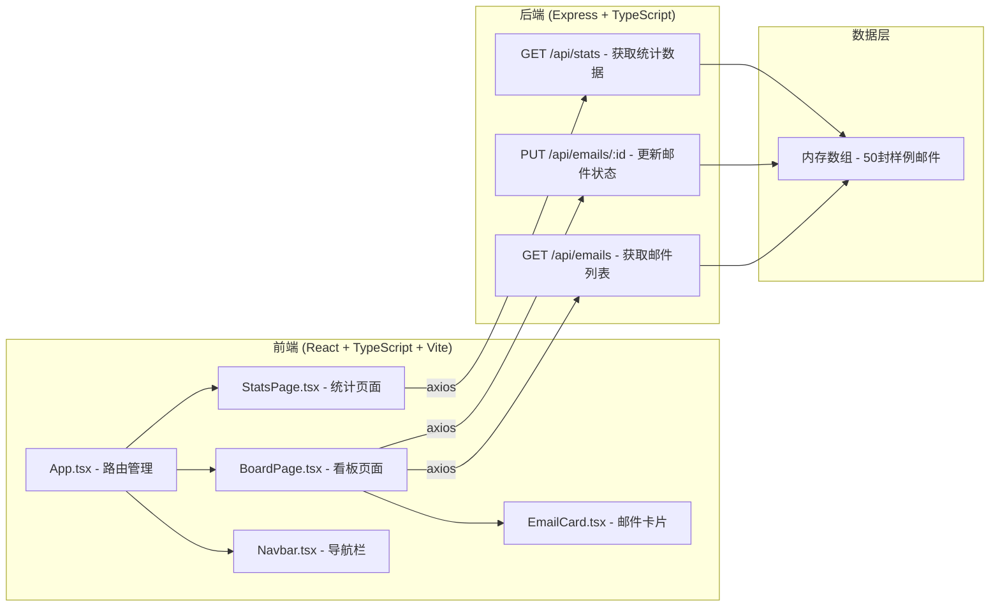
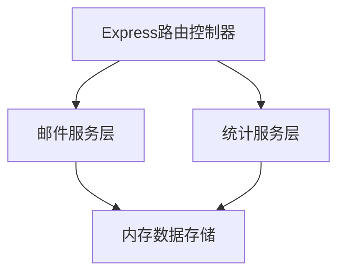
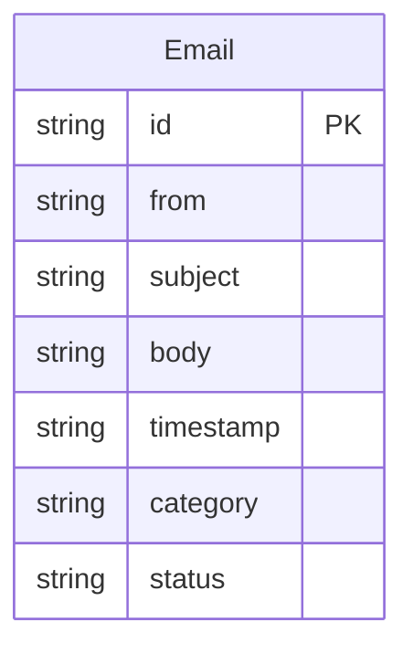

## 1. 架构设计



## 2. 技术说明

- 前端：React@18 + TypeScript + Vite + @dnd-kit/core + @dnd-kit/sortable + recharts + axios + react-router-dom
- 初始化工具：vite-init (react-express-ts模板)
- 后端：Express@4 + TypeScript + cors + uuid + nodemailer
- 数据库：无，使用Node.js内存数组存储

## 3. 路由定义

| 路由 | 用途 |
|------|------|
| / | 看板页面（默认） |
| /stats | 统计页面 |

## 4. API定义

### 4.1 TypeScript类型定义

```typescript
type EmailCategory = 'work' | 'social' | 'promo' | 'spam';
type EmailStatus = 'pending' | 'processing' | 'done';

interface Email {
  id: string;
  from: string;
  subject: string;
  body: string;
  timestamp: string;
  category: EmailCategory;
  status: EmailStatus;
}

interface DailyStats {
  date: string;
  count: number;
}

interface CategoryStats {
  category: EmailCategory;
  count: number;
}

interface StatsResponse {
  daily: DailyStats[];
  byCategory: CategoryStats[];
  total: number;
  done: number;
}
```

### 4.2 请求/响应模式

| 端点 | 方法 | 请求参数 | 响应 |
|------|------|----------|------|
| /api/emails | GET | ?status=pending\|processing\|done (可选) | Email[] |
| /api/emails/:id | PUT | { status: EmailStatus } | Email |
| /api/stats | GET | 无 | StatsResponse |

## 5. 服务端架构图



## 6. 数据模型

### 6.1 数据模型定义



### 6.2 初始数据

服务器启动时生成50封样例邮件，随机分配发件人、主题、内容、时间戳和分类，状态默认为pending。使用nodemailer库的邮件生成功能辅助创建格式各异的样例数据。每次返回数据时模拟100ms-300ms随机网络延迟。
