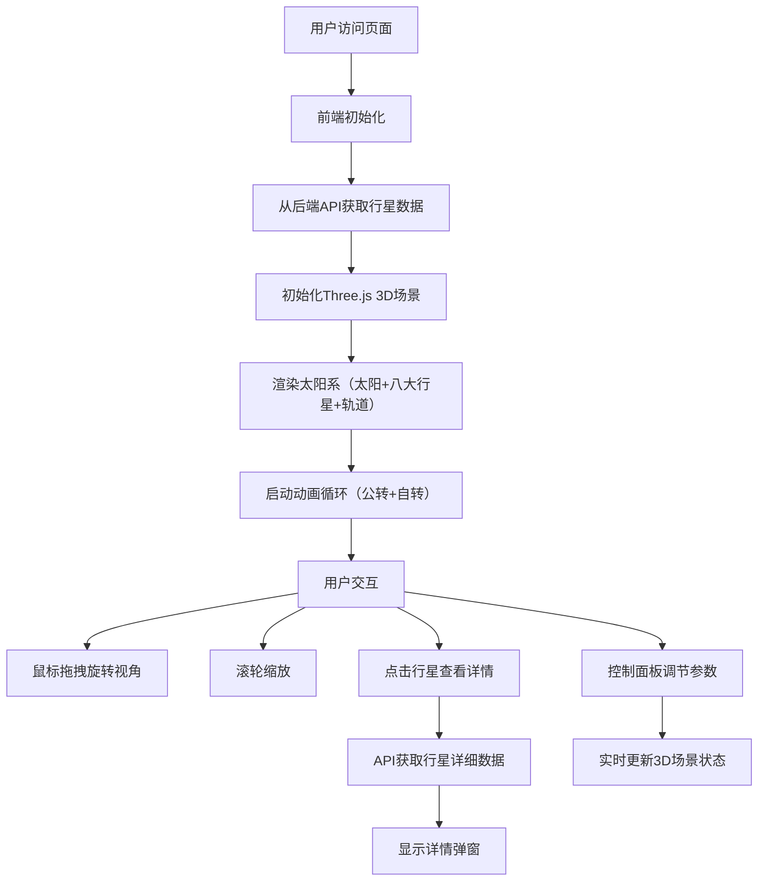

## 1. 产品概述

太阳系漫游指南是一款面向天文学爱好者和教育者的3D交互式太阳系可视化工具，用户可以在浏览器中直观地探索三维太阳系，观察行星公转轨迹与相对位置，获取详细的天文数据。

- **核心价值**：提供轻量级、沉浸式的太阳系3D可视化体验，无需安装庞大软件
- **目标用户**：天文学爱好者、教育工作者、学生
- **解决问题**：现有Web天文模拟过于简陋或需要安装大型软件，缺乏轻量且高质量的3D交互体验

## 2. 核心功能

### 2.1 用户角色

| 角色 | 注册方式 | 核心权限 |
|------|----------|----------|
| 普通用户 | 无需注册，直接访问 | 浏览3D太阳系、查看行星数据、调节视图与动画参数 |

### 2.2 功能模块

1. **3D太阳系漫游视图**：八大行星公转轨道、行星自转与公转动画、太阳光晕特效
2. **视角交互控制**：鼠标拖拽旋转、滚轮缩放、右键平移、视角边界限制
3. **行星信息查看**：点击行星显示详细天文数据弹窗
4. **可视化控制面板**：轨道线开关、行星标签开关、光晕强度调节、速度控制、暂停/继续
5. **性能模式**：降低几何体面数、关闭光晕和阴影，提升低端设备帧率
6. **响应式布局**：桌面端左侧控制面板、移动端底部抽屉

### 2.3 页面详情

| 页面名称 | 模块名称 | 功能描述 |
|----------|----------|----------|
| 主视图页 | 3D场景模块 | 渲染太阳、八大行星、轨道线、光晕特效，支持公转与自转动画 |
| 主视图页 | 视角控制模块 | 鼠标拖拽旋转、滚轮缩放、右键平移、视角边界与缩放限制 |
| 主视图页 | 控制面板模块 | 轨道线/标签/光晕开关、速度滑块、暂停按钮、性能模式、视角重置 |
| 主视图页 | 行星详情模块 | 点击行星弹出详情弹窗，显示名称、半径、周期、卫星数等数据 |

## 3. 核心流程

用户打开应用 → 从后端API加载行星数据 → 初始化3D场景渲染太阳系 → 用户通过鼠标交互旋转/缩放视角 → 用户点击行星查看详情 → 用户通过控制面板调节可视化效果 → 所有状态变化实时同步到3D场景

## 4. 用户界面设计

### 4.1 设计风格

- **设计风格**：深空科技风，沉浸式宇宙探索体验
- **主色调**：深空蓝 #0B0B1A（背景），面板蓝 rgba(15, 23, 42, 0.85)
- **强调色**：蓝色 #3B82F6，浅蓝 #60A5FA
- **行星色彩**：各行星真实色调，太阳金色光晕 #FFD700 → #FF4500
- **字体**：现代无衬线字体，白色文字
- **动效**：所有UI切换0.3s ease-in-out过渡，移动端抽屉0.4s弹性动画
- **特殊效果**：磨砂玻璃面板（backdrop-filter: blur(10px)）、太阳光晕渐变Sprite

### 4.2 页面设计概述

| 页面名称 | 模块名称 | UI元素 |
|----------|----------|--------|
| 主视图页 | 3D场景 | 全屏深色背景、太阳发光效果、八大行星按轨道排列、白色半透明椭圆轨道线、行星名称标签 |
| 主视图页 | 控制面板（桌面端） | 左侧320px宽半透明面板、磨砂玻璃效果、右边缘圆角16px、标题白色加粗16px、开关/滑块控件 |
| 主视图页 | 抽屉面板（移动端） | 底部40%屏幕高度、顶部圆角16px、抓取条、弹性滑入动画 |
| 主视图页 | 行星详情弹窗 | 背景#1E2A4A、圆角16px、内边距24px、关闭按钮淡出动画 |

### 4.3 响应式设计

- **桌面端（≥1024px）**：全屏3D场景 + 左侧固定320px控制面板
- **平板端（768-1023px）**：自适应布局，控制面板可折叠
- **移动端（<768px）**：全屏3D场景 + 底部可拖出抽屉（40%屏幕高度）
- **触摸优化**：支持手势缩放、点击选择行星

### 4.4 3D场景设计

- **环境**：深空黑色背景 #0B0B1A，无外部HDRI，营造宇宙真空感
- **光照**：太阳作为点光源，强度随光晕参数调节；环境光补充微弱照明
- **相机**：PerspectiveCamera，初始位置可看到整个太阳系，视角限制在半径300球体
- **构图**：太阳位于中心，行星按轨道半径比例分布，整体居中对称
- **交互**：OrbitControls 拖拽旋转、滚轮缩放（带阻尼）、右键平移
- **动画**：行星沿椭圆轨道公转（速度按真实比例）、行星自转、太阳光晕脉动
- **后期**：可选光晕效果（性能模式关闭）
- **性能**：桌面端45FPS+，性能模式55FPS+；移动端默认30FPS，性能模式40FPS
