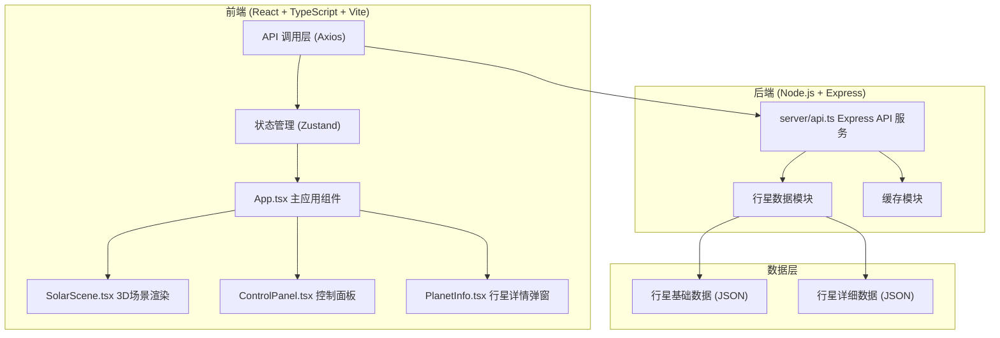

## 1. 架构设计



## 2. 技术描述

- **前端框架**：React 18 + TypeScript
- **构建工具**：Vite 5 + @vitejs/plugin-react
- **3D渲染引擎**：Three.js + @react-three/fiber + @react-three/drei
- **路由管理**：React Router DOM 6
- **HTTP客户端**：Axios
- **状态管理**：Zustand
- **样式方案**：原生CSS + CSS变量（深空主题）
- **后端框架**：Express 4 + CORS
- **包管理器**：npm

## 3. 项目结构

```
auto241/
├── index.html                    # 入口HTML
├── package.json                  # 项目依赖与脚本
├── vite.config.js                # Vite配置（API代理）
├── tsconfig.json                 # TypeScript配置（严格模式）
├── src/
│   ├── App.tsx                   # 主应用组件，路由与全局状态
│   ├── main.tsx                  # 应用入口
│   ├── index.css                 # 全局样式
│   ├── scene/
│   │   └── SolarScene.tsx        # 3D太阳系场景组件
│   ├── ui/
│   │   ├── ControlPanel.tsx      # 控制面板组件
│   │   └── PlanetInfo.tsx        # 行星详情弹窗组件
│   ├── store/
│   │   └── useSolarStore.ts      # Zustand状态管理
│   ├── api/
│   │   └── planets.ts            # 前端API调用封装
│   ├── types/
│   │   └── planet.ts             # 类型定义
│   └── utils/
│       └── constants.ts          # 常量配置
└── server/
    └── api.ts                    # Express后端API服务
```

## 4. 路由定义

| 路由 | 用途 |
|------|------|
| / | 主视图页 - 3D太阳系漫游 |

## 5. API定义

### 5.1 行星列表接口

**GET /api/planets**

返回太阳系八大行星基础数据与轨道参数。

**响应类型：**
```typescript
interface PlanetBasic {
  id: string;
  name: string;
  nameCn: string;
  color: string;
  radius: number;           // 行星半径（相对单位）
  orbitRadius: number;      // 轨道半径（相对单位）
  orbitSpeed: number;       // 公转速度（地球=1）
  rotationSpeed: number;    // 自转速度
  tilt: number;             // 自转轴倾角
  description: string;
}

// 响应
{
  success: boolean;
  data: PlanetBasic[];
}
```

### 5.2 行星详情接口

**GET /api/planets/:id**

返回指定行星的详细天文数据。

**响应类型：**
```typescript
interface PlanetDetail extends PlanetBasic {
  equatorialRadius: number;    // 赤道半径（公里）
  averageOrbitSpeed: number;   // 平均轨道速度（km/s）
  rotationPeriod: number;      // 自转周期（地球日）
  orbitalPeriod: number;       // 公转周期（地球日）
  knownMoons: number;          // 已知卫星数量
  mass: number;                // 质量（相对于地球）
  density: number;             // 密度（g/cm³）
  surfaceGravity: number;      // 表面重力（m/s²）
  averageTemperature: number;  // 平均温度（摄氏度）
  atmosphere: string;          // 大气成分
  discovery: string;           // 发现信息
  detailedDescription: string; // 详细描述
}

// 响应
{
  success: boolean;
  data: PlanetDetail;
}
```

## 6. 数据流向

```
初始化流程：
App.tsx → 调用 /api/planets → 获取行星列表数据 → 存入 Zustand Store
  → SolarScene.tsx 接收数据 → 创建 Three.js 场景 → 渲染到 Canvas

交互流程：
用户交互 → ControlPanel.tsx → 更新 Zustand Store
  → SolarScene.tsx 订阅状态变化 → 更新3D场景渲染

详情查看流程：
用户点击行星 → SolarScene.tsx 射线检测 → 获取行星ID
  → PlanetInfo.tsx 调用 /api/planets/:id → 获取详细数据 → 渲染弹窗
```

## 7. 核心组件说明

### 7.1 SolarScene.tsx
- 使用 @react-three/fiber 的 Canvas 组件创建3D场景
- 使用 @react-three/drei 的 OrbitControls 实现视角控制
- 包含：太阳（发光球体 + 光晕Sprite）、八大行星（球体 + 轨道线 + 标签）
- 使用 useFrame 钩子实现每帧动画更新（公转+自转）
- 支持射线检测实现行星点击交互

### 7.2 ControlPanel.tsx
- 桌面端：左侧固定面板（320px宽，磨砂玻璃效果）
- 移动端：底部抽屉（40%屏幕高度，弹性动画）
- 控件：轨道线开关、标签开关、光晕强度滑块、速度滑块、暂停按钮、性能模式开关、视角重置按钮

### 7.3 PlanetInfo.tsx
- 弹窗式组件，背景 #1E2A4A，圆角16px，内边距24px
- 显示行星名称、赤道半径、平均轨道速度、自转周期、公转周期、卫星数、描述
- 右上角X关闭按钮，0.3s淡出动画
- 点击遮罩或关闭按钮关闭弹窗

## 8. 状态管理 (Zustand)

```typescript
interface SolarState {
  planets: PlanetBasic[];
  selectedPlanetId: string | null;
  showOrbits: boolean;
  showLabels: boolean;
  glowIntensity: number;
  speedMultiplier: number;
  isPaused: boolean;
  performanceMode: boolean;
  
  setPlanets: (planets: PlanetBasic[]) => void;
  setSelectedPlanetId: (id: string | null) => void;
  toggleOrbits: () => void;
  toggleLabels: () => void;
  setGlowIntensity: (v: number) => void;
  setSpeedMultiplier: (v: number) => void;
  togglePause: () => void;
  togglePerformanceMode: () => void;
  resetView: () => void;
}
```

## 9. 性能优化策略

1. **性能模式**：
   - 行星几何体分段从64减少到16
   - 关闭光晕特效
   - 禁用阴影渲染
   - 降低标签渲染质量

2. **3D渲染优化**：
   - 使用 InstancedMesh 处理多个相似物体
   - 合理设置相机远/近裁剪面
   - 轨道线使用 LineSegments 而非连续线条

3. **React优化**：
   - 使用 memo 包裹不必要的重渲染组件
   - 使用 useMemo/useCallback 缓存计算结果和函数
   - Zustand 选择器避免不必要的订阅

## 10. 启动方式

- **开发模式**：`npm run dev` - 同时启动前端Vite服务和后端Express API
- **前端端口**：5173（Vite默认）
- **后端端口**：3001
- **API代理**：Vite 配置代理 `/api` 到 `http://localhost:3001`
