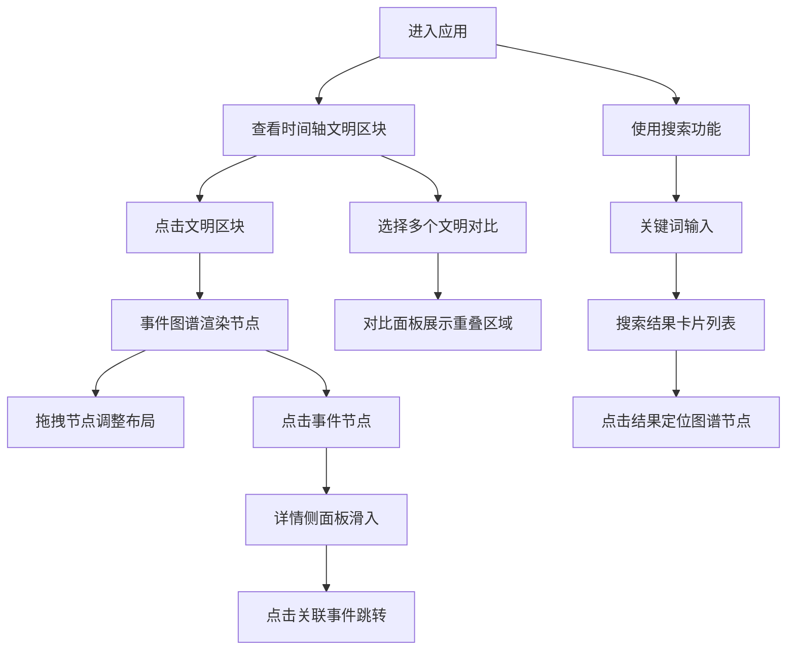

## 1. 产品概述
沉浸式时间旅行叙事探索应用，通过鼠标拖拽和缩放交互，在浏览器中以可视化方式展示历史事件之间的跨时代关联和并行发展的复杂网络关系，解决线性历史时间线难以直观展示历史事件关联性的问题。

- 核心目标：帮助用户直观理解不同文明时期历史事件之间的因果关系和并行发展
- 目标用户：历史爱好者、学生、教育工作者
- 产品价值：将抽象的历史时间线转化为可交互的可视化网络，提升历史学习的趣味性和深度

## 2. 核心功能

### 2.1 功能模块
1. **时间轴模块**：水平Canvas时间轴，展示公元前3000年到公元2000年的主要文明时期
2. **事件图谱模块**：D3力导向图，展示选中文明时期内的关键历史事件节点及因果关系
3. **文明对比面板**：支持最多3个文明的横向时间线对比，高亮重叠区域
4. **事件详情侧面板**：展示事件的详细信息和关联事件
5. **历史检索功能**：关键词搜索事件，结果卡片列表展示

### 2.3 页面详情
| 页面名称 | 模块名称 | 功能描述 |
|-----------|-------------|---------------------|
| 主页面 | 顶部导航栏 | 浏览器风格设计，包含应用标题和搜索入口 |
| 主页面 | 时间轴模块 | Canvas绘制水平时间轴，彩色区块标注文明时期，悬停显示tooltip，点击高亮关联事件 |
| 主页面 | 事件图谱模块 | 力导向图展示事件节点，支持拖拽调整布局，节点按影响力设置大小，带箭头边表示因果关系 |
| 主页面 | 文明对比面板 | 多文明时间线缩略图并排展示，虚线高亮重叠区域 |
| 主页面 | 详情侧面板 | 右侧滑入展示事件详情，包含名称、年份、区域、描述、关联事件列表 |
| 主页面 | 搜索面板 | 关键词模糊搜索，卡片列表展示结果，点击跳转到图谱 |

## 3. 核心流程
用户进入应用 → 查看时间轴上的文明时期 → 点击文明区块 → 事件图谱展示该时期的事件节点 → 拖拽节点调整布局 → 点击事件节点查看详情 → 选择多个文明进行对比 → 或使用搜索功能查找特定事件 → 点击搜索结果定位到图谱节点

## 4. 用户界面设计

### 4.1 设计风格
- **配色主题**：深色太空主题，主背景#0A0E1A，次背景#1A1F2E，强调色#64B5F6，文字#E2E8F0
- **按钮/卡片**：圆角设计，卡片悬停有阴影和上移动画
- **字体**：使用现代无衬线字体，标题粗体，正文清晰可读
- **布局**：顶部浏览器风格导航，主内容区上下分栏（时间轴在上，图谱在下）
- **动画**：所有过渡统一使用ease-out曲线，持续时间0.3s

### 4.2 页面设计概述
| 页面名称 | 模块名称 | UI元素 |
|-----------|-------------|-------------|
| 主页面 | 时间轴模块 | Canvas 100%宽120px高，背景#1E293B，圆角12px，彩色文明区块，Tooltip背景#0F172A圆角8px，0.2s淡入 |
| 主页面 | 事件图谱模块 | SVG力导向图，节点半径12-28px，带箭头边，拖拽弹性动画0.3s，松开0.5s重绘 |
| 主页面 | 文明对比面板 | 3列并排30%宽，背景#1F2937，圆角12px，内边距12px，虚线#3B82F6高亮重叠 |
| 主页面 | 详情侧面板 | 右侧滑入360px宽，背景#1F2937，圆角16px 0 0 16px，滑入动画0.35s ease-out |
| 主页面 | 搜索面板 | 卡片320px宽，背景#1E293B，圆角12px，悬停阴影上移过渡0.25s |

### 4.3 响应性
- 桌面优先设计，自适应1920x1080和1440x900分辨率
- 时间轴文字自动调整避免重叠
- 图谱区域根据容器大小自适应
- 触摸设备支持拖拽交互

### 4.4 性能要求
- 拖拽节点帧率不低于50fps
- 搜索响应时间不超过200ms
- 图谱布局重绘时间不超过0.5s
