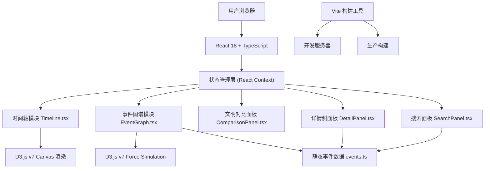
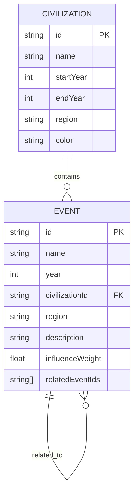

## 1. 架构设计



## 2. 技术描述
- **前端框架**：React@18 + TypeScript
- **构建工具**：Vite@5 + @vitejs/plugin-react
- **可视化库**：d3@7（力导向图、时间轴渲染）
- **状态管理**：React Context API（模块间通信）
- **唯一标识**：uuid
- **样式方案**：CSS-in-JS + CSS Variables
- **后端**：无（纯前端应用，静态数据）
- **数据库**：无（内置静态数据）

## 3. 路由定义
| 路由 | 用途 |
|-------|---------|
| / | 主页面，包含所有模块 |

## 4. 数据模型

### 4.1 数据模型定义



### 4.2 类型定义

```typescript
interface Civilization {
  id: string;
  name: string;
  startYear: number;
  endYear: number;
  region: string;
  color: string;
}

interface Event {
  id: string;
  name: string;
  year: number;
  civilizationId: string;
  region: string;
  description: string;
  influenceWeight: number;
  relatedEventIds: string[];
}

interface AppState {
  selectedCivilizationId: string | null;
  selectedCivilizationIds: string[];
  selectedEventId: string | null;
  highlightedEventId: string | null;
  searchQuery: string;
  searchResults: Event[];
  isDetailPanelOpen: boolean;
}
```

## 5. 项目文件结构

```
d:\Pro\tasks\auto242\
├── package.json
├── index.html
├── vite.config.js
├── tsconfig.json
├── src\
│   ├── main.tsx
│   ├── App.tsx
│   ├── AppContext.tsx
│   ├── index.css
│   ├── types\
│   │   └── index.ts
│   ├── data\
│   │   └── events.ts
│   ├── timeline\
│   │   └── Timeline.tsx
│   ├── eventGraph\
│   │   └── EventGraph.tsx
│   ├── comparison\
│   │   └── ComparisonPanel.tsx
│   ├── detail\
│   │   └── DetailPanel.tsx
│   └── search\
│       └── SearchPanel.tsx
```

## 6. 模块通信机制

### 6.1 Context 状态定义
- `selectedCivilizationId`: 当前选中的文明ID（用于事件图谱）
- `selectedCivilizationIds`: 选中的文明ID列表（最多3个，用于对比面板）
- `selectedEventId`: 当前选中的事件ID（用于详情面板）
- `highlightedEventId`: 高亮显示的事件ID（用于搜索结果跳转）
- `isDetailPanelOpen`: 详情面板是否打开

### 6.2 Context 操作方法
- `selectCivilization(id)`: 选择单个文明
- `toggleComparisonCivilization(id)`: 切换对比文明（添加/移除）
- `selectEvent(id)`: 选择事件并打开详情
- `highlightEvent(id)`: 高亮事件节点
- `closeDetailPanel()`: 关闭详情面板
- `setSearchQuery(query)`: 设置搜索关键词
- `getSearchResults()`: 获取搜索结果

## 7. 性能优化策略

### 7.1 拖拽性能
- 使用 D3.js 内置的 `d3.drag` 配合力导向图
- 节点拖拽时使用 `requestAnimationFrame` 保证帧率
- 弹性恢复动画使用 CSS transition 或 D3 transition
- 限制节点数量（最多显示50个节点）

### 7.2 搜索性能
- 静态数据预加载到内存
- 使用 `String.includes()` 进行模糊匹配，时间复杂度 O(n)
- 搜索结果限制最多显示20条
- 防抖处理输入事件（100ms延迟）

### 7.3 渲染性能
- Canvas 用于时间轴渲染（高性能像素操作）
- SVG 用于力导向图（方便交互和动画）
- React.memo 包裹子组件避免不必要重渲染
- useCallback/useMemo 优化回调和计算值
- 时间轴文字碰撞检测，避免重叠

## 8. 核心实现要点

### 8.1 时间轴模块
- Canvas 2D API 绘制
- 年份到像素的映射函数
- 鼠标坐标到文明区块的碰撞检测
- 文明区块颜色按区域从12色相环分配
- 文字渲染时进行重叠检测，自动调整位置或隐藏

### 8.2 事件图谱模块
- D3 forceSimulation 力导向布局
- 节点半径根据 `influenceWeight` 映射到 12-28px
- 箭头使用 SVG marker 定义
- 拖拽行为：`dragstart` 固定节点，`drag` 更新位置，`dragend` 释放并重启模拟
- 弹性恢复动画使用 `d3.transition().duration(300).ease(d3.easeElastic)`

### 8.3 文明对比面板
- 计算多个文明时间线的重叠区间
- 使用 SVG 绘制虚线高亮重叠区域
- 每个文明独立的缩略时间轴

### 8.4 详情侧面板
- CSS transform: translateX 实现滑入动画
- 关联事件列表项点击触发 `highlightEvent` 和 `selectEvent`

### 8.5 搜索面板
- 输入框 onChange 事件防抖
- 对事件名称、描述、区域进行多字段模糊匹配
- 结果卡片点击触发 `highlightEvent` 并滚动到图谱区域
