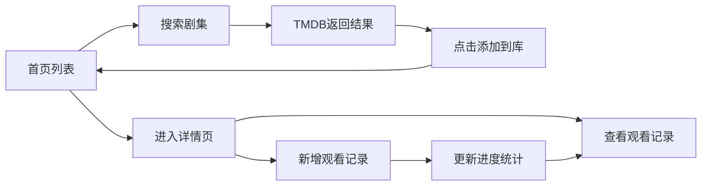

## 1. 产品概述

追剧小本本是一款面向影视爱好者的追剧管理Web应用，帮助用户统一管理分散在各视频平台的追剧清单，记录观看进度，追踪剧集详情，分析观看偏好。

- 核心价值：解决多平台剧集管理分散、观看记录不统一的痛点
- 目标用户：热爱追剧、有收藏和追更习惯的影视观众
- 市场定位：轻量级个人追剧管理工具，聚焦记录与分析功能

## 2. 核心功能

### 2.1 用户角色
| 角色 | 注册方式 | 核心权限 |
|------|----------|----------|
| 普通用户 | 无需注册（本地存储） | 搜索添加剧集、管理观看记录、查看统计分析 |

### 2.2 功能模块
1. **搜索添加**：通过TMDB API搜索剧集，一键添加到个人追剧库
2. **追剧列表**：网格卡片展示所有剧集，支持筛选和排序
3. **详情页面**：剧集详情与观看记录时间线，统计卡片展示
4. **记录管理**：新增观看记录（季数/集数/评分/短评），自动更新进度

### 2.3 页面详情
| 页面名称 | 模块名称 | 功能描述 |
|----------|----------|----------|
| 首页（追剧列表） | 搜索栏 | 输入剧名搜索TMDB，300ms防抖，结果列表点击添加 |
| 首页（追剧列表） | 筛选排序 | 按观看状态（正在追/已完结/已弃剧）和评分高低筛选排序 |
| 首页（追剧列表） | 剧集卡片网格 | 封面、剧名、观看进度（S02E05格式）、五星评分、最后更新时间 |
| 详情页 | 统计卡片区 | 总集数、已看集数、平均评分、追剧天数四项统计 |
| 详情页 | 观看记录时间线 | 按日期倒序展示每集记录，含日期、集数、评分、短评 |
| 详情页 | 新增记录表单 | 选择季数、集数、1-5星评分、填写短评 |

## 3. 核心流程

### 主流程描述
用户进入应用 → 浏览追剧列表 → 通过搜索栏搜索新剧集 → 点击搜索结果添加到列表 → 点击剧集卡片进入详情页 → 查看/添加观看记录 → 系统自动更新进度与统计数据

## 4. 用户界面设计

### 4.1 设计风格
- **主色调**：深色主题，主背景#0F172A，卡片背景#1E293B
- **强调色**：蓝色#3B82F6、紫色#8B5CF6、青色#06B6D4、绿色#10B981、金色#F59E0B
- **按钮与输入框**：圆角8px，内边距12px，聚焦边框过渡0.2s ease
- **字体**：Inter或系统无衬线字体，统一字号层级
- **布局风格**：卡片式网格布局，CSS Grid自适应2-4列
- **图标风格**：线性图标（lucide-react），配色与主题统一
- **动效**：0.3s fade-in加载动画，0.2s opacity过渡，hover上浮效果

### 4.2 页面设计概览
| 页面名称 | 模块名称 | UI元素 |
|----------|----------|--------|
| 首页 | 搜索栏 | 圆角输入框、搜索图标、防抖加载、结果下拉列表 |
| 首页 | 筛选栏 | 状态下拉、排序下拉、标签式切换 |
| 首页 | 卡片网格 | 280px宽卡片、封面图、进度标签、五星评分、悬停上浮 |
| 详情页 | 统计卡片 | 1E293B背景圆角12px、24px加粗数值、图标+文字布局 |
| 详情页 | 时间线 | 10B981竖线、3B82F6圆点节点、日期+集数+评分+短评 |
| 详情页 | 新增表单 | 季数/集数选择器、星级评分、短评输入、提交按钮 |

### 4.3 响应式
- 桌面端优先（>=1200px）：4列卡片网格
- 平板端（768-1199px）：3列卡片网格
- 移动端（<768px）：2列卡片网格
- 触控优化：增大点击区域，适配手指操作

### 4.4 动画与过渡
- 页面加载：元素依次fade-in（staggered delay）
- 卡片悬停：translateY(-4px) + 阴影加深，0.2s过渡
- 筛选切换：列表项opacity过渡0.2s
- 统计数据更新：数值变化带数字跳动效果
- 时间线展开：节点依次滑入，带轻微延迟
