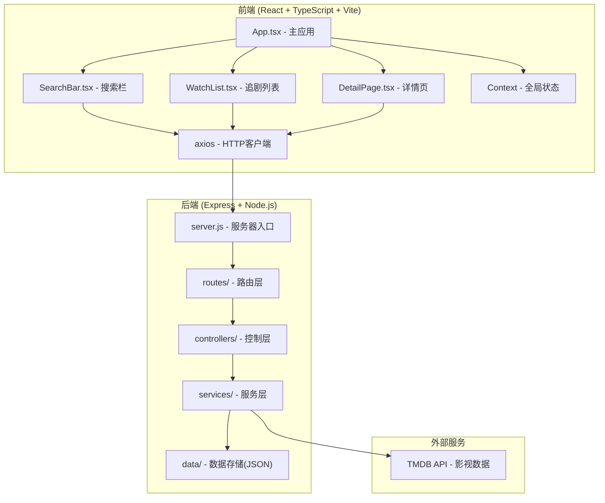
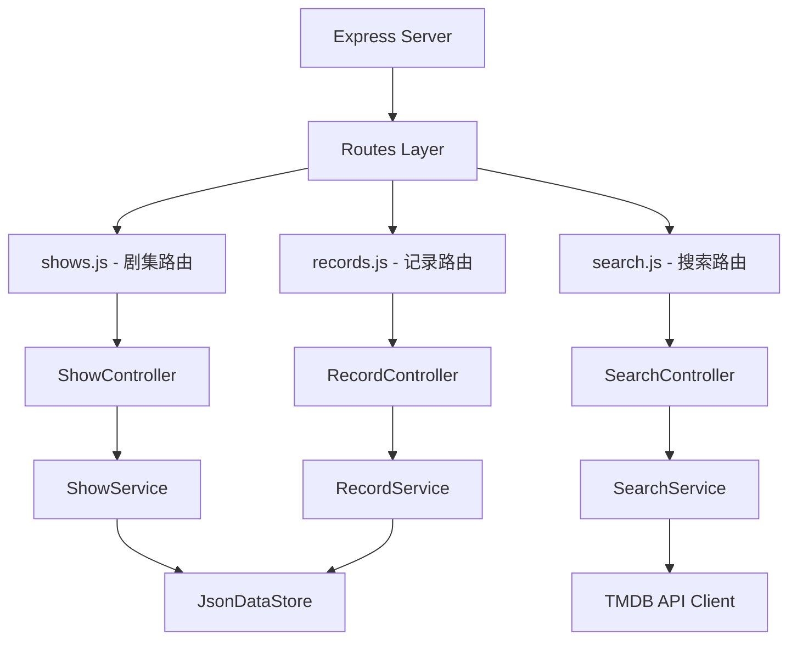
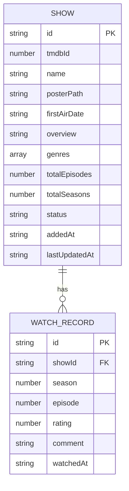

## 1. 架构设计



## 2. 技术描述

- **前端**：React 18 + TypeScript + Vite + React Router DOM + Axios
- **后端**：Express 4 + CORS + UUID
- **构建工具**：Vite 5
- **数据存储**：JSON文件持久化（开发阶段）
- **外部API**：TMDB (The Movie Database) API
- **状态管理**：React Context + useState
- **样式方案**：原生CSS + CSS Modules（内联样式）
- **虚拟滚动**：react-window（列表>20项时启用）

## 3. 路由定义

| 路由 | 用途 |
|------|------|
| / | 首页 - 追剧列表展示 |
| /detail/:id | 详情页 - 剧集详情与观看记录 |

## 4. API定义

### 4.1 类型定义

```typescript
// 剧集信息
interface Show {
  id: string;
  tmdbId: number;
  name: string;
  posterPath: string;
  firstAirDate: string;
  overview: string;
  genres: string[];
  totalEpisodes: number;
  totalSeasons: number;
  status: 'watching' | 'completed' | 'dropped';
  addedAt: string;
  lastUpdatedAt: string;
}

// 观看记录
interface WatchRecord {
  id: string;
  showId: string;
  season: number;
  episode: number;
  rating: number; // 1-5
  comment: string;
  watchedAt: string;
}

// 搜索结果
interface SearchResult {
  tmdbId: number;
  name: string;
  posterPath: string;
  firstAirDate: string;
  overview: string;
}

// 统计数据
interface ShowStats {
  totalEpisodes: number;
  watchedEpisodes: number;
  averageRating: number;
  daysTracked: number;
  currentSeason: number;
  currentEpisode: number;
}
```

### 4.2 接口列表

| 方法 | 路径 | 描述 | 请求体 | 响应 |
|------|------|------|--------|------|
| GET | /api/shows | 获取所有追剧列表 | - | Show[] |
| POST | /api/shows | 添加剧集到列表 | { tmdbId, name, posterPath, ... } | Show |
| DELETE | /api/shows/:id | 从列表删除剧集 | - | { success: boolean } |
| PATCH | /api/shows/:id | 更新剧集状态 | { status } | Show |
| GET | /api/shows/:id | 获取剧集详情 | - | Show & { records: WatchRecord[], stats: ShowStats } |
| GET | /api/search?q= | 搜索剧集（TMDB） | - | SearchResult[] |
| GET | /api/shows/:id/records | 获取观看记录列表 | - | WatchRecord[] |
| POST | /api/shows/:id/records | 新增观看记录 | { season, episode, rating, comment } | WatchRecord |
| DELETE | /api/records/:id | 删除观看记录 | - | { success: boolean } |

## 5. 服务器架构图



## 6. 数据模型

### 6.1 数据模型ER图



### 6.2 数据定义

**shows.json**
```json
[
  {
    "id": "uuid-string",
    "tmdbId": 12345,
    "name": "剧集名称",
    "posterPath": "/path/to/poster.jpg",
    "firstAirDate": "2023-01-01",
    "overview": "剧集简介...",
    "genres": ["剧情", "悬疑"],
    "totalEpisodes": 24,
    "totalSeasons": 2,
    "status": "watching",
    "addedAt": "2024-01-01T00:00:00Z",
    "lastUpdatedAt": "2024-01-15T00:00:00Z"
  }
]
```

**records.json**
```json
[
  {
    "id": "uuid-string",
    "showId": "show-uuid",
    "season": 1,
    "episode": 5,
    "rating": 5,
    "comment": "这一集太精彩了！",
    "watchedAt": "2024-01-10T00:00:00Z"
  }
]
```
