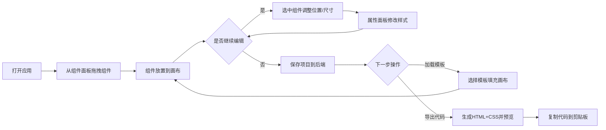

## 1. 产品概述
迷你设计工坊是一款低代码页面原型设计工具，允许用户通过可视化拖拽方式快速搭建产品原型页面，支持实时预览和导出HTML代码。
- 核心目标：降低产品原型设计门槛，提高设计效率，面向产品经理、设计师和前端开发者
- 产品价值：无需编码即可完成页面原型搭建，所见即所得，一键导出可用代码

## 2. 核心功能

### 2.1 用户角色
本产品为单用户桌面级Web应用，无需用户注册登录体系。

### 2.2 功能模块
1. **组件面板**：展示可拖拽组件列表（按钮、输入框、文本块、图片框、容器）
2. **画布区域**：组件放置、拖拽移动、缩放调整的主工作区
3. **属性面板**：编辑选中组件的样式属性（尺寸、位置、颜色、字体、边框、阴影等）
4. **顶部工具栏**：保存项目、加载项目、导出HTML、选择模板
5. **模板系统**：预置5个常用页面模板供用户快速套用
6. **HTML导出**：将画布组件转换为标准HTML+CSS代码并预览

### 2.3 页面详情
| 页面名称 | 模块名称 | 功能描述 |
|-----------|-------------|---------------------|
| 主编辑页 | 组件面板 | 展示5种可拖拽组件，支持拖拽到画布，卡片悬停动画 |
| 主编辑页 | 画布区域 | 网格背景（20px间距），组件拖拽吸附，组件自由移动/缩放 |
| 主编辑页 | 属性面板 | 实时编辑选中组件的12+种样式属性，0.2s过渡动画 |
| 主编辑页 | 顶部工具栏 | 保存/加载/导出/模板4个核心操作按钮，操作反馈Toast |
| 主编辑页 | 模板模态框 | 5个预置模板展示，点击载入画布，0.3s过渡动画 |
| 导出预览页 | 代码预览 | 新标签页展示渲染效果，提供复制代码按钮 |

## 3. 核心流程

用户从组件面板拖拽组件到画布 → 选中组件调整位置和大小 → 在属性面板修改样式 → 保存项目到后端 → 选择模板快速创建页面 → 导出HTML代码预览复制

## 4. 用户界面设计

### 4.1 设计风格
- **主色调**：#3B82F6（蓝色），深色科技风格
- **配色方案**：主背景#0F172A，面板背景#1E293B，卡片背景#334155
- **文字颜色**：主文字#F8FAFC，辅助文字#94A3B8，成功#10B981，警告#F59E0B，错误#EF4444
- **按钮风格**：圆角8px，背景纯色填充，悬停亮度提升20%，过渡0.2s
- **字体**：系统无衬线字体栈，标题16px粗体，正文14px常规
- **布局风格**：三栏式布局（左260px + 自适应 + 右300px），顶部56px工具栏
- **图标风格**：简洁线条式图标，与深色主题统一

### 4.2 页面设计概述
| 页面名称 | 模块名称 | UI元素 |
|-----------|-------------|-------------|
| 主编辑页 | 组件面板 | 圆角12px背景#1E293B，组件卡片圆角8px背景#334155，悬停上移2px+阴影 |
| 主编辑页 | 画布区域 | #F8FAFC背景，20px网格线#E2E8F0，选中组件2px#3B82F6边框高亮 |
| 主编辑页 | 属性面板 | 圆角12px背景#1E293B，内边距20px，分组表单布局 |
| 主编辑页 | 工具栏 | 56px高度，底部边框#334155，三枚彩色操作按钮 |
| 主编辑页 | 模态框 | 半透明遮罩rgba(0,0,0,0.6)，面板圆角16px居中显示 |
| 导出预览页 | 预览容器 | 白色背景，按画布位置绝对定位渲染 |

### 4.3 响应式
- 桌面端优先（≥1024px）：三栏完整布局
- 平板端（<1024px）：组件面板和属性面板折叠为侧边图标按钮，点击覆盖展开
- 拖拽和缩放操作：触屏设备优化触摸事件响应

### 4.4 动画与过渡
- 组件拖拽：弹性跟随0.1s ease-out
- 样式变更：0.2s ease过渡
- 面板展开/收起：0.3s ease-out
- Toast提示：从右上/顶部滑入0.3s，淡出1.5s后消失
- 模板载入：画布0.3s淡出淡入过渡
- 拖拽吸附：蓝色半透明对齐线提示
