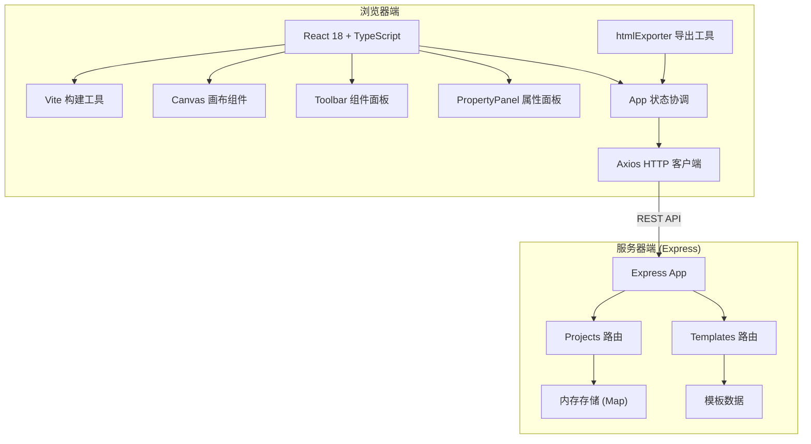
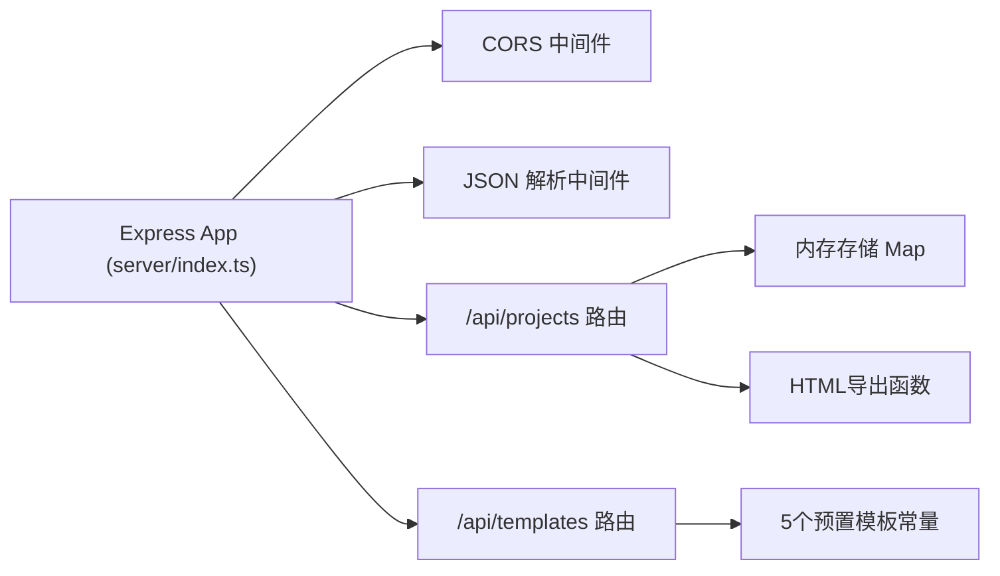
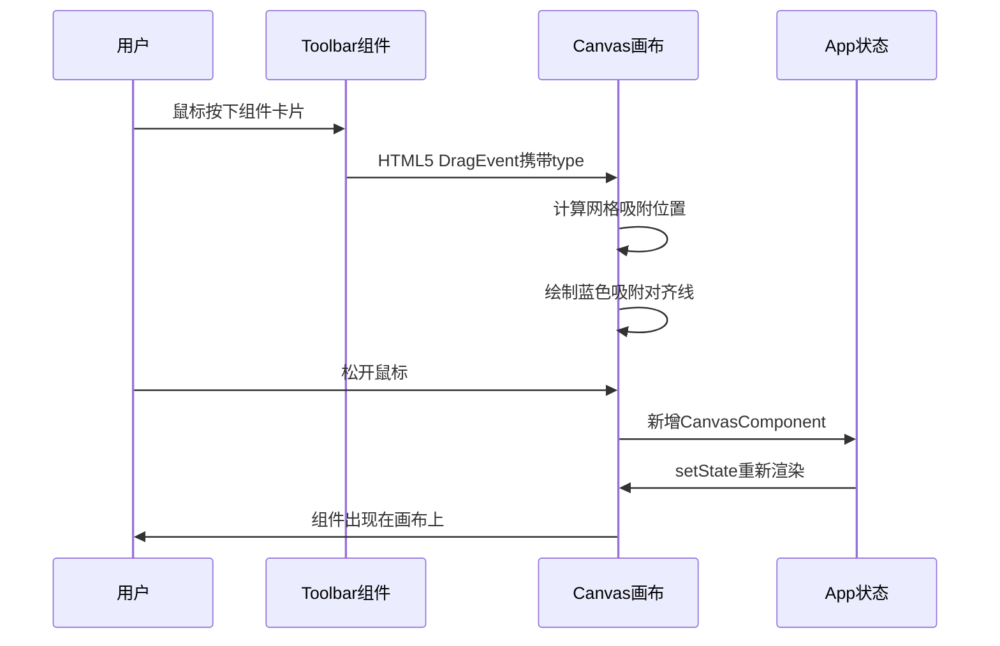

## 1. 架构设计



## 2. 技术说明

- **前端框架**：React@18 + TypeScript（严格模式）
- **构建工具**：Vite@5 + @vitejs/plugin-react
- **路由**：react-router-dom@6（单页应用）
- **HTTP客户端**：axios@1
- **后端服务**：Express@4 + cors
- **唯一ID生成**：uuid@9
- **数据存储**：服务器内存（Map对象），无需数据库
- **开发模式**：前后端分离，npm run dev 同时启动

## 3. 项目文件结构

| 路径 | 说明 |
|------|------|
| package.json | 项目依赖和脚本配置 |
| index.html | Vite入口HTML，深色背景全屏 |
| vite.config.js | Vite构建配置 |
| tsconfig.json | TypeScript严格模式配置 |
| server/index.ts | Express服务端入口 |
| server/routes/projects.ts | 项目CRUD+导出路由 |
| server/routes/templates.ts | 模板数据路由 |
| src/App.tsx | 主应用组件，状态管理 |
| src/components/Canvas.tsx | 画布组件（拖拽、缩放、网格） |
| src/components/Toolbar.tsx | 左侧组件面板 |
| src/utils/htmlExporter.ts | HTML+CSS代码生成器 |
| src/types/index.ts | TypeScript类型定义 |

## 4. API 定义

### 项目接口

```typescript
// 项目数据模型
interface Project {
  id: string;
  name: string;
  createdAt: number;
  updatedAt: number;
  components: CanvasComponent[];
}

// 画布组件数据模型
interface CanvasComponent {
  id: string;
  type: 'button' | 'input' | 'text' | 'image' | 'container';
  x: number;
  y: number;
  width: number;
  height: number;
  zIndex: number;
  style: ComponentStyle;
  content?: string;
  children?: CanvasComponent[];
}

interface ComponentStyle {
  backgroundColor: string;
  color: string;
  fontSize: number;
  borderColor: string;
  borderWidth: number;
  borderRadius: number;
  boxShadow: string;
  padding: number;
}
```

| 方法 | 路径 | 说明 | 请求体 | 响应 |
|------|------|------|--------|------|
| POST | /api/projects | 创建项目 | `{ name, components }` | `{ id, ...project }` |
| GET | /api/projects | 项目列表 | - | `Project[]` |
| GET | /api/projects/:id | 项目详情 | - | `Project` |
| PUT | /api/projects/:id | 更新项目 | `{ name, components }` | `Project` |
| DELETE | /api/projects/:id | 删除项目 | - | `{ success: true }` |
| POST | /api/projects/export | 导出HTML | `{ components }` | `{ html, css }` |

### 模板接口

| 方法 | 路径 | 说明 | 响应 |
|------|------|------|------|
| GET | /api/templates | 模板列表 | `Template[]` |
| GET | /api/templates/:id | 模板详情 | `Template` |

```typescript
interface Template {
  id: string;
  name: string;
  description: string;
  thumbnail: string;
  components: CanvasComponent[];
}
```

## 5. 服务端架构



## 6. 核心数据流

### 6.1 组件拖拽流程


### 6.2 属性编辑流程
- 用户选中组件 → App更新selectedId → 属性面板读取对应组件数据
- 用户修改输入框 → onInput触发 → App更新对应组件style → Canvas重渲染（0.2s过渡）

## 7. 性能优化策略

1. **Canvas组件**：使用CSS transform实现拖拽（GPU加速），避免layout thrashing
2. **状态更新**：拖拽过程使用useRef存储临时位置，requestAnimationFrame节流到60fps
3. **属性面板**：useMemo缓存派生样式值，避免不必要的重渲染
4. **组件渲染**：React.memo包装单个画布组件，比较props浅一致性
5. **缩放句柄**：pointer events + stopPropagation防止冒泡到画布拖拽
6. **最大组件数**：前端限制50个，超出时Toast警告
