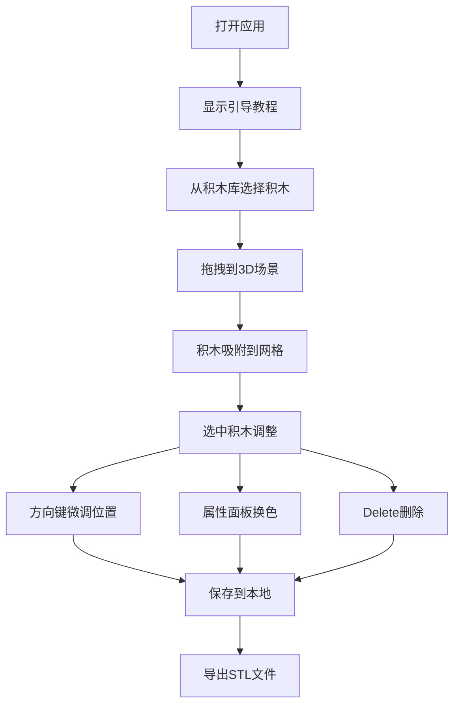

## 1. 产品概述

乐高风格3D建模应用，通过拖拽组合积木块自由创作3D模型，支持导出STL文件，降低3D建模门槛，面向儿童和初学者。

- 核心目标：让无建模经验的用户通过直观的拖拽操作快速创建3D模型
- 目标用户：儿童、初学者、教育场景、创客爱好者
- 核心价值：降低3D创作门槛，提供乐高式积木搭建体验

## 2. 核心功能

### 2.1 用户角色
| 角色 | 注册方式 | 核心权限 |
|------|----------|----------|
| 普通用户 | 无需注册，直接使用 | 搭建模型、保存本地、导出STL |

### 2.2 功能模块
1. **3D场景编辑器**：积木拖拽、视角控制、网格吸附
2. **积木库面板**：多种积木类型、颜色选择
3. **属性面板**：位置编辑、颜色切换、删除操作
4. **场景管理**：保存模型、撤销重做、导出STL
5. **引导教程**：三步上手指引

### 2.3 功能详情
| 模块名称 | 功能描述 |
|---------|----------|
| 积木库 | 5种基础积木类型（2x2方块、2x4长条、1x8薄板、斜面块、圆柱体），5种基础颜色（红、蓝、黄、绿、白），HTML5拖放API |
| 3D场景 | Three.js渲染，网格吸附（16mm间距），鼠标右键旋转视角（阻尼0.3），滚轮缩放（1-10倍） |
| 积木编辑 | 方向键微调（每次16mm），Delete删除，Shift多选批量操作，删除缩小动画（0.2s） |
| 属性面板 | 显示位置坐标（精度0.1），颜色选择器，删除按钮 |
| 场景管理 | IndexedDB本地存储，最多10个模型，缩略图64x64，名称和编辑时间 |
| STL导出 | ASCII格式STL文件，加载动画（旋转圆环） |
| 引导教程 | 三步引导，sessionStorage记录，浮动气泡样式 |

## 3. 核心流程

用户从左侧积木库拖拽积木到3D场景 → 积木自动吸附网格 → 通过鼠标/键盘调整位置 → 右侧面板调整颜色 → 保存或导出STL文件。

## 4. 用户界面设计

### 4.1 设计风格
- **主色调**：深色主题，背景色 #0F172A
- **辅助色**：面板背景 #1E293B，积木预览背景 #334155
- **强调色**：蓝色 #3B82F6，紫色 #6366F1
- **积木颜色**：红 #EF4444、蓝 #3B82F6、黄 #FACC15、绿 #22C55E、白 #F8FAFC
- **按钮风格**：圆角8px，悬停背景 #334155
- **字体**：现代无衬线字体，清晰易读
- **布局风格**：三栏布局，左中右结构，顶部工具栏
- **动画**：统一ease-out缓动，时长0.2s

### 4.2 页面设计概览
| 区域 | 模块名称 | UI元素 |
|------|----------|--------|
| 顶部 | 工具栏 | 保存、导出、撤销、重做按钮，高度56px |
| 左侧 | 积木库面板 | 宽度240px，积木图标卡片，80x80px，圆角8px |
| 中央 | 3D场景 | Three.js Canvas，网格线 #374151 |
| 右侧 | 属性面板 | 宽度280px，位置坐标，颜色选择，删除按钮 |
| 右下 | 引导气泡 | 宽度320px，圆角16px，三步引导 |

### 4.3 响应式
- 桌面端优先，最低支持1280px宽度
- 三栏固定宽度布局，中央场景自适应

### 4.4 3D场景指引
- **环境**：深色背景 #0F172A，地面网格辅助
- **灯光**：环境光 + 方向光，柔和阴影
- **相机**：透视相机，初始角度45度俯视
- **交互**：右键拖拽旋转，滚轮缩放，阻尼0.3
- **性能**：30FPS以上，最多100个积木
