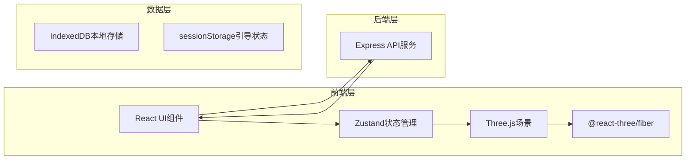

## 1. 架构设计



## 2. 技术描述

- **前端框架**：React 18 + TypeScript
- **3D渲染**：Three.js + @react-three/fiber + @react-three/drei
- **状态管理**：Zustand
- **构建工具**：Vite
- **样式方案**：CSS Modules / 内联样式
- **后端服务**：Express 4
- **本地存储**：IndexedDB
- **跨域处理**：cors 中间件

## 3. 项目结构

```
auto247/
├── package.json
├── index.html
├── vite.config.js
├── tsconfig.json
├── server/
│   └── index.js              # Express后端服务
└── src/
    ├── App.tsx               # 主应用组件
    ├── store/
    │   └── useAppStore.ts    # Zustand全局状态
    ├── scene/
    │   ├── SceneManager.ts   # 3D场景核心管理
    │   └── FloorGrid.ts      # 网格辅助组件
    └── ui/
        ├── BrickLibrary.tsx  # 积木库面板
        ├── PropertyPanel.tsx # 属性面板
        └── TutorialBubble.tsx # 引导气泡
```

## 4. API定义

### 4.1 GET /api/bricks/types
获取积木类型列表。

**响应：**
```typescript
interface BrickType {
  id: string;
  name: string;
  width: number;  // 单位数
  height: number; // 单位数
  depth: number;  // 单位数
  shape: 'cube' | 'slope' | 'cylinder';
}

// 响应示例
[
  { id: '2x2', name: '2x2方块', width: 2, height: 1, depth: 2, shape: 'cube' },
  { id: '2x4', name: '2x4长条', width: 2, height: 1, depth: 4, shape: 'cube' },
  { id: '1x8', name: '1x8薄板', width: 1, height: 0.5, depth: 8, shape: 'cube' },
  { id: 'slope', name: '斜面块', width: 2, height: 1, depth: 2, shape: 'slope' },
  { id: 'cylinder', name: '圆柱体', width: 1, height: 1, depth: 1, shape: 'cylinder' }
]
```

### 4.2 POST /api/export/stl
导出STL文件。

**请求体：**
```typescript
interface ExportRequest {
  bricks: {
    id: string;
    type: string;
    color: string;
    position: { x: number; y: number; z: number };
  }[];
}
```

**响应：**
```
Content-Type: application/octet-stream
Content-Disposition: attachment; filename="model.stl"
ASCII STL 格式字符串
```

## 5. 数据模型

### 5.1 积木数据模型
```typescript
interface Brick {
  id: string;
  type: string;
  color: string;
  position: { x: number; y: number; z: number };
}
```

### 5.2 保存的模型
```typescript
interface SavedModel {
  id: string;
  name: string;
  thumbnail: string;  // base64 64x64
  bricks: Brick[];
  createdAt: number;
  updatedAt: number;
}
```

### 5.3 应用状态
```typescript
interface AppState {
  bricks: Brick[];
  selectedIds: string[];
  history: { past: Brick[][], future: Brick[][] };
  showTutorial: boolean;
  tutorialStep: number;
}
```

## 6. 核心模块说明

### 6.1 SceneManager
- 初始化Three.js场景、相机、灯光
- 管理积木的增删改查
- 处理鼠标交互（拖拽旋转、缩放、选择）
- 生成STL导出数据
- 管理网格辅助线

### 6.2 useAppStore
- 管理全局积木列表
- 选中状态管理
- 撤销/重做栈
- 教程状态

### 6.3 积木类型常量
- 5种标准积木类型
- 标准单位：16mm
- 几何参数定义
