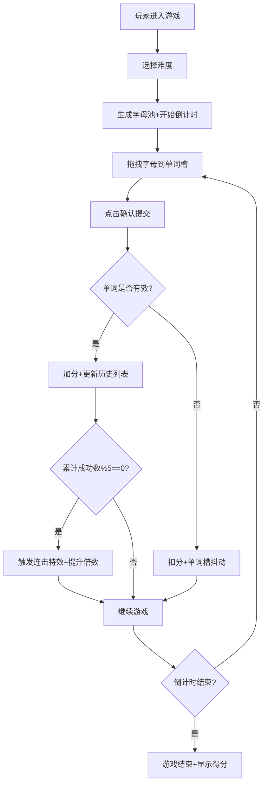

## 1. 产品概述

"文字榨汁机"是一款考验词汇量和反应速度的英文单词重组游戏，玩家在倒计时内从随机字母池中拖拽排列出尽可能多的有效英文单词，通过连击奖励和视觉反馈获得沉浸式游戏体验。

- 核心目标：提供兼具娱乐性和学习价值的词汇训练游戏
- 目标用户：英语学习者、词汇爱好者、休闲游戏玩家
- 产品价值：在游戏化体验中提升英语词汇能力和反应速度

## 2. 核心功能

### 2.1 功能模块
1. **游戏主界面**：16x16字母池网格、单词拖拽槽、确认提交按钮
2. **计分系统**：实时分数显示、单词历史列表、连击倍数奖励
3. **倒计时系统**：难度关联倒计时、低时间警告视觉反馈
4. **难度系统**：简单/普通/困难三档难度切换
5. **视觉特效**：连击粒子爆炸、屏幕震动、分数动画、扫描线动效

### 2.2 页面详情
| 页面名称 | 模块名称 | 功能描述 |
|-----------|-------------|---------------------|
| 游戏主页面 | 字母池网格 | 16x16网格显示随机字母，支持鼠标拖拽选择 |
| 游戏主页面 | 单词槽 | 接收拖拽字母，显示当前拼写单词，提交后清空 |
| 游戏主页面 | 确认按钮 | 提交单词进行校验，触发正确/错误反馈 |
| 游戏主页面 | 计分面板 | 显示实时分数、倒计时、连击倍数、单词历史 |
| 游戏主页面 | 难度切换器 | 右上角切换三档难度，自动重置游戏 |

## 3. 核心流程

玩家进入游戏后选择难度，系统根据难度生成字母池并开始倒计时。玩家从字母池拖拽字母到单词槽组成单词，点击确认按钮提交。系统校验单词有效性，正确则加分并更新历史，错误则扣分并抖动提示。每成功提交5个单词触发连击特效，粒子爆炸并提升连击倍数。倒计时结束后游戏结束，显示最终得分。

## 4. 用户界面设计

### 4.1 设计风格
- **主色调**：赛博朋克暗色风格，背景#0F172A，字母池背景#1E293B
- **强调色**：主按钮#10B981（悬停#059669），难度按钮#3B82F6（选中#2563EB），警告色#EF4444，连击#F59E0B
- **圆角规范**：所有卡片统一8px圆角，侧边面板12px圆角
- **内边距规范**：字母格4px，按钮12px 24px，面板16px
- **字体**：数字使用monospace加粗，字母使用等宽字体
- **特殊效果**：动态扫描线（CSS伪元素，透明度0.03，3s循环）、屏幕边框光晕、粒子爆炸

### 4.2 页面设计概述
| 页面名称 | 模块名称 | UI元素 |
|-----------|-------------|-------------|
| 游戏主页面 | 字母池网格 | 16x16网格，50x50px格子，#1E293B背景，圆角8px，字母居中等宽 |
| 游戏主页面 | 单词槽 | 宽度100%，高度64px，底部边框#3B82F6，拖拽进入时弹性缩放1.05倍/0.2s |
| 游戏主页面 | 确认按钮 | 圆角8px，#10B981背景，12px 24px内边距，悬停#059669带0.2s过渡 |
| 游戏主页面 | 计分面板 | 宽度240px，#0F172A背景，圆角12px，16px内边距，分割线#334155 |
| 游戏主页面 | 难度切换 | 右上角圆角8px，#3B82F6背景，8px 16px内边距，选中加深至#2563EB |
| 游戏主页面 | 特效层 | Canvas粒子、屏幕边框光晕、扫描线动效 |

### 4.3 响应式设计
- **桌面端**：16x16字母池网格，正常布局
- **移动端（<600px）**：自动缩为12x12网格，增大格子边距防止触摸误触
- **布局策略**：页面上下左右居中，主游戏区+右侧计分面板双栏布局

### 4.4 动画与交互
- **拖拽效果**：字母拖拽时带半透明跟随效果，放入单词槽时弹性缩放
- **分数动画**：加分时数字上弹+20px后渐隐0.4s
- **错误反馈**：单词槽红色抖动0.3s
- **连击特效**：屏幕边框闪烁#F59E0B光晕0.5s，20个随机颜色粒子爆炸1s
- **低时间警告**：倒计时<10秒时变红并闪烁
- **难度切换**：0.5s淡出淡入过渡动画
- **性能优化**：所有动画使用CSS transform和opacity，稳定60fps
