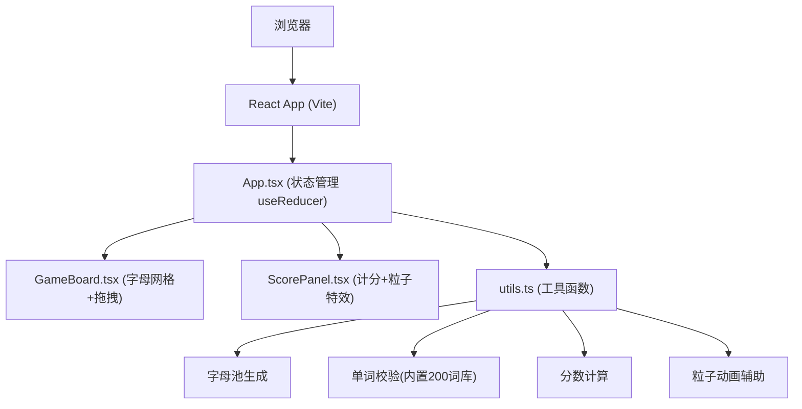

## 1. 架构设计



## 2. 技术描述
- **前端框架**：React 18 + TypeScript
- **构建工具**：Vite 5
- **状态管理**：React useReducer（集中式状态机）
- **样式方案**：原生CSS + CSS Variables（避免重排重绘）
- **动画方案**：CSS Transforms + Opacity + Canvas粒子
- **性能优化**：requestAnimationFrame、will-change、GPU加速

## 3. 核心文件结构
| 文件路径 | 职责说明 |
|----------|----------|
| `package.json` | 项目依赖与脚本，react/react-dom/typescript/vite/@vitejs/plugin-react |
| `index.html` | 入口页面，全屏深色背景#0F172A |
| `vite.config.js` | Vite构建配置 |
| `tsconfig.json` | TypeScript严格模式配置 |
| `src/App.tsx` | 主组件，状态机管理、字母池生成、倒计时、useReducer调度 |
| `src/GameBoard.tsx` | 字母网格组件，拖拽逻辑，字母卡片渲染与动画 |
| `src/ScorePanel.tsx` | 右侧计分面板，单词历史、分数、倒计时、粒子特效 |
| `src/utils.ts` | 工具函数，字母池生成、单词校验、分数计算、粒子动画辅助 |

## 4. 状态管理设计

### 4.1 Game State 类型定义
```typescript
type Difficulty = 'easy' | 'normal' | 'hard';
type GameStatus = 'idle' | 'playing' | 'ended';

interface GameState {
  status: GameStatus;
  difficulty: Difficulty;
  letterPool: string[][];
  currentWord: string[];
  score: number;
  combo: number;
  comboMultiplier: number;
  timeLeft: number;
  wordHistory: { word: string; score: number }[];
  isShaking: boolean;
  showComboEffect: boolean;
  floatingScores: { id: number; value: number; x: number; y: number }[];
}
```

### 4.2 Action 类型
```typescript
type GameAction =
  | { type: 'SET_DIFFICULTY'; payload: Difficulty }
  | { type: 'START_GAME' }
  | { type: 'RESET_GAME' }
  | { type: 'ADD_LETTER'; payload: { letter: string; row: number; col: number } }
  | { type: 'REMOVE_LETTER'; payload: number }
  | { type: 'CLEAR_WORD' }
  | { type: 'SUBMIT_WORD' }
  | { type: 'TICK' }
  | { type: 'STOP_SHAKE' }
  | { type: 'STOP_COMBO_EFFECT' }
  | { type: 'REMOVE_FLOATING_SCORE'; payload: number };
```

## 5. 词库数据

内置约200个常见英语单词，按长度3-8字母分组：
- 3字母：cat, dog, run, sun, hat, ...（约50个）
- 4字母：book, tree, fish, bird, moon, ...（约50个）
- 5字母：apple, house, water, music, happy, ...（约40个）
- 6字母：school, friend, window, summer, ...（约30个）
- 7字母：computer, sunshine, birthday, ...（约20个）
- 8字母：keyboard, internet, children, ...（约10个）

## 6. 性能优化策略

1. **CSS动画优化**：所有动画使用transform和opacity，避免触发布局重排
2. **GPU加速**：对频繁动画元素使用`will-change: transform`和`transform: translateZ(0)`
3. **拖拽性能**：使用mousemove事件节流，拖拽元素使用fixed定位脱离文档流
4. **Canvas粒子**：粒子动画使用requestAnimationFrame，控制粒子数量<=20
5. **React优化**：使用React.memo包裹子组件，useCallback缓存事件处理函数
6. **字体优化**：使用等宽字体，确保字母渲染稳定无偏移

## 7. 难度配置表
| 难度 | 倒计时 | 字母池特征 |
|------|--------|------------|
| 简单 | 300秒 | 高频字母(E,A,R,I,O,T,N,S,L,C)占比70% |
| 普通 | 180秒 | 高频字母占比55%，中频字母25%，低频20% |
| 困难 | 90秒 | 高频字母占比40%，中频25%，低频35% |

## 8. 分数规则
- 3字母：3分 × 连击倍数
- 4字母：4分 × 连击倍数
- 5字母：6分 × 连击倍数
- 6字母：9分 × 连击倍数
- 7字母：13分 × 连击倍数
- 8字母：18分 × 连击倍数
- 错误提交：-2分
- 连击倍数：每5个正确单词+1倍，最高10倍
