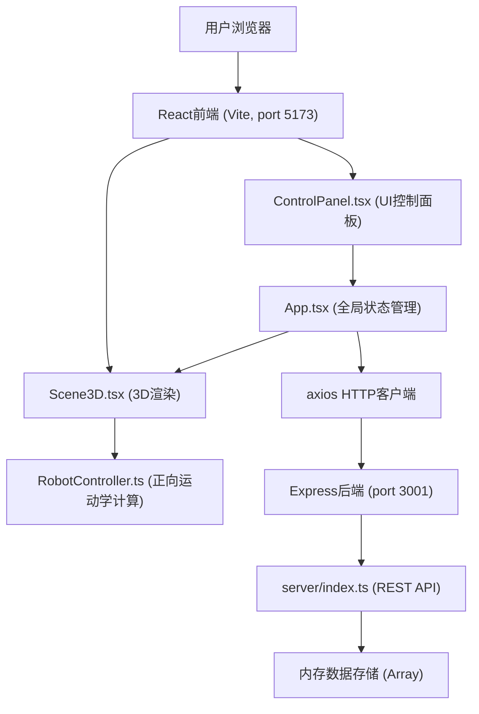
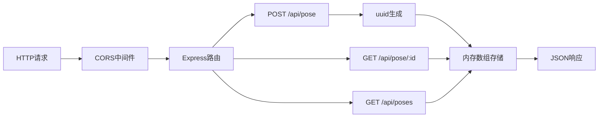
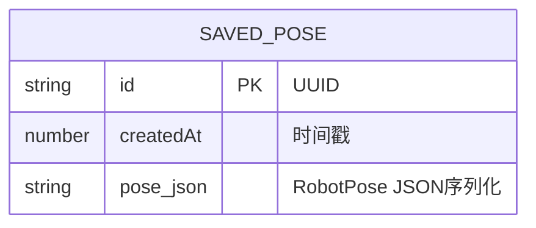

## 1. 架构设计



## 2. 技术描述

- 前端：React@18 + TypeScript + Vite
- 3D渲染：three + @react-three/fiber + @react-three/drei
- HTTP客户端：axios
- 后端：Express@4 + TypeScript + ts-node
- 数据存储：内存数组（开发/演示用）
- 后端端口：3001，前端端口：5173
- CORS：开放localhost:5173

## 3. 路由定义

| 路由 | 用途 |
|-------|---------|
| / | 主应用页面，包含控制面板和3D场景 |

## 4. API定义

### 4.1 类型定义

```typescript
// 单条腿的关节角度
interface LegPose {
  coxa: number;    // 基节角度 0-180
  femur: number;   // 股节角度 0-180
  tibia: number;   // 胫节角度 0-180
}

// 完整姿态：6条腿
interface RobotPose {
  legs: LegPose[];  // 长度为6的数组
}

// 保存的姿态记录
interface SavedPose {
  id: string;       // UUID
  createdAt: number;
  pose: RobotPose;
}

// 姿态缩略信息
interface PoseSummary {
  id: string;
  createdAt: number;
}
```

### 4.2 API端点

| 方法 | 路径 | 描述 | 请求体 | 响应 |
|------|------|------|--------|------|
| POST | /api/pose | 保存当前姿态 | `{ pose: RobotPose }` | `{ id: string }` |
| GET | /api/pose/:id | 获取指定姿态 | - | `SavedPose` |
| GET | /api/poses | 列举所有已保存姿态 | - | `PoseSummary[]` |

## 5. 服务器架构图



## 6. 数据模型

### 6.1 数据模型定义



### 6.2 数据流向说明

1. ControlPanel滑块变化 → App.tsx更新pose state → Scene3D调用RobotController.getJointTransforms() → 更新Three.js骨骼对象
2. 保存姿态按钮 → axios POST /api/pose → Express生成UUID存入内存 → 返回id给前端展示
3. 重置姿态按钮 → App.tsx触发动画state → Scene3D播放0.5s easeInOutCubic插值动画
