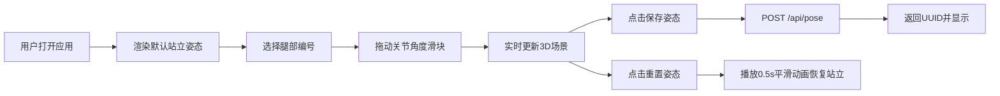

## 1. 产品概述

灵巧六足仿真器是一个面向机器人爱好者和教育工作者的轻量级Web应用，提供浏览器内的多足机器人搭建、关节控制与实时运动学动画可视化功能。

- 解决机器人爱好者和教育工作者缺少便捷3D机器人仿真工具的问题
- 目标市场价值：降低机器人运动学学习门槛，提供交互式教学与实验平台

## 2. 核心功能

### 2.1 功能模块

1. **3D场景渲染模块**：六足机器人3D可视化、视角控制、高亮显示
2. **关节控制面板**：6条腿选择、每条腿3个关节角度滑块控制
3. **姿态管理模块**：重置姿态、保存姿态到后端、姿态UUID展示
4. **后端API服务**：姿态数据存储、读取、列举

### 2.2 页面详情

| 页面名称 | 模块名称 | 功能描述 |
|-----------|-------------|---------------------|
| 主应用页 | 3D场景渲染 | 使用Three.js渲染六足机器人，支持鼠标拖拽旋转、平移、滚轮缩放 |
| 主应用页 | 控制面板 | 左侧320px宽度面板，包含6条腿选择按钮、关节角度滑块、操作按钮 |
| 主应用页 | 姿态保存 | 通过axios POST保存当前关节角度数据到后端，返回UUID展示 |
| 主应用页 | 重置姿态 | 平滑插值动画恢复默认站立姿态 |

## 3. 核心流程

用户打开应用 → 默认显示站立姿态六足机器人 → 选择某条腿（高亮显示）→ 拖动关节滑块实时更新3D模型 → 点击保存姿态 → 后端返回UUID → 点击重置姿态恢复初始状态

## 4. 用户界面设计

### 4.1 设计风格

- 主背景色：#0F172A（深蓝黑）
- 控制面板背景：#1E293B（深灰蓝）
- 主色调：#6366F1（靛蓝）用于机器人主体和选中态
- 高亮色：#F59E0B（琥珀黄）用于选中腿部高亮
- 重置按钮：#EF4444（红色）
- 姿态按钮：#10B981（绿色）
- 保存按钮：#3B82F6（蓝色）
- 字体：标签使用monospace等宽字体，字号14px
- 圆角：按钮和面板统一12px圆角，滑块轨道和输入框8px圆角
- 所有交互元素带0.2s CSS过渡动画

### 4.2 页面设计概述

| 页面名称 | 模块名称 | UI元素 |
|-----------|-------------|-------------|
| 主应用页 | 控制面板 | 左侧320px宽，#1E293B背景，12px圆角，20px内边距 |
| 主应用页 | 腿部选择按钮 | 6个56x56px按钮，#334155背景，选中态#6366F1，0.2s环形扩散光效 |
| 主应用页 | 关节滑块组 | 每组12px间距，monospace标签14px #CBD5E1，轨道#475569，手柄#818CF8 |
| 主应用页 | 操作按钮 | 底部#10B981重置按钮、#3B82F6保存按钮，悬停亮度提升20%，0.2s过渡 |
| 主应用页 | 3D场景 | 右侧全屏剩余区域，#0F172A背景，1px #334155分割线 |
| 主应用页 | Toast提示 | 保存成功时#10B981背景，8px圆角，2.5s自动淡出 |

### 4.3 响应式

桌面端优先设计，控制面板固定320px宽度，3D场景自适应剩余空间。

### 4.4 3D场景指引

- 环境：深色背景，地面网格辅助线#374151
- 光照：环境光 + 方向光，确保机器人结构清晰可见
- 相机：透视角度45°，OrbitControls支持左键旋转、右键平移、滚轮缩放（1-8倍），旋转阻尼0.3，平移阻尼0.2
- 机器人：圆柱+球体构成，每条腿3节，主体#6366F1，关节球体#1E293B，选中腿#F59E0B带glow效果
- 动画：关节更新实时响应（<50ms延迟），重置时0.5s easeInOutCubic缓动插值
