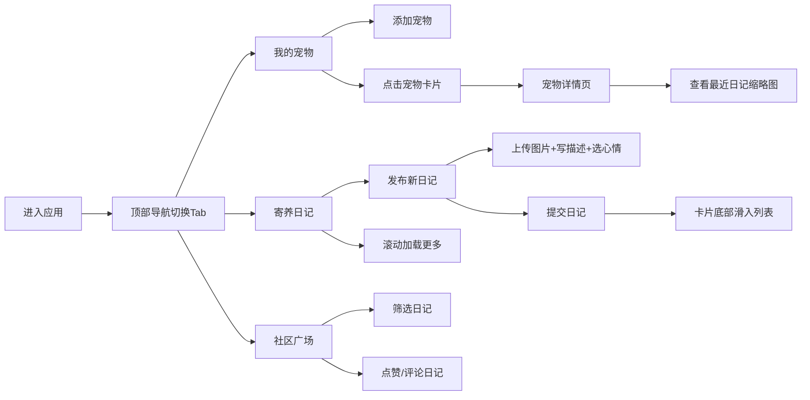

## 1. 产品概述
宠物寄养日记与社区互助系统是一款面向养宠家庭的工具平台，解决宠物主人出差/旅游时委托亲友照顾宠物的记录与沟通问题。平台通过日记记录、实时互动和社区评价，让主人随时了解宠物状态，同时连接附近养宠家庭，建立互助信任网络。

## 2. 核心功能

### 2.1 用户角色
本版本无需注册登录，以本地设备为单一用户身份，支持宠物主人和寄养人两种使用场景。

### 2.2 功能模块
1. **宠物档案页**：添加/管理多只宠物卡片，查看宠物详情和最近日记
2. **寄养日记页**：发布带图日记，无限滚动浏览日记列表
3. **社区广场页**：全局日记流，按品种/心情筛选，点赞评论互动

### 2.3 页面详情

| 页面名称 | 模块名称 | 功能描述 |
|-----------|-------------|---------------------|
| 宠物档案页 | 宠物卡片列表 | 宽280px高360px圆角卡片，展示宠物头像、品种标签、托管状态 |
| 宠物档案页 | 添加宠物表单 | 弹窗表单录入宠物信息（名称、品种、性别、年龄、头像） |
| 宠物档案页 | 宠物详情页 | 顶部3天日记缩略图墙（80x80px，点击放大），完整宠物信息 |
| 寄养日记页 | 日记发布器 | 最多3张图片拖拽上传、200字文字描述、心情标签选择 |
| 寄养日记页 | 日记列表 | 无限滚动加载（每页5条），滚动淡入淡出动画，底部滑入动画 |
| 社区广场页 | 日记流 | 按时间倒序展示所有日记，支持品种和心情标签筛选 |
| 社区广场页 | 互动区 | 爱心点赞（放大+粒子动画）、评论框（@功能，100字限制） |

## 3. 核心流程

## 4. 用户界面设计

### 4.1 设计风格
- **主色调**：米色背景 #FAF0E6，深棕扶手色 #6B4226，暖橙选中色 #E67E22
- **材质质感**：木质感暖色调，CSS渐变模拟亚麻纹理背景
- **卡片样式**：统一20px圆角，柔和阴影，hover时上移4px阴影加深（0.2s ease）
- **字体**：衬线字体 Georgia，营造温暖亲切的阅读感
- **动效**：所有过渡动画（0.3s cubic-bezier / 0.4s ease-out / 0.5s 状态条）
- **图标**：使用 lucide-react 图标库，保持线条统一圆润

### 4.2 页面设计概述

| 页面名称 | 模块名称 | UI元素 |
|-----------|-------------|-------------|
| 全局 | 顶部导航 | 3个Tab底部滑条动画，选中暖橙，未选中灰色 #8D8D8D |
| 宠物档案页 | 宠物卡片 | 左上角圆形头像+品种标签，右下角状态"托管中/在家"，切换时底部彩色状态条0.5s动画 |
| 宠物档案页 | 缩略图墙 | 80x80px圆角8px，点击弹出大图查看（半透明遮罩+缩放动画） |
| 寄养日记页 | 心情标签 | 彩色徽章：开心-绿#2ECC71、闹腾-橙#E67E22、生病-红#E74C3C |
| 寄养日记页 | 列表动画 | 新卡片从底部滑入0.4s ease-out，滚动时旧卡片淡出、新卡片淡入0.3s opacity |
| 社区广场页 | 点赞按钮 | 点击放大1.2倍+粒子弹射动画0.3s |
| 社区广场页 | 评论气泡 | 发送后横向展开动画0.2s |

### 4.3 响应式
- 桌面端优先设计，宽度自适应
- 卡片网格布局：桌面端3列，平板端2列，移动端1列
- 触控区域不小于48x48px，移动端优化点击反馈

### 4.4 性能优化
- 首屏加载 < 200ms
- 图片懒加载（Intersection Observer）
- 无限滚动虚拟列表优化
- 网络请求超时 < 1秒
- 乐观更新机制提升响应速度
