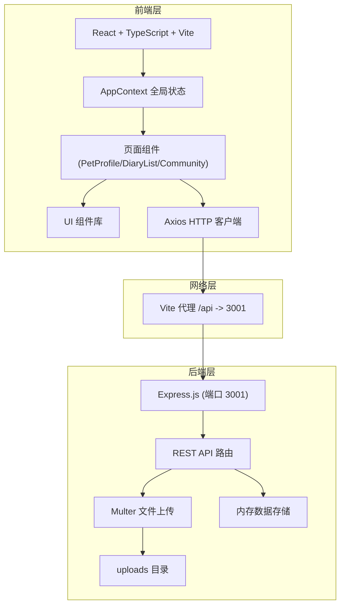
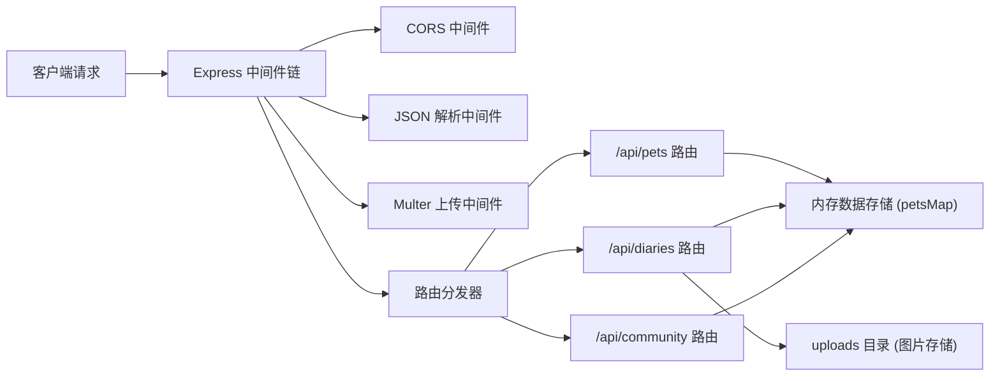
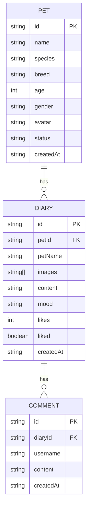

## 1. 架构设计



## 2. 技术描述

- **前端框架**：React 18 + TypeScript 5 + Vite 5
- **状态管理**：React Context API + useReducer（AppContext 全局状态）
- **HTTP 客户端**：Axios（带超时配置、拦截器、乐观更新处理）
- **后端框架**：Express 4（Node.js）
- **文件上传**：Multer（保存到 server/uploads 目录）
- **跨域处理**：CORS 中间件
- **数据存储**：内存存储（Map 对象模拟数据库）
- **构建工具**：Vite（配置代理、热更新）
- **图标库**：lucide-react
- **CSS 方案**：内联样式 + CSS 变量（无需 Tailwind，按用户要求自定义动画）

## 3. 路由定义

| 前端路由 | 页面 | 说明 |
|-------|---------|------|
| / | 宠物档案页 | 默认首页，展示宠物卡片列表 |
| /pets/:id | 宠物详情页 | 点击宠物卡片进入，展示缩略图墙 |
| /diary | 寄养日记页 | 发布日记、无限滚动列表 |
| /community | 社区广场页 | 全局日记流、筛选、互动 |

## 4. API 定义

### 4.1 宠物档案 API

```typescript
interface Pet {
  id: string;
  name: string;
  species: 'cat' | 'dog' | 'rabbit' | 'other';
  breed: string;
  age: number;
  gender: 'male' | 'female';
  avatar: string;
  status: 'home' | 'fostering';
  createdAt: string;
}

// GET /api/pets
// Response: { data: Pet[] }

// POST /api/pets
// Request: FormData (name, species, breed, age, gender, avatar)
// Response: { data: Pet }

// GET /api/pets/:id/diaries?limit=3
// Response: { data: Diary[] }
```

### 4.2 寄养日记 API

```typescript
type Mood = 'happy' | 'normal' | 'playful' | 'sick' | 'sleepy';

interface Diary {
  id: string;
  petId: string;
  petName: string;
  images: string[];
  content: string;
  mood: Mood;
  likes: number;
  liked: boolean;
  comments: Comment[];
  createdAt: string;
}

interface Comment {
  id: string;
  username: string;
  content: string;
  createdAt: string;
}

// GET /api/diaries?page=1&limit=5
// Response: { data: Diary[], hasMore: boolean, total: number }

// POST /api/diaries
// Request: FormData (petId, petName, content, mood, images[])
// Response: { data: Diary }

// GET /api/community/diaries?filter={breed?:string, mood?:Mood}
// Response: { data: Diary[] }

// POST /api/diaries/:id/like
// Response: { data: { likes: number, liked: boolean } }

// POST /api/diaries/:id/comment
// Request: { username: string, content: string }
// Response: { data: Comment }
```

## 5. 服务器架构图



## 6. 数据模型

### 6.1 数据模型定义



### 6.2 乐观更新机制

```typescript
// AppContext 中实现乐观更新
interface OptimisticUpdate<T> {
  id: string;
  previousState: T;
  newState: T;
  rollback: () => void;
}

// 流程：
// 1. 保存当前状态
// 2. 立即更新 UI（乐观假设成功）
// 3. 发送 API 请求
// 4a. 成功：确认状态
// 4b. 失败：回滚到 previousState，显示错误提示
```

### 6.3 模块边界

- **宠物档案模块**（PetProfile.tsx）：只操作宠物数据，提供宠物 ID 和名称给其他模块引用
- **寄养日记模块**（DiaryList.tsx + 后端 API）：依赖宠物的 ID 和名称，不直接修改宠物档案数据
- 两模块通过 AppContext 共享宠物列表缓存，通过 REST API 进行数据同步
