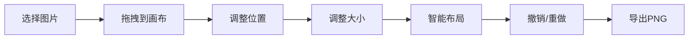

## 1. 产品概述

智能图像拼贴应用，帮助用户通过拖拽和智能布局快速创建视觉平衡的图像拼贴。解决手动调整图片位置和大小耗时且难以达到视觉平衡的问题。

- 核心功能：支持 10-20 张图片的拖拽编排、智能布局算法自动排列、手动微调缩放、撤销历史、PNG 导出
- 目标用户：需要快速制作图片拼贴的设计师、内容创作者、普通用户
- 产品价值：大幅提升拼贴制作效率，自动实现专业级视觉布局

## 2. 核心功能

### 2.1 用户角色

| 角色 | 注册方式 | 核心权限 |
|------|----------|----------|
| 普通用户 | 无需注册 | 使用全部功能 |

### 2.2 功能模块

1. **拼图画布模块**：拖拽卡片、缩放控制点、智能布局动画、选中态、图片加载失败占位符
2. **智能布局算法**：自动计算卡片位置，均匀间距，填满画布，平滑过渡动画
3. **手动微调工具**：四角缩放控制点、保持纵横比、实时阴影反馈
4. **历史管理**：最多 20 步操作历史、撤销功能
5. **导出功能**：PNG 格式导出、背景透明、分辨率与画布一致

### 2.3 页面详情

| 页面名称 | 模块名称 | 功能描述 |
|---------|---------|---------|
| 主页面 | 左侧图片库面板 | 缩略图网格显示，拖拽添加到画布，悬停缩放高亮 |
| 主页面 | 顶部工具栏 | 智能布局按钮、撤销按钮、导出按钮 |
| 主页面 | 中央画布区域 | 4:3 画布，卡片拖拽、缩放、智能布局 |

## 3. 核心流程

用户从左侧图片库拖拽图片到画布 → 拖拽调整卡片位置 → 拖拽四角控制点缩放卡片 → 点击智能布局按钮自动排列 → 点击撤销回退操作 → 点击导出下载 PNG

## 4. 用户界面设计

### 4.1 设计风格

- 深色主题，主背景 `#0F172A`
- 卡片区背景 `#F8FAFC`
- 主色调蓝色 `#3B82F6`，撤销按钮灰色 `#64748B`，导出按钮绿色 `#10B981`
- 按钮圆角 8px，卡片圆角 8px，画布圆角 16px
- 字体：现代无衬线字体，标题加粗，正文常规
- 卡片阴影 `0 2px 8px rgba(0,0,0,0.15)`
- 按钮悬停颜色加深 10%，点击 `transform: scale(0.95)` 效果

### 4.2 页面设计概览

| 页面名称 | 模块名称 | UI 元素 |
|---------|---------|---------|
| 主页面 | 左侧图片库 | 宽度 280px，背景 `#1E293B`，圆角 12px，内边距 16px，缩略图 100x80px，圆角 4px，悬停缩放 1.05，边框高亮 `#3B82F6` |
| 主页面 | 顶部工具栏 | 按钮间距 12px，智能布局蓝色 `#3B82F6`，撤销灰色 `#64748B`，导出绿色 `#10B981` |
| 主页面 | 中央画布 | 4:3 比例，最大 1200x900px，背景 `#F8FAFC`，圆角 16px，卡片初始 160x120px，缩放控制点 12px 圆形 `#3B82F6` |

### 4.3 响应式设计

- 桌面优先设计，画布最大尺寸 1200x900px
- 左侧面板固定宽度 280px
- 右侧画布自适应剩余空间
- 不支持移动端触控优化（桌面端应用）

### 4.4 动画与交互

- 拖拽时卡片半透明跟随光标
- 缩放时阴影深度随尺寸变化
- 智能布局 0.5s 平滑过渡 `transition-duration: 0.5s ease-in-out`
- 悬停效果 0.2s 缩放
- 按钮点击 0.1s 按下效果
