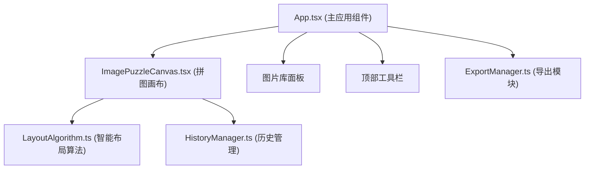

## 1. 架构设计



## 2. 技术描述

- 前端：React@18 + TypeScript + Vite
- 样式：TailwindCSS@3 + CSS-in-JS
- 状态管理：React useState/useRef (轻量级，无需 zustand)
- 图片导出：html2canvas
- 构建工具：Vite@5
- 图标：lucide-react

## 3. 目录结构

```
src/
├── module-puzzle/
│   ├── ImagePuzzleCanvas.tsx    # 拼图画布组件
│   └── LayoutAlgorithm.ts       # 智能布局算法
├── module-history/
│   └── HistoryManager.ts        # 历史管理模块
├── module-export/
│   └── ExportManager.ts         # 导出模块
└── App.tsx                      # 主应用组件
```

## 4. 数据模型

### 4.1 Card 类型定义

```typescript
interface Card {
  id: string;
  src: string;
  x: number;
  y: number;
  width: number;
  height: number;
  aspectRatio: number;
}
```

### 4.2 HistoryManager 接口

```typescript
interface HistoryState {
  cards: Card[];
}

interface IHistoryManager {
  push(state: HistoryState): void;
  undo(): HistoryState | null;
  canUndo(): boolean;
  clear(): void;
}
```

### 4.3 LayoutAlgorithm 接口

```typescript
function calculateLayout(
  cards: Card[],
  canvasWidth: number,
  canvasHeight: number,
  gap: number
): { x: number; y: number; width: number; height: number }[];
```

### 4.4 ExportManager 接口

```typescript
function exportToPng(
  canvasElement: HTMLElement,
  fileName: string
): Promise<void>;
```

## 5. 类型定义

```typescript
// 全局类型定义
interface Card {
  id: string;
  src: string;
  x: number;
  y: number;
  width: number;
  height: number;
  aspectRatio: number;
}

type HistoryState = Card[];

// 画布常量
const CANVAS_ASPECT_RATIO = 4 / 3;
const CANVAS_MAX_WIDTH = 1200;
const CANVAS_MAX_HEIGHT = 900;
const CANVAS_BG_COLOR = '#F8FAFC';
const CANVAS_BORDER_RADIUS = 16;

const CARD_INITIAL_WIDTH = 160;
const CARD_INITIAL_HEIGHT = 120;
const CARD_BORDER_RADIUS = 8;
const CARD_MIN_WIDTH = 80;
const CARD_MIN_HEIGHT = 60;

const GAP_BETWEEN_CARDS = 8;

const HANDLE_SIZE = 12;
const HANDLE_HOVER_SIZE = 16;
const HANDLE_COLOR = '#3B82F6';
```

## 6. 性能要求

- 拖拽和缩放操作帧率 ≥ 50fps
- 智能布局算法（10 张卡片内）计算耗时 ≤ 200ms
- 使用 requestAnimationFrame 优化拖拽性能
- 使用 transform 而非 top/left 实现高性能动画
